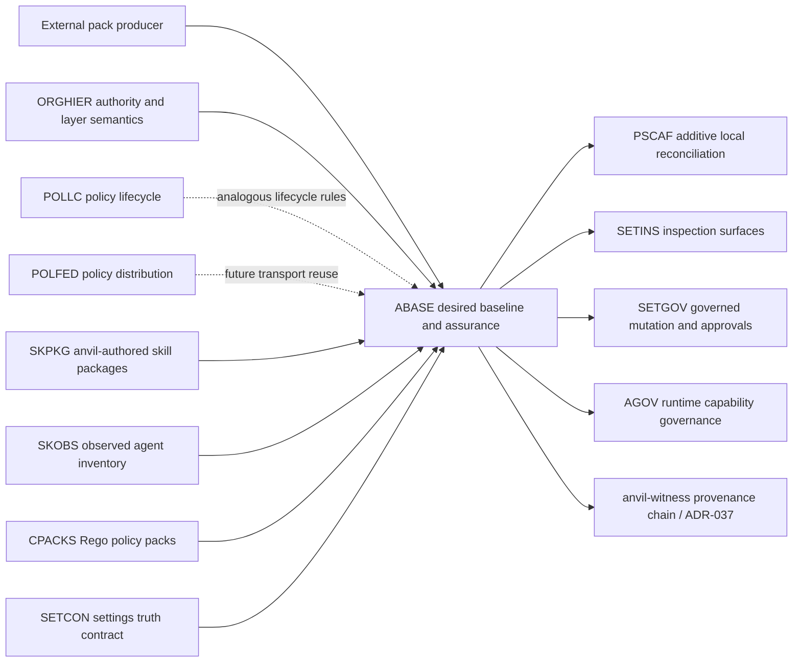

<!-- APS: See https://github.com/eddacraft/anvil-plan-spec for format reference -->
<!-- Executable only if tasks exist and status is Ready. -->

# Agent Baseline Assurance

| ID    | Owner       | Priority | Status |
| ----- | ----------- | -------- | ------ |
| ABASE | @joshuaboys | P1       | Draft  |

**Last reviewed:** 2026-09-14 — created from an enterprise beta conversation
about keeping agent instructions and skills current across an engineering
organisation of roughly 900 people, followed by operator product-boundary and
multi-organisation review.

> **Posture:** product thesis and module boundary only. This module is not
> executable and contains no authorised work items. Promote it only after the
> design-partner validation and architecture gates in the Ready Checklist.

## Purpose

Let an organisation declare the approved agent baseline for a repository,
resolve that baseline from explicitly authorised layers, reconcile its
materialised artefacts without erasing local ownership, and prove which exact
versions were present when work was performed.

The product promise is **agent baseline assurance**: answer, deterministically,
whether a repository has the right agent instructions, skills, agents, hooks,
settings, and referenced policy packs for its governance context, whether they
are current, and what changed when they were reconciled.

## Origin And Demand Signal

An enterprise agentic-engineering lead described an internal system used to
distribute `AGENTS.md` content and skills across an organisation of roughly 900
engineers. Model releases make those assets obsolete quickly; the operational
problem is ensuring every team receives the approved update without destroying
team-owned additions. People shown the internal system reportedly recognise it
as a product, although few enterprises are yet as mature in agentic delivery.

This is evidence of a broad product problem, not evidence that this particular
organisation will buy: it already has an internal solution. Validation must
test replacement, coexistence, and less-mature-enterprise adoption separately.

## Product Boundary

anvil consumes and governs **materialised agent baseline packs**. It does not
author neutral skills or compile them into every harness-specific format.

An upstream producer — a customer platform, consultancy delivery system, or a
tool such as Delivery Shadow — may compile neutral source into Codex, Claude,
Cursor, Copilot, OpenCode, or other harness artefacts. anvil begins at the
signed/versioned materialisation boundary and owns:

- trusted source and immutable identity;
- context-specific selection and pinning;
- additive reconciliation into supported surfaces;
- drift, freshness, compatibility, and policy evaluation;
- update planning and governed mutation;
- receipts binding delivered artefacts to work performed under the recorded
  baseline.

This keeps harness translation replaceable and prevents anvil becoming a
general skill authoring system, package marketplace, or internal developer
platform.

## Domain Model

| Term | Meaning |
| ---- | ------- |
| **Installation** | One local anvil installation, which may serve many unrelated contexts. |
| **Principal** | The human or automation identity operating that installation. |
| **Governance context** | The explicit authority graph selected for a repository or worktree. It includes the relevant organisation/engagement and project, never an implicit singleton organisation. |
| **Authority** | An entity allowed to publish or require a layer. Source and authority are distinct: a consultancy may produce an artefact that a customer authority approves. |
| **Layer** | A namespaced contribution owned by one authority and scope, for example organisation, security, business area, pod, team, project, or permitted personal overlay. |
| **Agent baseline pack** | An immutable manifest plus already-materialised artefacts and references, identified by publisher, name, version, and digest. |
| **Projection** | A pack artefact targeted at a specific harness surface such as `AGENTS.md`, a skill directory, an agent definition, hook, or settings fragment. |
| **Effective baseline** | The deterministic result of resolving all applicable layers for one governance context. |
| **Receipt** | Evidence of context, authorities, selected pack digests, projections, reconciliation outcomes, exceptions, and observed state. |

There is no installation-wide “current organisation” and no unqualified
“latest”. A repository resolves an explicit governance context; mutable
channels such as `approved` resolve to immutable digests before use.

## Layering And Ownership Contract

- Layer order and authority are explicit. Filesystem location, authentication
  order, and whichever account was used first never determine precedence.
- Each managed region is addressed by publisher, layer, component, and target
  surface. Empty layers emit nothing unless the contract deliberately requires
  a discoverable placeholder.
- Local content outside managed regions remains operator-owned. Managed regions
  use stable markers and compare-and-swap semantics rather than whole-file
  replacement.
- A lower authority cannot relax a higher authority's requirement unless the
  higher layer explicitly delegates that capability. Contradictions produce a
  visible conflict, not last-write-wins output.
- Personal or consultancy-wide defaults may add content only where the active
  customer/organisation context permits it. They cannot leak credentials,
  private packs, policy, or evidence across engagements.
- Repository and worktree context selection is inspectable and fail-closed when
  ambiguous. Switching repositories must not carry authority or credentials
  from the previous context.

The managed-block technique used by the acknowledgements starter is one valid
projection mechanism, especially for shared documents. It is not the domain
model: whole managed files, directories, settings entries, and references to
other versioned artefacts are also valid projections.

## Assurance States

anvil must distinguish what it can actually prove:

| State | Claim |
| ----- | ----- |
| **Required** | The effective baseline requires this component. |
| **Resolved** | A trusted immutable version/digest was selected. |
| **Installed** | Expected bytes or configuration exist at the target. |
| **Current** | Observed content matches the selected digest and compatibility constraints. |
| **Discoverable** | The target harness should discover the installed projection under its documented rules. |
| **Loaded** | Runtime evidence shows the harness loaded it, when such evidence exists. |
| **Obeyed** | Never inferred from presence or loading; requires separate outcome evidence and may remain unknown. |

Initial enforcement should focus on required/resolved/installed/current and
discoverable. Rego policy may require pack identities, versions, digests, and
compatibility, but policy carries requirements — not the pack payload.

## In Scope

- Explicit multi-organisation and multi-engagement context resolution for one
  installation.
- Layered desired state across organisation, security, business area, pod,
  team, project, and explicitly permitted personal scopes.
- Publisher-qualified pack identity, immutable pins, mutable approved channels,
  compatibility metadata, signatures/digests, and provenance.
- Materialised projections for instructions, skills, agents, hooks, settings,
  and references to policy packs.
- Safe plan/apply/update/verify operations using additive reconciliation.
- Current, stale, missing, drifted, incompatible, conflicted, excepted, and
  unknown outcomes.
- Reviewable updates, scoped/expiring exceptions, and receipts that bind the
  effective baseline to later decision evidence.
- A producer contract that customer and consultancy tooling can implement
  without adopting one authoring system or visual convention.

## Out Of Scope

- Neutral skill authoring or harness-specific skill compilation.
- A public skill marketplace, arbitrary package manager, or generic template
  engine.
- Source-code scaffolding, cloud-resource provisioning, service catalogues, or
  CI/CD orchestration.
- Silent fleet-wide rewriting; fleet remediation remains reviewable and
  policy-governed.
- Claiming an agent obeyed instructions merely because files were present.
- Hosted identity, secret storage, or cross-customer trust brokerage.
- Replacing Delivery Shadow or customer-specific producers that create the
  materialised artefacts.

## Relationship Map

| Module/surface | Owns | Relationship to ABASE |
| -------------- | ---- | --------------------- |
| [Project Scaffolding](./project-scaffolding.aps.md) (PSCAF) | Typed local component catalogue and additive, race-safe reconciliation. | ABASE supplies context-resolved desired state; PSCAF is the mutation substrate. PSCAF does not own organisations, packs, channels, or fleet state. |
| [Organisational Policy Hierarchy](./org-policy-hierarchy.aps.md) (ORGHIER) | Authority, selectors, inheritance, conflicts, and override permissions for Rego policy. | Coordinate one authority model. ABASE generalises layering to agent artefacts; it must not invent incompatible precedence. The Aidan signal is candidate demand evidence, not automatic promotion. |
| [Policy Lifecycle](./policy-lifecycle.aps.md) (POLLC) | Draft/canary/active/deprecated/retired lifecycle for policy versions. | Reuse lifecycle vocabulary and rollout invariants where they generalise; do not pretend agent baseline packs are Rego policy packs. |
| [Policy Federation](./policy-federation.aps.md) (POLFED) | Pull-based publication and distribution of policy packs within one organisation. | Initial ABASE consumes local/materialised packs. Future remote distribution may reuse transport and approval patterns; multi-organisation context remains an ABASE prerequisite, not a POLFED assumption. |
| [Skill Packaging & Distribution](./skill-packaging-distribution.aps.md) (SKPKG) | anvil-authored, binary-bundled customer skills and the typed client registry/install safety. | Reuse target-client, managed-install, and manifest contracts. ABASE owns externally produced organisation/customer packs and must not absorb SKPKG's bundled-product catalogue or fork its skill manifest. |
| [Skill Discovery & Observability](./skill-discovery-observability.aps.md) (SKOBS) | Observed inventory, hashes, sources, changes, and suspicious-pattern signals. | SKOBS supplies observed state; ABASE supplies desired state and comparison. Their manifests must compose rather than compete, and cross-harness inventory must replace Claude-only assumptions before load-bearing use. |
| [Compliance Policy Packs](./compliance-policy-packs.aps.md) (CPACKS) | Rego policy content and its fixtures/install contract. | A baseline pack may require a CPACKS identity/digest by reference. ABASE never owns or embeds the policy's semantic content. |
| Settings truth and inspection (SETCON/SETINS) | Canonical configured/resolved/evidenced-active distinctions and their read surfaces. | ABASE must expose state through the canonical truth contract; SETINS renders that state and never recomputes it. |
| [Settings Governed Changes](./settings-governed-changes.aps.md) (SETGOV) | Proposals, approvals, activation verification, and audit for protection-affecting mutations. | ABASE update/apply should reuse this workflow when pack changes affect protection; it must not create a second approval mechanism. |
| [Git-native Exceptions](./git-native-exceptions.aps.md) (EXCEPT) | Scoped, expiring, auditable exceptions. | Missing/stale/drifted baseline requirements use EXCEPT rather than permanent hidden skips. |
| [Agent Governance Patterns](./agent-governance-patterns.aps.md) (AGOV) | Runtime capability, trust, destructive-pattern, and audit signals. | ABASE proves what agent material was supplied; AGOV governs what the agent may do. Distribution is not runtime enforcement. |
| [`anvil-witness`](../../crates/anvil-witness/) and [ADR-037](../decisions/037-witness-chain-and-l4-policy.md) | Canonical append-only, hash-chained provenance ledger and DAG verification. | ABASE receipts must extend the existing `WitnessLine`/witness-chain contract, or reference companion evidence from it, to bind governance context and immutable pack digests to later work without claiming behavioural obedience. ABASE must not create a parallel provenance store; AGOV-006 follows the same extension rule. |

## Candidate First Slice

The smallest product-learning slice is one local repository and two distinct
governance contexts, using Delivery Shadow or equivalent tooling as the first
external producer:

1. Define and validate the materialised pack manifest and trust contract.
2. Resolve an explicit repository context to one immutable baseline digest.
3. Reconcile one managed document region and one managed skill directory.
4. Report current, stale, missing, drifted, incompatible, conflicted, and
   unknown without mutating by default.
5. Apply one transactional update and emit a receipt.
6. Prove that switching contexts cannot reuse the previous context's private
   pack, credentials, or policy.

Fleet dashboards, remote publication, automatic pull requests, and broad
harness coverage follow only after this local contract is boringly reliable.

## Work Items

None authorised while the module is Draft. After the Ready Checklist is
complete, decompose the accepted first slice above into outcome-focused work
items and promote them explicitly.

## Ready Checklist

- [ ] Revalidate the problem with the original enterprise contact, including
      replacement versus coexistence with the existing internal tool.
- [ ] Interview at least one less-mature enterprise to test whether the need is
      present before bespoke internal machinery already exists.
- [ ] Accept an ADR for governance context, authority composition, trust roots,
      and cross-organisation isolation.
- [ ] Decide customer terminology and whether “pack” remains internal only.
- [ ] Define the materialised pack schema, signature/digest rules, compatibility
      contract, and producer conformance fixture.
- [ ] Reconcile the pack manifest with SKPKG/SKOBS so skill identity, source,
      version, capability, and observed-state fields compose without a second
      canonical schema.
- [ ] Reconcile ABASE layering with ORGHIER and lifecycle semantics with POLLC.
- [ ] Confirm PSCAF can accept externally resolved desired components without
      becoming a fleet or package manager.
- [ ] Define evidence language for installed/current/discoverable/loaded and
      prohibit unsupported “obeyed” claims.
- [ ] Define the ABASE receipt extension against ADR-037 and
      `crates/anvil-witness`, including how any companion evidence is
      content-addressed from the canonical witness chain.
- [ ] Decompose the accepted first slice into independently verifiable work
      items and promote them explicitly.

## Open Questions

- Is the first buyer the central agentic/platform team, security, or engineering
  governance, and who owns exceptions?
- Does the adoption wedge replace an internal distributor, wrap it with
  assurance, or serve organisations that have not built one?
- Which transport is sufficient for the first slice: Git, OCI artefact, release
  attachment, or an existing customer-controlled store?
- How are organisation and consultancy authorities composed when both publish
  requirements into the same customer repository?
- Which projections may be Git-ignored local material and which must be
  committed for review and team consistency?
- What runtime evidence can prove a harness loaded a projection without adding
  harness-specific surveillance or false confidence?

## Draft Positions Pending Ratification

- **P-ABASE-001:** anvil governs materialised packs; upstream systems own
  neutral authoring and harness compilation.
- **P-ABASE-002:** one installation supports multiple explicit governance
  contexts; there is no implicit global organisation.
- **P-ABASE-003:** pack versions resolve to immutable digests and become
  provenance inputs.
- **P-ABASE-004:** managed document blocks are one projection mechanism, not
  the product boundary.
- **P-ABASE-005:** initial value is deterministic assurance and safe local
  reconciliation; fleet distribution is a later, separately gated layer.
