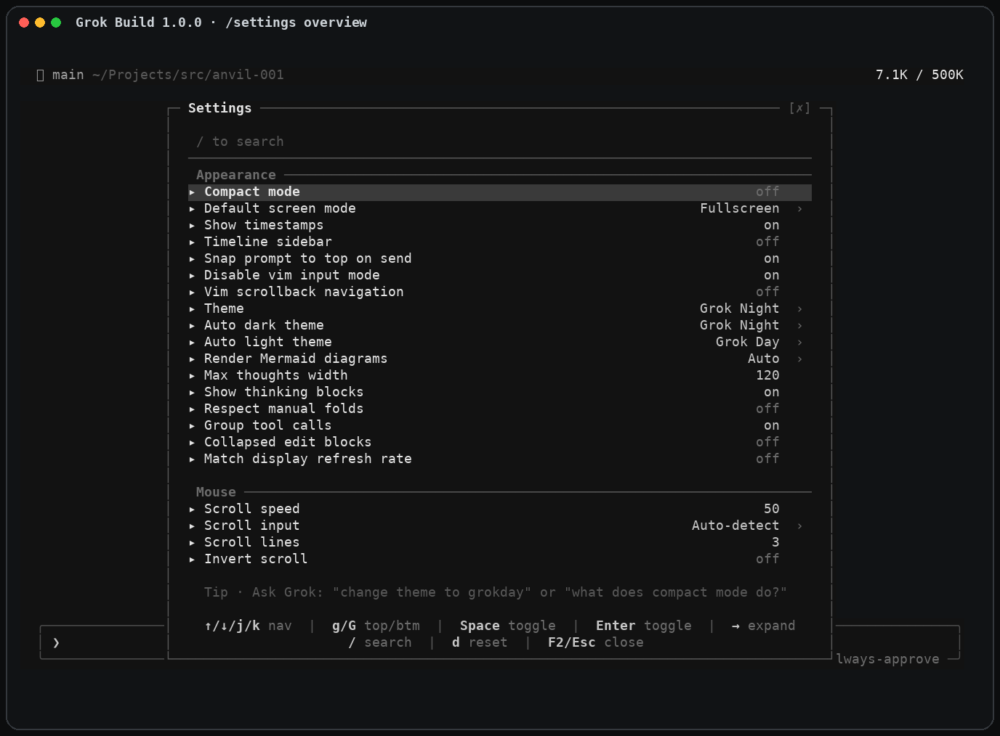
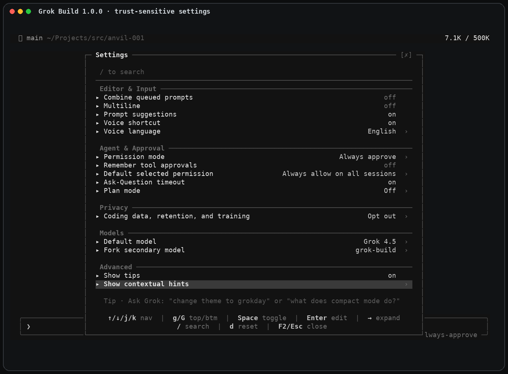
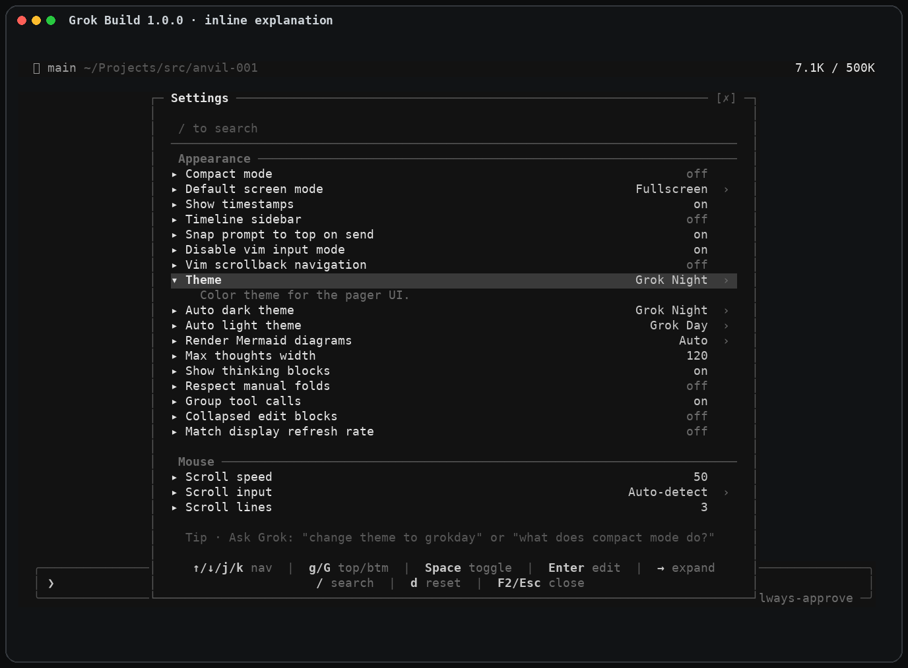
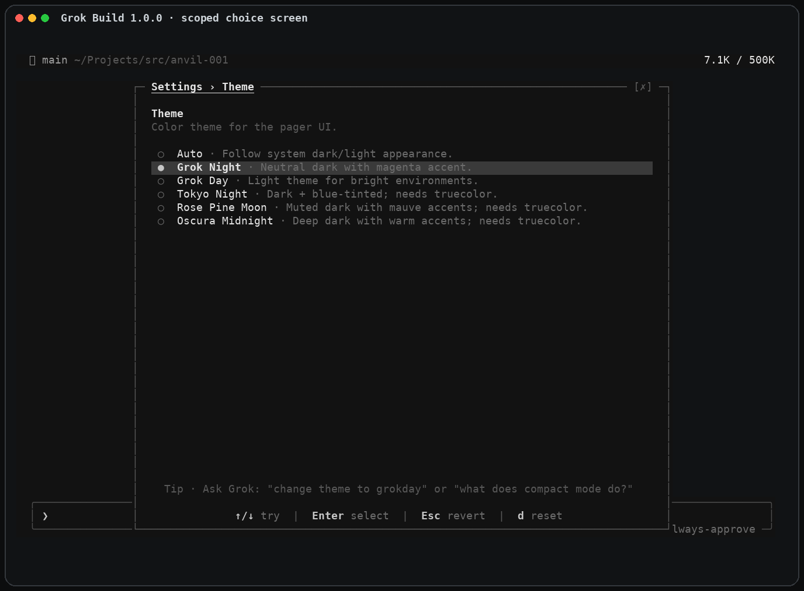
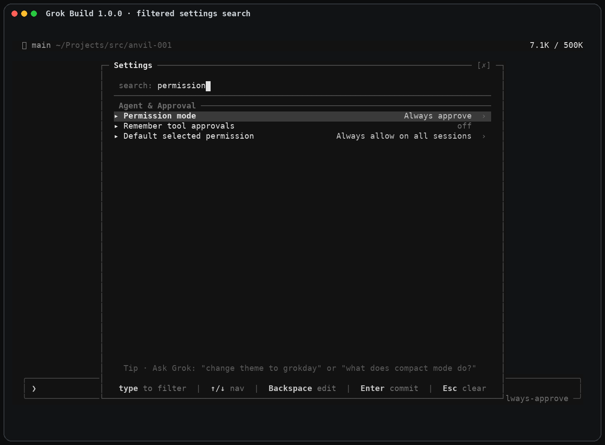

# Anvil `/settings` — settings truth surface

| Field | Value |
| ----- | ----- |
| Status | Final (spec v1.1, 2026-08-06) — Slice 0 contract is [ADR-132](../decisions/132-settings-truth-contract.md) |
| Date | 2026-08-06 |
| Source | Operator-supplied product specification, imported verbatim below |
| APS | [SETCON](../modules/settings-truth-contract.aps.md), [SETINS](../modules/settings-inspect-surface.aps.md), [SETPREF](../modules/settings-safe-preferences.aps.md), [SETGOV](../modules/settings-governed-changes.aps.md), [SETNL](../modules/settings-nl-proposals.aps.md) |

> **Planning note (2026-08-06; deltas noted 2026-08-13, ADR 2026-08-25).** This
> document is the imported product specification, kept verbatim as the reference
> contract. The APS modules above carry execution authority; where a module
> narrows or defers spec scope, the module file states so explicitly. SETCON-001
> is accepted as [ADR-132](../decisions/132-settings-truth-contract.md)
> (catalogue home `eddacraft-anvil-settings`, daemon-RPC attestation, global
> exit-code map). Audit-store reuse remains SETGOV-007.
>
> **Code-truth deltas (2026-08-13).** §7 and §23 name `anvil config validate`;
> that subcommand does not exist — the current family
> (`crates/anvil-cli/src/commands/config.rs`) is `show | set | convert`, and no
> module plans a `config validate`. Read those clauses as "the existing
> `anvil config` family remains supported". The spec also omits
> `anvil config set`, an existing direct config writer (as are the `anvil init`
> / `anvil start` bootstrap writes) that predates invariant 3's single-writer
> rule; the SETPREF entry gate records the reconciliation boundary and SETGOV
> subsumes `config set` into the governed path.

### Reference interaction captures

These captures preserve the Grok Build `/settings` interaction patterns that
informed the operator-supplied specification. They are design evidence, not a
normative visual contract for Anvil. Captured from Grok Build 1.0.0 on
12 August 2026; no setting was changed while collecting them.

#### Grouped overview and visible current values



#### Trust-sensitive settings remain legible in context



#### Progressive explanation in place



#### Scoped choice screen with reversible navigation



#### Search narrows the truth surface without losing grouping or values



---

Status: Final  
Specification version: 1.1  
Date: 6 August 2026  
Target product release: `/settings` v0.1

## 1. Summary

Add a searchable `/settings` control centre to Anvil's interactive TUI and a matching `anvil settings` CLI surface.

The purpose is not merely to make configuration easier to edit. It is to make Anvil's own governance legible and verifiable. Across the staged delivery, a user should be able to determine:

- what has been configured;
- how those declarations were resolved;
- which policies constrained the result;
- what the running system is actually enforcing;
- whether the desired and active states differ;
- what would become safer or less safe if a value changed;
- what changed, who changed it, and what happened afterwards.

The first-release top-level surface is:

```text
Settings | Status | Sources
```

Slice 3 adds `Audit` only after the durable audit and governed-mutation contract is implemented. The first release must not display an empty or partial Audit surface that could imply complete historical coverage.

The first release is inspect-first. It includes the settings truth surface and direct editing of low-risk interface preferences. Operational and governance values remain read-only until the shared proposal and mutation service ships. Where an established policy-change workflow exists, the settings surface links to it without creating an alternative mutation path.

The governing product principle is:

> Anvil may infer desired configuration from its resolver, but it may describe a control as active only when accepted, current evidence from the responsible runtime component proves it.

## 2. Problem

Anvil configuration is distributed across project files, user settings, environment variables, runtime adapters, hooks, organisation policy and command-specific defaults. Users can often discover what a setting *can* be, but not reliably:

- what value is declared at each scope;
- what value is resolved after precedence and policy constraints;
- what value is active in the running system;
- which source supplied or constrained it;
- whether it is inherited, overridden, locked, invalid or stale;
- whether changing it strengthens or weakens protection;
- what must restart or reactivate;
- what changed, who changed it, and why.

This is a product and trust problem, not merely a convenience problem. A governance tool should expose evidenced operational truth rather than presenting configuration intent as proof of enforcement.

## 3. Core terminology

The product and implementation must use the following terms consistently.

| Term | Meaning |
| --- | --- |
| Configured value | A declaration made by one configuration source. |
| Requested value | The value requested by the applicable declarations before policy constraints. |
| Policy constraint | A rule that limits the permitted value space, such as a minimum enforcement mode or prohibited egress destination. |
| Resolved value | The desired value after precedence, merge rules and policy constraints have been applied. |
| Active value | The value that accepted, current evidence from the responsible runtime component proves it is enforcing. |
| Runtime attestation | Structured runtime evidence bound to a responsible component instance and configuration revision. The term does not imply hardware-backed attestation unless explicitly stated. |
| Drift | A current, accepted attestation proves that active enforcement differs from resolved state. Stale, failed or unavailable evidence is reported separately. |
| Proposal | An immutable, expiring description of a requested change against a known configuration revision. |
| Material change | A change with operational, governance, security, privacy or audit consequence. |

`Effective` must not be used as an ambiguous substitute for both resolved and active state.

For a setting that requires runtime evidence, the row-level runtime states `active`, `drift`, `stale`, `failed` and `unknown` are mutually exclusive at a point in time. Configuration and workflow states such as `invalid`, `locked` and `pending activation` are separate and may coexist with a runtime state.

## 4. Product invariants

1. A control is described as `active` only when accepted, current runtime evidence proves it. Missing evidence is `unknown`; superseded evidence is `stale`; reported activation failure is `failed`.
2. Organisation policy is represented as constraints, not merely as another precedence source.
3. No interface writes configuration outside the authoritative settings service.
4. Every material mutation identifies its target scope, consequence and required authority before it can be applied.
5. Risk is evaluated from the transition and context, not only from the setting key.
6. Secret values, and values without a trusted sensitivity classification, are never rendered, logged, audited, exported to telemetry or supplied to a natural-language model.
7. A stale proposal cannot be applied after a relevant source, constraint or runtime precondition changes.
8. Failed validation cannot produce a partial configuration write.
9. Composite settings retain provenance at the field or member level.
10. The same catalogue, resolver, constraint engine, redaction rules and settings service are used by the TUI, CLI, MCP views, diagnostics and test harnesses.
11. Overall health is derived only from controls marked health-relevant by the catalogue or made mandatory by policy. An unavailable optional integration does not fail health merely because it is inspectable.

## 5. Goals

1. Give users one discoverable place to inspect configured, resolved and active Anvil behaviour.
2. Make provenance, precedence, constraints and scope visible at the row level.
3. Make configuration drift and incomplete runtime evidence obvious.
4. Distinguish harmless preferences from protection-affecting changes.
5. Preview and validate every material change before persistence.
6. Provide keyboard-first navigation, search and accessible descriptions.
7. Provide stable, redacted machine-readable output for automation.
8. Produce a durable audit trail for material change activity.

## 6. Non-goals for the first release

- A general-purpose YAML or TOML editor.
- Editing secrets or displaying secret values.
- Bypassing organisation policy, review requirements or approval gates.
- Inventing a second configuration system for the TUI.
- Editing every advanced, unknown or experimental field.
- Remote organisation administration from a local project session.
- Treating a resolved file value as proof of active enforcement.
- Provider billing or token-consumption reporting.
- An Audit view or claims of complete material-change history in `/settings` v0.1.
- Natural-language mutation in the initial delivery slice.

## 7. Entry points and CLI contract

### Interactive entry points

- `/settings` opens the control centre inside an active Anvil TUI session.
- `/settings <key>` opens the control centre focused on a canonical key or recognised alias.
- `anvil settings` opens the same control centre when stdin and stdout are attached to a supported terminal.
- Contextual links from `/status`, diagnostics, failed checks and integration health may deep-link to a setting.

### Non-interactive entry points

Slices 0 to 2 expose:

```text
anvil settings show
anvil settings explain <key>
anvil settings status
anvil settings sources
```

Slice 3 adds:

```text
anvil settings audit
```

All inspection commands support `--format text|json`. `--json` is a convenience alias for `--format json`.

- An explicit subcommand, `--format`, `--json`, `--check` or `--no-tui` selects non-interactive mode and never starts an alternate-screen TUI.
- When output is not attached to a terminal, `anvil settings` behaves as `anvil settings show --format text` unless an explicit subcommand or format is supplied.
- `--no-tui` forces structured text output in a terminal unless another format is selected.
- Existing `anvil config show` and `anvil config validate` remain supported as the low-level compatibility interface and use the same catalogue and resolver. `/settings` and `anvil settings` are the user-facing truth surface. No existing `config` command is deprecated by this release.
- JSON output uses a versioned schema and stable canonical keys. Display labels and layout are not API fields.
- Normal inspection can return a valid model containing invalid or unhealthy state.
- Bare `anvil settings`, `show` and `status` support `--check`; the flag implies non-interactive output. It returns a non-zero health result when a health-relevant control is invalid, `drift`, `stale`, `failed` or `unknown`, when a mandatory policy bundle is invalid, or when resolution is incomplete. Advisory and non-health-relevant findings remain in the payload without failing the check unless policy makes them mandatory.
- A redaction failure fails closed and produces no settings payload.

The CLI exposes these stable semantic outcomes:

| Outcome | Meaning |
| --- | --- |
| `success` | The command completed. With `--check`, all health-relevant controls are healthy. |
| `check_failed` | A valid inspection payload was produced, but `--check` found an unhealthy or indeterminate required state. |
| `usage_error` | Arguments or command usage were invalid. |
| `resolution_error` | The catalogue, sources, constraints or read model could not be resolved safely. |
| `access_error` | The caller was not authorised to inspect the requested scope or data. |
| `redaction_error` | Safe redaction could not be guaranteed; no settings payload was emitted. |
| `internal_error` | An unexpected I/O, runtime collection or internal failure prevented completion. |

Each semantic outcome maps to a stable numeric code in Anvil's global CLI exit-code contract. `/settings` must not create a command-local numeric mapping. If no global registry exists, Slice 0 establishes it. The mapping must be documented and golden-tested before Slice 1 ships.

### Machine-readable contract

JSON output is a single document with no progress, decoration or explanatory text on stdout. Its minimum envelope is:

```json
{
  "schema_version": "anvil.settings.v1",
  "command": "show",
  "generated_at": "2026-08-06T08:00:00Z",
  "model_revision": "<opaque revision>",
  "context": {},
  "health": {
    "status": "healthy",
    "reasons": []
  },
  "data": {},
  "diagnostics": []
}
```

Canonical keys, field meanings and enum values are API. `health.status` is one of `healthy`, `unhealthy` or `indeterminate`. Consumers must ignore unknown fields. The `command` value and canonical setting-key space are extensible. Additive optional fields may be introduced within `anvil.settings.v1`; removing or reinterpreting a field, or adding, removing or changing a value in a closed enum, requires a new schema version. The entire document is recursively redacted according to the shared classification rules. A redaction failure emits no partial document.

### MCP contract

Slice 1 exposes read-only MCP equivalents of `show`, `explain`, `status` and `sources` from the same read model. Slice 3 adds read-only Audit inspection. `/settings` v0.1 exposes no MCP mutation tool. MCP output uses the same canonical keys, sensitivity classifications and recursive redaction rules as the CLI, even when its transport envelope differs.

This specification defines non-interactive CLI inspection only. Class A editing occurs through the interactive control centre opened by `/settings` or `anvil settings`. It does not introduce `set`, `unset` or non-interactive apply commands; any future CLI mutation contract must be specified explicitly and use the same settings service, scope rules and authority model.

If slash commands are invoked in a non-TUI context, Anvil returns a concise explanation and the equivalent CLI command.

## 8. Information architecture

### Settings

A searchable, grouped view of resolved values, active state and provenance.

Groups:

1. **Protection**
   - enforcement mode;
   - enabled checks and packs;
   - severity thresholds;
   - intercept behaviour;
   - exception policy;
   - fail-open or fail-closed behaviour where configurable.

2. **Agents & approvals**
   - default permission posture;
   - approval requirements;
   - policy gates;
   - session escalation behaviour;
   - admin and policy override restrictions.

3. **Privacy & egress**
   - capture and retention;
   - redaction;
   - allowed destinations;
   - telemetry;
   - network and tool egress controls.

4. **Integrations**
   - Claude, Codex, Grok and other adapters;
   - MCP registration and health;
   - hooks and activation state;
   - runtime versions and compatibility.

5. **Interface**
   - compact mode;
   - timestamps;
   - motion and accessibility;
   - timeline and sidebar visibility;
   - contextual hints.

Scope, resolution and precedence belong in row details and the Sources view rather than appearing as configurable settings unless there are genuine user-controlled values.

### Status

A read-only operational summary built from the same status model as Anvil's existing diagnostics:

- Anvil version and runtime;
- active project, worktree and session;
- resolved protection posture;
- attested active protection posture;
- overall health: `healthy`, `unhealthy` or `indeterminate`, with reasons;
- `drift`, `stale`, `failed` or `unknown` runtime state;
- enabled integrations and failures;
- active agent adapters where relevant;
- pending restart or reactivation;
- configuration and policy validation state;
- age and source of runtime attestations.

### Sources

An explanation of how desired state was resolved and constrained:

- each discovered configuration source in precedence order;
- organisation constraints shown separately from ordinary precedence;
- source scope and path, redacted where necessary;
- whether the source is writable by the current session;
- overridden declarations and the winning declaration;
- field-level or member-level provenance for composite values;
- environment-provided values shown according to their catalogue redaction policy;
- unknown and deprecated keys;
- the revision or digest used when generating the view.

### Audit (Slice 3)

Recent material configuration events:

- timestamp;
- event type;
- actor and identity confidence;
- session identity;
- target scope;
- changed canonical keys without sensitive values;
- consequence classification;
- validation, approval, persistence and activation results;
- reference to a proposal, commit, pull request, policy event or recovery record.

Audit includes externally observed configuration changes where Anvil can detect them. It must distinguish an Anvil-managed mutation from an external edit.

The Audit surface reports its observation coverage, retention boundary and known gaps, including periods when Anvil was not running or a source could not be observed. It must never imply that externally initiated history is complete when that completeness cannot be evidenced.

## 9. Row design

A row should never collapse desired and active state into one value when they differ.

A current attested mismatch is `drift`:

```text
▸ Enforcement mode       resolved: block [repo]   active: warn [current]   DRIFT
```

Superseded evidence is `stale`, not automatically drift:

```text
▸ Enforcement mode       resolved: block [repo]   last active: warn [stale 12m]   STALE
```

When values agree, the compact form may be used:

```text
▸ Enforcement mode       block [repo]   active ✓   policy-constrained
```

Required row metadata:

- human-readable label;
- resolved value;
- active value or runtime state where runtime attestation applies;
- source badge: `org`, `user`, `repo`, `worktree`, `env`, `session` or `default`;
- policy-constraint badge when applicable;
- runtime state: `active`, `drift`, `stale`, `failed` or `unknown`;
- separate configuration or workflow state such as `locked`, `invalid` or `pending activation`;
- consequence badge where useful;
- concise description on focus.

Expandable detail shows:

- canonical namespaced key;
- configured declarations by scope;
- merge behaviour for structured values;
- requested and resolved values, with every applied constraint;
- active or last-known value, responsible component instance, evidence trust, attestation age and revision;
- complete applicable provenance;
- policy constraints and why they apply;
- accepted values and default;
- operational consequence;
- affected components;
- validation errors and warnings;
- restart or reactivation requirements;
- equivalent CLI command and documentation reference.

If a component cannot safely reveal an active value, it may attest a classified value digest or conformance result instead. The UI must explain the reduced evidence level.

The `org` source badge denotes an ordinary organisation-scoped declaration. Organisation policy constraints are always shown separately and must not be represented only by that source badge. Unknown or unclassified values show their key, scope and source where safe, but hide the value unless a trusted catalogue declares it safe to render.

## 10. Navigation and interaction

- `/` focuses search.
- Arrow keys or `j/k` navigate.
- `g/G` jump to the top or bottom.
- `Enter` opens detail or begins an allowed edit.
- `Space` toggles only Class A booleans through the settings service.
- `d` opens a reset preview for the declaration at a selected writable scope; the keypress itself never persists a change. Class A reset may be confirmed in Slice 2. Class B and C reset enters the normal proposal flow in Slice 3 and remains read-only before then.
- `Esc` backs out without mutation.
- The footer displays only commands valid in the current state.
- Search matches labels, canonical keys, descriptions, groups and deprecated aliases.
- Search results retain group, source, constraint and state context.
- Locked or unsupported values remain inspectable and explain the controlling authority and next action.

## 11. Configuration and policy model

### Typed settings catalogue

The UI consumes a typed settings catalogue rather than hard-coded rows. Each catalogue item includes:

- stable namespaced key and display label;
- owning core component, adapter or extension;
- group and ordering;
- value type and allowed values;
- default;
- supported scopes;
- source precedence;
- merge semantics for scalar, map, list, set and nullable values;
- deletion or tombstone semantics;
- mutability and target writer;
- base consequence class;
- transition-aware consequence evaluator;
- sensitivity classification and redaction policy;
- validation functions;
- runtime evidence mode: none, value, classified digest or conformance;
- health relevance: required, advisory or none;
- activation owner, accepted evidence trust and restart behaviour;
- documentation reference;
- deprecated aliases and migration metadata;
- catalogue and extension version compatibility.

Adapter and extension keys must be namespaced. Catalogue collisions fail validation rather than choosing a winner silently. Configuration owned by an unavailable extension remains inspectable by key, scope and source, but its value is hidden by default and it cannot be interpreted as active until a trusted compatible catalogue is loaded.

### Composite values and provenance

The resolver must define explicitly whether each collection is replaced, appended, unioned or merged by key. Provenance is retained for each field or member contributing to the result.

A single row-level source badge may summarise a composite value only when the expanded view exposes its complete provenance. Deletions and exclusions are first-class resolution events rather than disappearing from the explanation.

### Policy constraints

Policy constraints are evaluated after ordinary configuration resolution and can establish:

- required or prohibited values;
- minimum or maximum postures;
- mandatory collection members;
- prohibited collection members;
- permitted override scopes;
- required approval authorities.

A local, environment or session source cannot bypass a controlling constraint merely by having higher configuration precedence.

## 12. Runtime state and attestation

Components responsible for enforcing configurable behaviour expose an activation status containing:

- component identity, instance identity and version;
- evidence channel and trust classification;
- applicable canonical keys;
- active value, classified digest or conformance result;
- resolved-configuration revision or digest last applied;
- activation and observation timestamps;
- expiry or maximum validity interval;
- restart or reactivation requirement;
- failure or incompatibility status.

The settings service accepts evidence only from the registered activation owner and only when the channel and identity satisfy the catalogue's trust requirement. It then compares accepted evidence with current resolved state.

For each setting that requires runtime evidence, the service assigns exactly one runtime state in this order:

1. `unknown`: no accepted evidence exists.
2. `stale`: accepted evidence exists but refers to a previous component instance or configuration revision, has expired, or its component has disconnected or exited.
3. `failed`: current evidence reports activation failure or incompatibility.
4. `drift`: current evidence proves that active enforcement differs from resolved state.
5. `active`: current evidence proves that active enforcement matches resolved state.

A last-known active value may be displayed as historical evidence, but it cannot satisfy current activation. `Pending activation` is a workflow state rather than a runtime evidence state. The UI must not convert `stale`, `failed`, `unknown` or `drift` into a reassuring active indicator.

Overall health is calculated only from settings marked `required` for health or made mandatory by policy:

- `healthy`: every required setting is valid and `active`;
- `unhealthy`: a required setting is invalid, `failed` or in `drift`, or a mandatory policy bundle is invalid;
- `indeterminate`: a required setting is `unknown` or `stale`, or required resolution or evidence collection could not establish current truth.

Advisory states remain visible without failing health unless policy elevates them. Both `unhealthy` and `indeterminate` fail `--check`.

## 13. Change consequence model

Settings have a base class, but the final consequence is evaluated for the proposed transition, target scope and current context.

### Class A: interface preference

Examples: timestamps, compact display, motion and hints.

- May be changed inline.
- Defaults to user scope unless the user explicitly selects another supported scope.
- Shows immediate feedback.
- Remains reversible.

### Class B: operational configuration

Examples: cache limits and non-security runtime behaviour.

- Shows target scope and exact diff.
- Validates before apply.
- Requires explicit confirmation.
- Reports restart and reactivation consequences.

### Class C: governance, security or privacy policy

Examples: enforcement mode, required checks, approval gates, egress, redaction and override policy.

- Never changes through a one-key toggle.
- Shows whether the transition strengthens, preserves, weakens or has unknown effect on protection.
- Generates a proposal containing an exact diff, validation result and target scope.
- Requires explicit confirmation and every applicable higher-level approval.
- Uses a reviewable repository patch, branch or pull request when the controlling source is version-controlled.
- Treats confirmation of a proposal as distinct from policy approval.
- Never treats language such as “enable”, “merge” or “make it work” as authority to bypass policy.

### Class D: secrets

- Never displays or exports secret values.
- Shows only presence, source, validity or expiry metadata when the catalogue explicitly marks that metadata safe.
- Uses an approved secure update path outside the entire settings surface.

### Transition result

The consequence evaluator returns:

```text
base class
impact: strengthened | neutral | weakened | unknown
required authority
required workflow
affected components
activation consequences
```

`Unknown` impact is handled conservatively and cannot silently fall back to a lower-risk workflow.

## 14. Scope and reset semantics

- Every material write names an explicit target scope.
- Editing an inherited value creates an override only after the UI states that consequence.
- The UI does not infer that the winning source is the intended write target.
- Reset removes the declaration at the selected scope and previews the value and source that will become resolved afterwards.
- Read-only sources, including most environment and organisation sources, explain their approved update path.
- Session overrides require explicit authority, have an expiry and cannot exceed policy constraints.
- A proposal records its target source revision. If the source changes, the proposal becomes stale and must be regenerated.

## 15. Authoritative settings service

The TUI, CLI, MCP interface, diagnostics and future natural-language interface use one settings service. They do not write configuration files directly.

The service owns:

1. actor authentication and authorisation;
2. catalogue and extension loading;
3. source discovery and revision capture;
4. precedence and composite-value resolution;
5. policy-constraint evaluation;
6. runtime-state collection and evidence acceptance;
7. consistent read-model snapshot generation;
8. health aggregation;
9. target-scope validation;
10. redacted patch generation;
11. transition consequence analysis;
12. configuration and policy validation;
13. approval routing;
14. concurrent-change detection;
15. atomic persistence;
16. activation or restart requests;
17. post-write resolution and activation verification;
18. audit and recovery recording.

### Proposal contract

A material proposal is immutable and contains:

- proposal identifier and expiry;
- actor and session;
- target scope and source;
- catalogue version;
- source, constraint and relevant runtime revisions;
- exact redacted patch;
- predicted resolved result;
- consequence analysis;
- validation results;
- required approvals;
- affected components and activation consequences.

Immediately before apply, the service rechecks authority, approvals, revisions, constraints and validation. Any relevant change invalidates the proposal.

### Persistence and recovery

- Writes are atomic and preserve file permissions.
- Comments and formatting are preserved where the supported writer can do so safely.
- Symbolic links, path traversal, permission boundaries and replace operations follow an explicit safe-write policy.
- Multi-file changes either commit through a transactional backend or have a durable recovery protocol.
- Material mutations record a durable intent before persistence and a completion, rejection or recovery outcome afterwards.
- An operation is not reported as successfully active merely because persistence succeeded.
- If audit finalisation or activation verification fails, the service returns a non-success outcome, exposes the resulting state and supplies a deterministic recovery action.

For version-controlled Class C changes, creating a patch, branch or pull request does not change active configuration. Merge and subsequent runtime activation are observed and audited as separate events.

## 16. Natural-language proposals

A later slice may provide “Ask Anvil to change a setting”. Natural language is an untrusted proposal-authoring input, not an authority or mutation path.

Flow:

1. Parse requested intent.
2. Resolve candidate canonical keys and target scope.
3. Display assumptions and ambiguity.
4. Generate an exact redacted proposal through the settings service.
5. Evaluate consequence and validate.
6. Request the normal confirmations and approvals.
7. Apply through the same authoritative mutation path or make no change.
8. Record the outcome in Audit.

The model receives no secret values. Model output cannot weaken policy, select authority on the user's behalf or bypass deterministic validation.

## 17. Error handling and secure failure

- Invalid current configuration remains inspectable and clearly marked.
- The last known active state is shown separately and labelled with its age and revision.
- A redaction failure produces no potentially sensitive output.
- Failed writes leave the original source untouched or enter the documented recovery state for a multi-resource transaction.
- Concurrent modifications are detected before apply.
- A failed post-write validation is visible and invokes the documented rollback or recovery behaviour.
- Unsupported, unknown or locked settings explain the controlling source and next action.
- Values without a trusted sensitivity classification are hidden by default.
- If validation, policy evaluation or consequence analysis cannot complete, Class B and C changes fail closed.
- If runtime attestation is unavailable, the runtime state is `unknown`, not active.
- Diagnostic errors avoid embedding unredacted source values or paths.

## 18. Audit contract

Material event types include:

- proposed;
- rejected;
- approved;
- persisted;
- activation-requested;
- activated;
- activation-failed;
- rolled-back;
- recovered;
- externally-modified.

Each event records actor identity with a confidence level, such as authenticated Anvil principal, linked operating-system identity or locally asserted identity. Anvil must not present a weak identity as cryptographically verified.

Audit storage must define:

- durability and append behaviour;
- tamper-evidence expectations;
- retention and rotation;
- offline behaviour;
- recovery after interrupted writes;
- redaction and classification rules;
- linkage to repository commits, policy events and runtime evidence.

Sensitive setting values are omitted. Where comparison is necessary, store an approved classified digest rather than the value itself.

Audit inspection reports the earliest retained event, retention boundary, current observation coverage and known observation gaps. Hash linking provides tamper evidence for the local chain; it is not presented as proof against a privileged actor capable of rewriting the entire local store.

## 19. Accessibility and terminal compatibility

- Do not communicate state by colour alone.
- Support narrow terminals with responsive detail views.
- Preserve complete keyboard operation.
- Respect reduced-motion preferences.
- Provide stable text labels for snapshot testing and screen readers where supported.
- Degrade to a structured text listing when alternate-screen TUI support is unavailable.
- Keep status language explicit: `active`, `unknown`, `stale`, `failed` and `drift` must remain distinguishable without icons or colour.

## 20. Telemetry and privacy

If product telemetry is enabled, collect only coarse interaction signals such as panel opened, search used or validation failed.

Never collect:

- configured, resolved or active values;
- paths;
- search strings;
- policy contents;
- proposal diffs;
- secret metadata;
- audit details;
- runtime attestation payloads.

Honour existing telemetry controls. Telemetry failure must not prevent local inspection of settings.

## 21. Acceptance criteria

### Foundation

1. TUI, CLI and MCP views consume the same typed catalogue, resolver, constraint engine and redaction rules.
2. Organisation constraints cannot be bypassed by a higher-precedence repository, environment or session declaration.
3. Scalar and composite resolution preserve complete provenance.
4. JSON output uses the versioned envelope and recursive redaction contract.
5. Unknown extension settings remain inspectable by key, scope and source, but their values are hidden unless a trusted catalogue classifies them safe.
6. Runtime state classification is deterministic and keeps `active`, `drift`, `stale`, `failed` and `unknown` distinct.
7. Health aggregation considers only health-relevant or policy-mandated controls.

### Inspect truth surface

8. `/settings` opens in an active Anvil TUI session.
9. Settings are grouped, searchable and keyboard navigable.
10. Every displayed resolved value includes its source or composite provenance.
11. Resolved and active values are displayed separately when they differ.
12. A control without accepted runtime evidence is shown as `unknown`.
13. Current attested mismatch is shown as `drift`; superseded evidence is `stale`; activation failure is `failed`.
14. At least one overridden value shows its complete precedence and constraint chain.
15. Status reports runtime, project, protection, integration health and each non-healthy runtime state.
16. CLI and MCP inspection are derived from the same revisioned read model as the TUI.
17. Secret and unclassified values never appear in rendering, JSON, logs, diagnostics, audit or telemetry.
18. Snapshot tests cover normal, narrow, invalid-config, locked, unknown, stale, failed, drift and redacted-value states.

### Safe preferences

19. Class A preferences can be changed and reverted through the settings service.
20. The target scope is visible, with user scope used as the documented default.
21. Reset previews the newly inherited value before it removes the selected declaration.
22. Concurrent modification prevents apply, preserves the source and leaves the pending edit available for review or retry.

### Governed changes and audit

23. Class B and C changes cannot bypass the shared proposal and mutation service.
24. Every proposal contains a target scope, exact redacted patch, revisions, predicted result, consequence and validation result.
25. Risk classification reflects the transition and context rather than only the setting key.
26. A stale proposal cannot be applied.
27. Class C changes cannot be applied by a one-key toggle or ordinary confirmation alone.
28. Failed validation produces no partial write.
29. Persistence, activation and audit outcomes remain distinct and visible.
30. Runtime activation failure produces `failed` and never reports the new value as active; a current attested mismatch produces `drift`.
31. The Audit view and CLI report retention boundaries and observation gaps and never imply unsupported completeness.

### Security and resilience

32. Tests cover symbolic links, path traversal, permissions, interrupted writes and concurrent writes.
33. Redaction failure produces no settings payload.
34. Property tests cover precedence, policy constraints, composite merge rules, runtime-state classification, health aggregation and redaction invariants.
35. Golden tests cover the versioned JSON contract and the globally documented CLI exit-code mapping.
36. Runtime evidence from an unregistered owner, untrusted channel or incompatible component is rejected and cannot produce `active`.

## 22. Delivery slices

### Slice 0: truth contract

- terminology and mutually exclusive runtime-state model;
- typed catalogue, sensitivity classification and health relevance;
- composite merge and provenance rules;
- policy-constraint model;
- runtime attestation and evidence-trust contract;
- redaction invariants;
- versioned JSON envelope and global CLI exit semantics;
- settings-service and consistent read-model boundary.

### Slice 1: inspect

- grouped searchable Settings view;
- resolved, `active`, `drift`, `stale`, `failed` and `unknown` states;
- source badges and expanded details;
- Status and Sources read-only views;
- non-interactive CLI inspection and read-only MCP equivalents;
- terminal, property, golden and snapshot tests.

### Slice 2: safe preferences

- Class A editing through the settings service;
- explicit/default target-scope behaviour;
- atomic persistence;
- reset and inheritance behaviour;
- accessibility preferences.

Slices 0 to 2 form the first product release.

### Slice 3: governed changes and audit

- immutable Class B and C proposals;
- transition-aware consequence analysis;
- diff preview and validation;
- target-scope selection;
- approval integration;
- repository patch, branch or pull-request workflow;
- activation verification and recovery;
- Audit view and `anvil settings audit`, including coverage and retention reporting.

### Slice 4: natural-language proposals

- intent parsing;
- ambiguity handling;
- proposal generation through the settings service;
- consequence explanation;
- normal approval and audit integration.

## 23. Final product and architecture decisions

### Organisation policy

Organisation policy is supplied as a signed policy bundle from an authorised local, customer-managed or Anvil control-plane source. The local trust store identifies accepted signing authorities. An unverifiable, expired or incompatible bundle is never silently ignored. A still-valid previously accepted bundle remains authoritative where applicable; otherwise Anvil's built-in fail-closed defaults determine whether affected state is `invalid` or `unknown`. The untrusted bundle cannot select its own failure behaviour.

Organisation policy constrains ordinary configuration. It does not participate as a conventional last-writer-wins source.

### Runtime attestation

Every built-in enforcement-critical component displayed as health-relevant in the first release must implement the runtime attestation contract. Optional or extension components without compatible attestation support are shown as `unknown` when inspected and cannot contribute to an overall healthy or fully enforced status when policy makes them required.

An attestation is current only when it comes from the registered activation owner over an accepted channel and refers to the active component instance and current resolved-configuration revision. A component may declare a shorter validity interval. Observed process exit or disconnection, revision change or expiry makes the attestation stale immediately.

### Writable scopes and merge behaviour

The settings catalogue identifies the canonical writer for every writable setting and scope. The UI never discovers a write target heuristically. Each structured setting declares its own replace, append, union or keyed-merge behaviour; there is no implicit global collection merge rule.

### Actor identity

The canonical actor is the Anvil session principal. Audit records bind it to the available authentication evidence and assign one of three confidence levels:

- `verified`: authenticated by an accepted identity provider or signing credential;
- `asserted`: linked to a local operating-system or tool identity without independent verification;
- `unknown`: no reliable identity evidence is available.

The UI never presents `asserted` or `unknown` identity as verified.

### Audit storage and retention

Local audit uses Anvil's durable append-only event store with hash-linked records. Hash linking is treated as local tamper evidence, not proof against a privileged actor who can replace the entire store. Enterprise and customer-managed deployments can export, checkpoint or replicate those events to their configured evidence store without replacing the local transaction record.

Retention is policy-controlled. The product default is 90 days locally, and organisation policy can require a longer period. Retention never removes an event required by an active hold or unresolved recovery operation.

### Version-controlled governance changes

A Class C change targeting a version-controlled source produces a reviewable change artifact by default. It does not modify the active branch or submit a remote pull request implicitly. Creation of a branch, native VCS change or pull request is a separate explicit action using the established change workflow and available integration.

### Recovery guarantee

Material mutations use a durable intent followed by idempotent reconciliation. If configuration persistence succeeds but audit finalisation or activation fails, Anvil records a recovery-required state, does not report the proposal as active, and retries or rolls back according to the target writer's declared recovery strategy. For recoverable failures within the supported persistence model and while required storage remains available, every interrupted mutation must converge to either the verified previous state or the verified proposed state. An ambiguous state remains blocked and visible until reconciled.

### Command-family relationship

`anvil settings` is the user-facing inspection and governed-change surface. `anvil config` remains the low-level compatibility and validation interface. Both use the same service and data contracts. This specification introduces no duplicated resolver or writer and no deprecation of existing automation.

## 24. Release decision

Implementation begins with the truth contract, followed by the inspection surface and safe interface preferences. These form `/settings` v0.1 with `Settings`, `Status` and `Sources` only.

`Audit` and broader edits do not ship until the shared proposal, authority, persistence, activation and audit path passes the governed-change acceptance criteria. Natural-language proposal authoring remains a subsequent slice and receives no independent authority.

This boundary keeps `/settings` aligned with Anvil's wider role as an independent evidence and decision layer. The feature succeeds when Anvil can distinguish declared intent, resolved state after policy constraints and evidenced active enforcement, then explain any gap between them.
