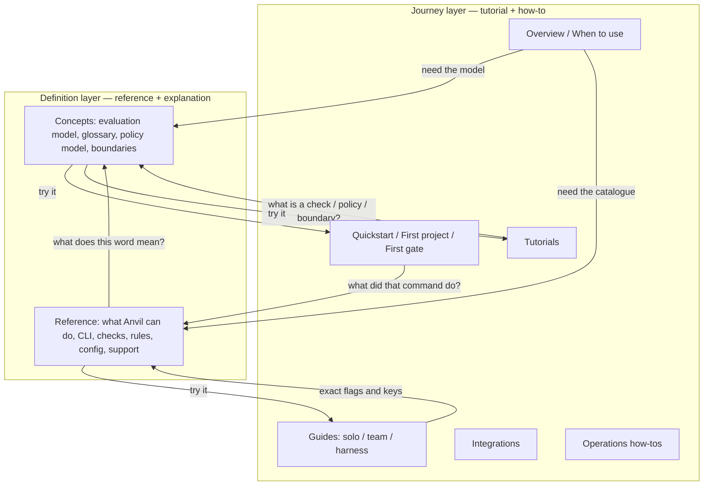
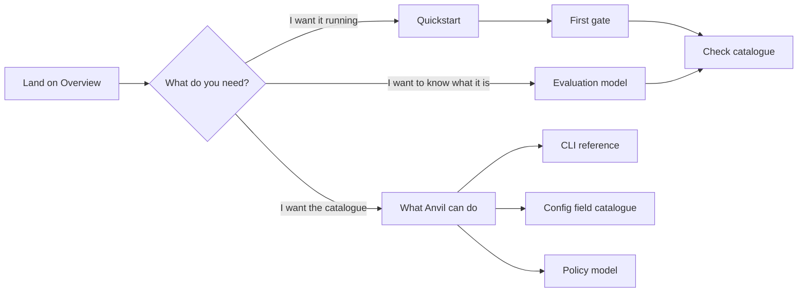
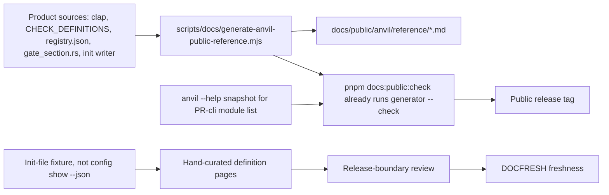
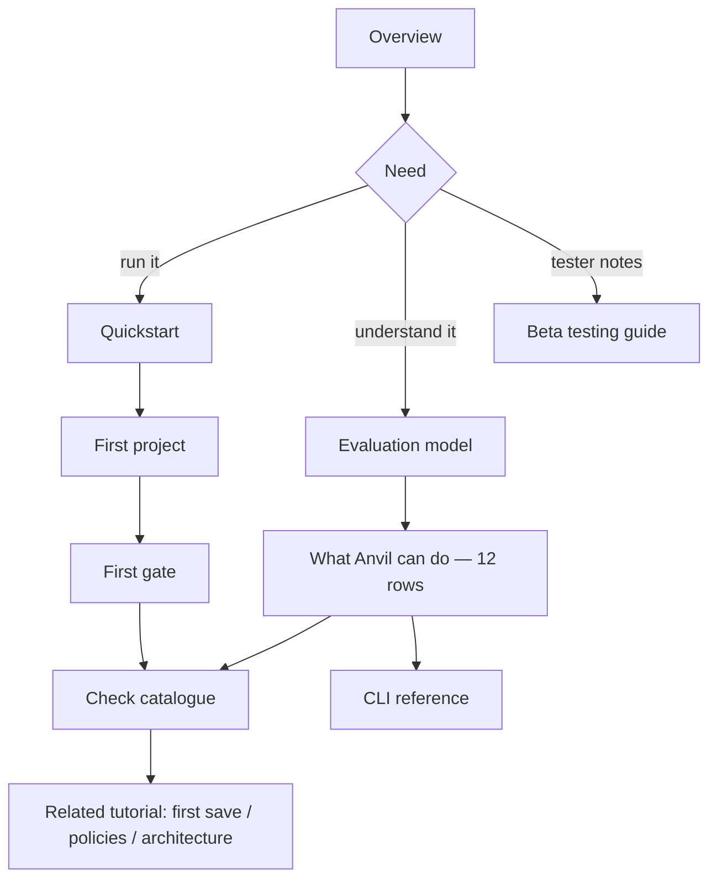
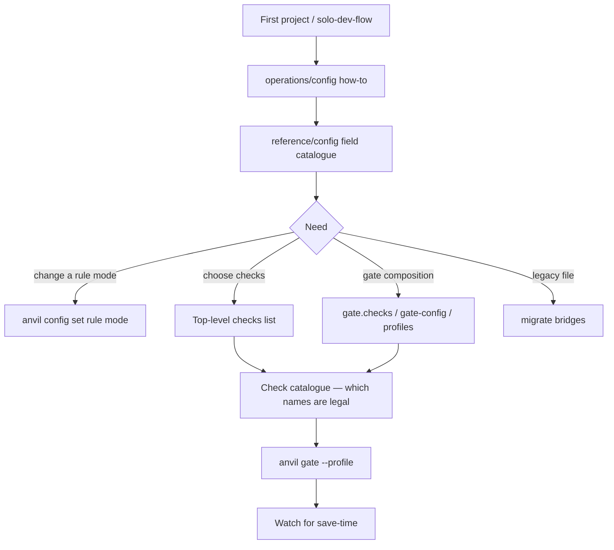
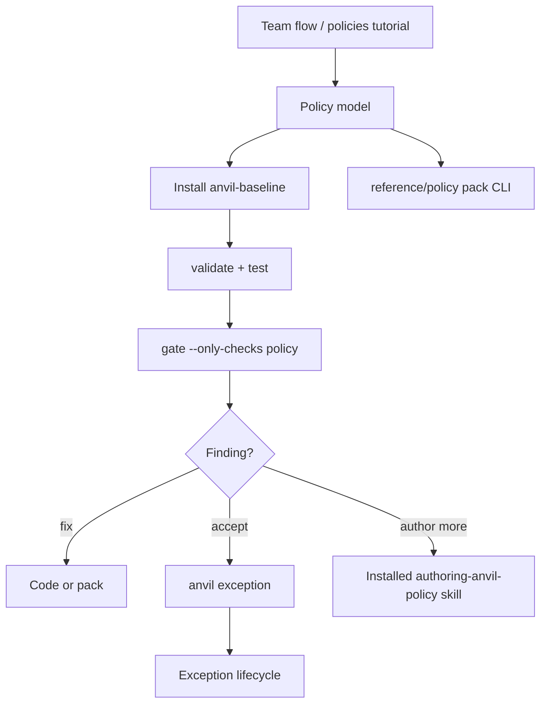

# Product documentation: journey layer and definition layer

| Type | Authority | Owner | Status | Freshness |
| ---- | --------- | ----- | ------ | --------- |
| Spec | Authoritative for DOCDEF design and the DOCRB-011 live-nav split | [DOCDEF](../modules/docs-definition-layer.aps.md), [DOCRB](../modules/docs-rebaseline.aps.md) | Accepted | 2026-08-19 — operator-approved after design review |

| Upstream | Downstream |
| -------- | ---------- |
| `docs/guides/documentation-governance.md`; [ADR-123](../decisions/123-documentation-authority-and-diagram-model.md); [ADR-108](../decisions/108-policy-authoring-lint-and-agent-guidance.md); `apps/anvil-docs-private/sidebars/anvil.ts`; `scripts/docs/generate-anvil-public-reference.mjs`; `docs/architecture/quality-model.md`; `crates/anvil-cli/src/commands/check_catalog.rs`; `plans/specs/2026-08-16-docs-rebaseline.md` | `plans/modules/docs-definition-layer.aps.md`; `plans/modules/docs-rebaseline.aps.md` (DOCRB-011); `docs/public/anvil/**`; `apps/anvil-docs-private/sidebars/anvil.ts` |

**Execution authority** is the DOCDEF work-item set plus DOCRB-011. This
specification records the approved information architecture and product
surface map. It is not a release claim.

## Overview

A new beta tester reported that Anvil's public docs are all high-level and do not explain what the product actually does. That reading is fair. After DOCSYNC-028's first-time-user rebuild, the **live** sidebar (`apps/anvil-docs-private/sidebars/anvil.ts`) is almost entirely journeys: overview, quickstart, tutorials, and three how-to guides. The definition layer — every check, every config key we can honestly catalogue, the check-versus-scan-versus-gate model, the policy lifecycle, and a complete command/flag/schema reference — is either missing or already written and hard to find from live nav.

This is not a total absence of links. Overview already points at the glossary and support matrix; troubleshooting and upgrade-notes point at the CLI page; config and the rust-project tutorial point at rules. The smoking gun is **live navigation plus missing models**: a tester following the live sidebar never reaches a manual, and no public page states the planless `anvil check` subset or the evaluation hierarchy in user language.

This programme keeps the journey layer and adds a first-class definition layer. It does not replace tutorials with a manual. It makes the manual findable, generated where the product already has a single source of truth, and hand-curated where it does not.

The first **tester-visible** increment is deliberately small and is **not** a content dump:

1. **Bookkeeping branch** — exclusive DOCDEF module + index row, internal product-surface-map spec, and a DOCRB item that splits live IA/nav off DOCRB-008 (diagrams stay on 008).
2. **PR-nav (DOCRB)** — live sidebar + unhide already-written pages using front-matter IDs + overview doors. No new prose.
3. **PR-eval (DOCDEF)** — one evaluation-model page (including the approved check-versus-scan wording below) and a **short** “What Anvil can do” index with a hard row cap.

Later PRs deepen the generator and fill remaining definition pages.

---

## Background and motivation

### What the live sidebar publishes

`apps/anvil-docs-private/sidebars/anvil.ts` currently publishes:

| Sidebar category | Pages | Character |
| --- | --- | --- |
| Overview | `overview`, `when-to-use` | Three-minute pitch |
| Quickstart | `quickstart`, `first-project`, `first-gate` | First-hour path |
| Tutorials | six tutorial pages | Task walkthroughs |
| Core Concepts | `plans`, `gates`, `sessions`, `audit-trail` | Short how-tos, not models |
| Guides (collapsed) | `solo-dev-flow`, `team-flow`, `agent-harness` | Journeys |
| Integrations (collapsed) | `github`, `vscode`, `mcp` | How-to |
| Operations (collapsed) | `config`, `security`, `troubleshooting` | How-to / migrate |
| Release Notes (collapsed) | `changelog`, `upgrade-notes` | Release |

That is Diátaxis **tutorial + how-to** with almost no **reference + explanation** on the live host.

### Rollback nav is prior IA, not the live host

`apps/docs-site/sidebars/anvil.ts` is the **rollback** sidebar (`apps/docs-site` is rollback only; ADR-123). It already has a Reference category and lists most of the pages the live sidebar hides, using the **front-matter IDs**:

| Live/rollback slug | Front-matter `id` | File |
| --- | --- | --- |
| `reference/cli-reference` | `cli-reference` | `docs/public/anvil/reference/cli.md` |
| `reference/rule-reference` | `rule-reference` | `docs/public/anvil/reference/rules.md` |
| `reference/support-reference` | `support-reference` | `docs/public/anvil/reference/support.md` |
| `integrations/agent-skills` | `agent-skills` | `docs/public/anvil/integrations/skills.md` |

`scripts/docs/check-public-docs.mjs` currently validates navigation against **`apps/docs-site/sidebars/anvil.ts`**, not the live private sidebar. That is why pages can exist without `public_unlisted: true` and still be invisible to a beta tester on the live host. Changing only `apps/anvil-docs-private/sidebars/anvil.ts` will not be enforced until the nav check points at the live sidebar (or a second check is added). Treat the rollback sidebar as **prior IA to reuse** (IDs, which pages are already written), not as out-of-scope trivia. Keep dashboard off the **live** nav even though rollback still lists `guides/dashboard`.

### Pages that exist and are not on the live sidebar

These files live under `docs/public/anvil/` and are **not** listed in `apps/anvil-docs-private/sidebars/anvil.ts`. Some are reachable from in-body links; none are first-class live-nav entries:

| Path | Front-matter `id` | Kind today |
| --- | --- | --- |
| `docs/public/anvil/reference/cli.md` | `cli-reference` | Generated top-level command table (CLICT; verified 0.9.6-beta). Tells the reader to run `--help` for flags. |
| `docs/public/anvil/reference/rules.md` | `rule-reference` | Generated compiled pattern registry only (49 enabled rules / 11 families). Explicitly not secrets, architecture, policy, command-safety, or other gate checks. |
| `docs/public/anvil/reference/support.md` | `support-reference` | Generated languages, targets, clients. |
| `docs/public/anvil/concepts/glossary.md` | (filename) | Sixteen one-line terms. No scan, no audit-versus-check, no config, no rule-versus-check. |
| `docs/public/anvil/concepts/review-capsules.md` | | Concept page, not on live nav. |
| `docs/public/anvil/guides/save-time-validation.md` | | How-to, not on live nav. |
| `docs/public/anvil/guides/dashboard.md` | | Flag-gated CLI surface. DASH / DASHCORE are **merged modules** pending release evidence; the CLI still defaults off (`web_dashboard_access_allowed()`). Keep **off live nav**. |
| `docs/public/anvil/guides/insights.md` | | How-to, not on live nav. Local-only wording required. |
| `docs/public/anvil/guides/ai-guardrail-demo.md` | | Demo, stay off-nav. |
| `docs/public/anvil/guides/ai-guardrail-profile.md` | | Demo, stay off-nav. |
| `docs/public/anvil/guides/start-output-contracts.md` | | Contract page, P2 / off-nav for now. |
| `docs/public/anvil/guides/wow-start-demo.md` | | Demo, stay off-nav. |
| `docs/public/anvil/integrations/skills.md` | `agent-skills` | Integration, not on live nav. |
| `docs/public/anvil/integrations/watch-output.md` | | Integration, not on live nav. |
| `docs/public/anvil/operations/git-hooks.md` | | Operations, not on live nav. |
| `docs/public/anvil/operations/telemetry.md` | | Operations, not on live nav. |
| `docs/public/anvil/operations/uninstall.md` | | Operations, not on live nav. |
| `docs/public/anvil/releases/rust-rewrite.md` | | Historical release note, not on live nav. |
| `docs/public/anvil/beta-testing-guide.md` | | Beta operator page, not on live nav. |
| `docs/public/anvil/tutorials/developer-acceleration.md` | | Intentional `public_unlisted: true` stub. **Out of scope** for this programme. |

### Current page character (too high-level)

- `docs/public/anvil/overview.md` — three-minute "what Anvil does". Defines check / finding / gate in one line each. No check catalogue. No scan distinction. Mentions when Anvil runs (pre-write / save-time) without definition homes.
- `docs/public/anvil/concepts/gates.md` — titled "Checks, findings, and gates" but is a short how-to (`anvil check`, `anvil gate --profile`), not a model. It already slips into scan language (`anvil check` as a "file-focused scan") without defining the term. It already documents warn-only surfaces and `--fail-on-warnings`.
- `docs/public/anvil/operations/config.md` — UCFG-owned migrate / `config show` / `config set --help` / convert page, **titled "Configuration reference" today**. Not a field catalogue. Already documents `antipattern.exclude`.
- `docs/public/anvil/reference/cli.md` — generated top-level `enum Commands` table. No subcommands, no flags except a special case for `start`.
- `docs/public/anvil/tutorials/policies.md` — install `anvil-baseline`, validate, test, `gate --only-checks policy`. Not a policy model and not an authoring guide.

### Internal authority that never reached users

| Internal document | What it owns | Why it must not be copied onto the public site |
| --- | --- | --- |
| `docs/architecture/quality-model.md` | Check / finding / gate / scan / boundary / graph, and the roles of `check`, `gate`, `watch`, `doctor`, `audit`, `architecture`, `policy` | Internal conceptual architecture. Public docs derive a user-facing explanation from it and must **quote** the approved public wording in this design rather than paraphrase the internal model. |
| `docs/guides/anvil-rule-authoring.md` | Rule authoring | Contributor / agent surface, not a beta-tester manual. |
| `docs/guides/custom-architecture-policies.md` | Architecture policy authoring | Internal. Public page covers the user-visible boundary model only. |
| `docs/guides/policy-validation.md` | Policy validation internals | ADR-108: comprehensive Rego / agent authoring is CLI/MCP-routed and excluded from the public docs build. |
| `docs/guides/command-safety-configuration.md` | Command-safety configuration | Internal. Public check page cites the user-visible behaviour only. |
| `docs/guides/policy-exceptions.md` | Exception model internals | Public exception page covers the `anvil exception` lifecycle only. |
| `docs/guides/documentation-governance.md` | Authority model, Diátaxis, hosting | Contributor contract. Public site does not link into `docs/guides/**`. Public IA is assigned to **DOCRB**. |

### The generator is already the right seam, and it is too thin

`scripts/docs/generate-anvil-public-reference.mjs` is the only public-docs generator. It currently emits **only**:

1. `docs/public/anvil/reference/cli.md` — top-level `enum Commands` in `crates/anvil-cli/src/main.rs`, plus `start` flags from `crates/anvil-cli/src/commands/start.rs`, plus exit codes.
2. `docs/public/anvil/reference/rules.md` — compiled pattern registry (`patterns/compiled/registry.json`). Not the check catalogue.
3. `docs/public/anvil/reference/support.md` — languages, targets, clients.

It does **not** generate subcommands, per-command flags, config keys, or the check catalogue in `crates/anvil-cli/src/commands/check_catalog.rs`.

`pnpm docs:public:check` already runs the generator in `--check` mode. New generator outputs must join that existing hook; do not invent a second CI path.

Kindling's `docs/public/kindling/reference/config.md` is the **page-structure** quality bar (defaults, resolution order, `verified_against`). It is **not** a schema analogue: Kindling is configured by flags and environment variables and has no project config file. Do not imitate its "there is no config file" framing on Anvil pages.

### Hosting and governance constraints

- Public/user Anvil docs live in `docs/public/anvil/**`.
- Live host: `apps/docs-shell` proxies `apps/anvil-docs-private` (gated Anvil / beta) and `apps/docs-public` (APS / Kindling / edda-stack). Truth: `infra/src/vercel.ts`, ADR-123. `apps/docs-site` is rollback only.
- Public IA is supposed to be Diátaxis (tutorial / how-to / reference / explanation) per `docs/guides/documentation-governance.md`, and **DOCRB owns that IA**.
- ADR-108: comprehensive agent / Rego authoring guidance is CLI/MCP-routed and **excluded from the public docs build**. Public policy docs may explain that the installed skill and routed commands exist; they must not mirror or link the comprehensive agent reference bundle.
- Related APS (do not edit from this draft):
  - **DOCSYNC** — exclusive; file `plans/modules/documentation-sync.aps.md`. Public content; remaining drafts include API ref (005), dashboard (011), multi-language (013), VS Code / CI divergence (016). **Not** a shared multi-writer module.
  - **DOCRB** — exclusive; owns public IA refresh and diagrams. 001/002 Merged, 003/004 still Draft. DOCRB-008 (Draft) owns `docs/public/**` navigation plus curated diagrams.
  - **DOCFRESH** — freshness.
  - **DSITE** — legacy host.
  - **CLICT** — CLI command truth.
  - **UCFG** — unified config.
  - **CIB** — the **only** shared multi-writer module today (`plans/project-context.md` §Keeping Plans Current).

---

## Goals and non-goals

### Goals

1. Keep and improve the journey layer (quickstart, first-gate, tutorials, solo / team / harness flows).
2. Add a first-class definition layer: reference pages that name every shipped user-visible object, and explanation pages that define the product model.
3. Make both layers discoverable from the **live** sidebar and from each other (bidirectional links).
4. Publish a user-facing evaluation model that states the planless `anvil check` subset, quotes the approved check-versus-scan wording, and covers gate profiles, warn-only surfaces, and when Anvil runs.
5. Publish a **generated** check catalogue for all engines in `CHECK_DEFINITIONS`, not only the anti-pattern rule registry, without hand-copying descriptions into this spec or the public page.
6. Publish an honest config-field catalogue extracted from writers and readers, not from `anvil config show --json`.
7. Extend the existing generator so CLI depth and the check catalogue stay fresh via the existing `docs:public:check` hook.
8. Scope the first tester-visible work so nav flips without a prose dump, and evaluation-model ships as its own DOCDEF PR.

### Non-goals

1. Do not replace journeys with a manual. Both layers stay.
2. Do not publish the ADR-108 Rego / agent authoring corpus on the public site. Do not treat `anvil policy list` / `explain` as pack authoring. Do not invent `anvil policy lint`.
3. Do not put APS, ADR process, council, CIB, FLAGCAT internals, or contributor workflow on the public site. Beta testers are product users.
4. Do not document unshipped or flag-off surfaces as generally available. Dashboard stays off live nav (modules merged, CLI still flag-gated). `admin` is a one-line CLI mention.
5. Do not invent a complete typed `.anvil.yaml` JSON Schema. UCFG parses as JSON `Value`. The catalogue is extracted, cited, and labelled incomplete where the parser is open.
6. Do not tell users to add surface checks (`sql-migrations`, `github-actions`, `dockerfile`, `shell-scripts`) via the top-level `checks:` list. Those are flag-driven. They **are** shipped (default-on in gate) and belong on the public index with a status badge.
7. Do not restyle Kindling, APS, or edda-stack docs in this programme.
8. Do not copy `docs/architecture/quality-model.md` or `docs/guides/**` onto the public site.
9. Do not edit the shared multi-writer module (**CIB**) from feature PRs. Do not stuff this programme into DOCSYNC. DOCSYNC is exclusive, not shared multi-writer.
10. Do not silently dual-own public IA. Live sidebar changes are a **DOCRB** item.

---

## Proposed design

### Two-level information architecture

Diátaxis already names the four intents. This programme groups them into two reader-facing layers:

| Layer | Diátaxis intents | Job | Sidebar home |
| --- | --- | --- | --- |
| **Journey** | Tutorial + how-to | Get a result in a context (first hour, first save, first gate, solo week, team policy, CI) | Overview, Quickstart, Tutorials, Guides, Integrations, Operations |
| **Definition** | Reference + explanation | Name an object and say exactly what it is, what it is not, and where the product implements it | Concepts (explanation) + Reference (catalogue) |

Every journey page ends with "Related definitions" links. Every definition page ends with "Try it" links back to the relevant tutorial or guide. Neither layer restates the other.



### Reader start-here

A beta tester landing on the live site today is offered a story and never a manual. Change the start-here contract:

1. `docs/public/anvil/overview.md` keeps the three-minute pitch, then adds two equal doors: **Start using Anvil** (Quickstart) and **Look up what Anvil does** (live Reference pages that already exist after PR-nav; then evaluation-model + short index after PR-eval).
2. A new Reference category is **expanded by default** (rollback has it collapsed). It is the manual.
3. Concepts stays expanded and, once PR-eval lands, leads with `concepts/evaluation-model`.
4. `docs/public/anvil/beta-testing-guide.md` is added to Overview so invited testers can find the operator page.



### Sidebar target (live host)

Proposed `apps/anvil-docs-private/sidebars/anvil.ts` shape. Slugs are **Docusaurus IDs**, copied from front matter or from `apps/docs-site/sidebars/anvil.ts`.

Items marked **unhide** already exist on disk. There is **no** `concepts/checks-and-scans` page: Q5 is decided — one `evaluation-model` page.

```text
Overview (expanded)
  overview
  when-to-use
  beta-testing-guide                          unhide (PR-nav)

Quickstart (expanded)
  quickstart
  first-project
  first-gate

Tutorials (expanded)
  (unchanged six pages; developer-acceleration stays public_unlisted)

Concepts (expanded)
  concepts/evaluation-model                   new   PR-eval
  concepts/glossary                           unhide PR-nav; small term adds in PR-eval
  concepts/gates                              link-only in PR-eval; rewrite in a later DOCDEF PR
  concepts/baseline                           new   PR-policy
  concepts/policy-model                       new   PR-policy
  concepts/boundaries                         new   PR-policy
  concepts/plans
  concepts/sessions
  concepts/audit-trail
  concepts/review-capsules                    unhide PR-policy

Reference (expanded)                          new live category (PR-nav)
  reference/what-anvil-can-do                 new   PR-eval  (hard row cap; see below)
  reference/cli-reference                     unhide PR-nav; deepen PR-cli
  reference/checks                            new   PR-checks  (generated)
  reference/rule-reference                    unhide PR-nav
  reference/config                            new   PR-config  (file reference/config.md, id: config)
  reference/support-reference                 unhide PR-nav
  reference/policy                            new   PR-policy

Guides (collapsed)
  guides/solo-dev-flow
  guides/team-flow
  guides/agent-harness
  guides/save-time-validation                 unhide PR-links
  guides/insights                             unhide PR-links; local-only wording
  (dashboard, wow-start-demo, ai-guardrail-*, start-output-contracts stay off live nav)

Integrations (collapsed)
  integrations/github
  integrations/vscode
  integrations/mcp
  integrations/agent-skills                   unhide PR-links (id is agent-skills, not skills)
  integrations/watch-output                   unhide PR-links

Operations (collapsed)
  operations/config                           keep as how-to; rename title in PR-config
  operations/security
  operations/troubleshooting
  operations/git-hooks                        unhide PR-links
  operations/telemetry                        unhide PR-links
  operations/uninstall                        unhide PR-links

Release Notes (collapsed)
  releases/changelog
  releases/upgrade-notes
  releases/rust-rewrite                       unhide P2
```

This tree **reuses rollback IDs** and keeps the live journey grouping from DOCSYNC-028. It is not a paste of the rollback tree (see Alternatives 4 and 5).

`concepts/gates.md` is **not** deleted. PR-eval adds a link to the evaluation-model page. A later DOCDEF PR rewrites `gates.md` so the how-to examples move to Quickstart / first-gate and the concept page describes the judgement model, warn-only surfaces, and profiles.

`operations/config.md` stays the UCFG how-to (inspect, convert, migrate). Its documentId is `operations/config` and does **not** collide with the catalogue. When the catalogue lands, **rename** the operations page title from "Configuration reference" to "Inspect and migrate configuration" so two pages are not both called reference. They link to each other.

Pinned catalogue contract (use this pair everywhere; do not invent `config-fields`):

| Piece | Value |
| --- | --- |
| File | `docs/public/anvil/reference/config.md` |
| Front-matter `id` | `config` |
| Live sidebar item | `reference/config` |
| Operations how-to | `operations/config` (documentId `operations/config`) |

### Minimum definition layer

Six definition artefacts are in scope. Nothing else is required to call the programme successful.

| # | Artefact | Public path | Source of truth | Generation |
| --- | --- | --- | --- | --- |
| 1 | Evaluation model | `docs/public/anvil/concepts/evaluation-model.md` | This design's outline + approved wording; internal `quality-model.md` is upstream only | Hand-written in PR-eval; reviewed at release boundary against the internal model |
| 2 | Check catalogue (all engines) | `docs/public/anvil/reference/checks.md` | `CHECK_DEFINITIONS` in `check_catalog.rs` + explicit surface-flag table | Extend `generate-anvil-public-reference.mjs` |
| 3 | Config field catalogue | `docs/public/anvil/reference/config.md` (`id: config`; sidebar `reference/config`) | Init writer, `gate_section.rs`, migrate/discover, tests, **file** `anvil init` writes | Hand-curated, source-cited, until UCFG publishes a typed schema |
| 4 | Full CLI (commands + subcommands + flags) | `docs/public/anvil/reference/cli.md` (`id: cli-reference`) and per-family pages if needed | clap under `crates/anvil-cli/src/main.rs` and scoped command modules | Extend the existing generator + help-snapshot check |
| 5 | User-visible policy model | `docs/public/anvil/concepts/policy-model.md` + `docs/public/anvil/reference/policy.md` | Pack CLI in `commands/policy/mod.rs`, starter pack, `anvil exception`, ADR-108 skill door | Hand-written lifecycle; pack-command table generated with the CLI generator |
| 6 | Architecture / boundary reference | `docs/public/anvil/concepts/boundaries.md` | Quality-model "boundary" term + `anvil architecture` / `import-boundaries` | Hand-written; links to the architecture tutorial and the check page |

#### 1. Evaluation model (user-facing, not a copy)

**Q5 is decided:** P0 ships **one** page, `concepts/evaluation-model.md`. There is no `concepts/checks-and-scans` page.

##### Required page outline (implement this, do not invent another)

```text
# How Anvil evaluates a project
## What you are looking at
## The four nouns testers mix up
### Check
### Finding
### Gate
### Scan
## Commands versus the model
### `anvil check` is planless and narrow
### `anvil gate` is the merge decision
### Watch, doctor, audit, architecture, policy, baseline
## Gate profiles
## Warn-only surfaces and `--fail-on-warnings`
## When Anvil runs (pre-write, save-time, daemon, witness)
## Honesty rules and known gaps
## Try it
## Related definitions
```

##### Approved public wording — check versus scan

The public page **must quote these sentences**, not paraphrase `docs/architecture/quality-model.md`. Light connective tissue around them is allowed; replacing them is not.

1. A **check** is the smallest thing Anvil evaluates: one concern, one name you can put in `checks:` or `--only-checks`.
2. A **scan** is how evidence is gathered for a check, not a second product object and not a command you choose instead of `check` or `gate`.
3. The command `anvil check` is a planless command that happens to say "scan" in its `--help` text; that wording names the method, not a type of result.
4. `antipattern-scan` is a **check name** — the engine that runs the compiled rule catalogue — even though the word "scan" appears in the name.
5. `anvil check` runs only the planless-eligible pair `secret-detection` and `antipattern-scan`.
6. Other engines listed in `.anvil.yaml` (`import-boundaries`, `policy`, `command-safety`, `lint`, `test`, `coverage`, `dependency`, and the surface checks) are ignored by `anvil check` and run under `anvil gate`.
7. A **gate** is the workflow judgement over one or more checks: can this change advance or merge?
8. `welcome` has its own discovery pass that honours `.gitignore`; that pass is not a check, and other commands do not follow that gitignore rule.
9. When CLI help says "scan files", read it as the check command gathering evidence, not as a third noun beside check and gate.
10. Findings from the four warn-only surfaces (`dockerfile`, `shell-scripts`, `sql-migrations`, `github-actions`) and warning-severity anti-pattern findings do not fail `anvil gate` unless you pass `--fail-on-warnings` or set `ANVIL_FAIL_ON_WARNINGS`.

##### Planless `anvil check` subset (first-class honesty rule)

Authority: `PLANLESS_ELIGIBLE_CHECKS` in `crates/anvil-cli/src/commands/check.rs`.

| Command | Engines it will run | What it ignores |
| --- | --- | --- |
| `anvil check` | Only `secret-detection` and `antipattern-scan` | Every other catalogue engine, **even if** it appears in top-level `checks:`. Unknown / non-planless entries are silently ignored. |
| `anvil gate` | The gate set: init-default checks, other `checks:` entries that are gate-supported, and default-on surface checks behind `track.surface.*` | Engines the profile / `--only-checks` / `--skip-checks` exclude |

Planless-eligible means the check operates on the supplied file list and needs no profile, policy bundle, or project-level config beyond the source itself. `import-boundaries` / alias `architecture`, `policy`, `command-safety`, `lint`, `test`, `coverage`, and `dependency` require config, a toolchain, or a profile, and live under `anvil gate`.

"Check is the smallest unit of evaluation" does **not** mean "`anvil check` runs every check."

##### Other terms (user-facing)

| Term | User-facing definition | Must not be used as |
| --- | --- | --- |
| **Finding** | The generic result a check emits (warning, violation, error, or informational). | A command to apply a suggested edit. |
| **Boundary** | A declared structural dependency constraint. Prefer this word over "architecture" in user language. | Interchangeable with the `architecture` CLI or the `import-boundaries` alias. |
| **Graph** | Anvil's structural understanding of the project. Second-step teaching concept. | A user-facing command they must learn on day one. |
| **Baseline** | The record of findings accepted when Anvil was introduced. Later gates compare against it. | A check. |
| **Rule** | One compiled anti-pattern pattern (`reference/rule-reference`). Belongs to the `antipattern-scan` check. | Interchangeable with check, or with an OPA pack. |
| **Gate profile** | A named bundle of checks and thresholds for a context. Shipped names: `dev`, `ci`, `production`, `ai` (`PROFILES` in `crates/anvil-cli/src/commands/gate.rs`). | A check, or a synonym for `.anvil.yaml`. |
| **Pre-write validation** | The daemon / intercept path that evaluates a write **before** it lands (MCP `anvil_validate_write` / apply-patch). | `anvil check` or `anvil gate`. |
| **Save-time validation** | The watch / hook path that evaluates after a save. | A merge gate. |
| **Daemon** | The local process that keeps protection on (daily ensure / start / intercept). | A check engine. |
| **Protection state** | Whether that local process is armed for the project. | A gate verdict. |
| **Witness** | Evidence that a protected action ran (audit trail / capsule / hook). | A finding. |

##### Surfaces, as the public page must describe them

| Surface | Role | Default posture |
| --- | --- | --- |
| `anvil check` | Planless, file-list analysis. Runs **only** `secret-detection` and `antipattern-scan`. | Not a merge decision. |
| `anvil gate` | Workflow judgement. CI / merge readiness. Runs the full gate set, including surface checks. | The only surface that answers "may this advance?" |
| `anvil watch` | Continuous mode. Default action is `check` (therefore the planless pair). `--action gate` or `--action none` exist. | Not itself a check. |
| `anvil doctor` | Setup / environment health. | Not a gate. |
| `anvil audit` | Broader exploratory reporting over findings. | Not a merge decision. |
| `anvil architecture` | Structure definition. | Enforcement is still a check (`import-boundaries`). |
| `anvil policy` | Pack install / validate / test / eval subsystem. | Policy is one family of **gate** checks (`policy`). |
| `anvil baseline` | Record of accepted existing findings. | Not a check. |

Honesty rule: implementation is still converging. Some checks exist in analysis before full gate wiring. Docs call the gap out (catalogue columns `gate` and `gate-config`). Docs do not invent a second dialect.

#### 2. Check catalogue

Generate `docs/public/anvil/reference/checks.md` from the `CHECK_DEFINITIONS` array in `crates/anvil-cli/src/commands/check_catalog.rs`. **Do not hand-copy descriptions** into this design or into a hand-written public table. The generator emits `description` from the struct field.

**Parser contract**

- Input: the `CHECK_DEFINITIONS: &[CheckDefinition] = &[ ... ]` array only.
- Read struct fields: `stable_id`, `canonical_name`, `aliases`, `description`, `init_enabled`, `init_visible`, `gate_supported`, `gate_config_supported`.
- Do **not** parse `//` comments for flag names, file-shape rationale, or default-on claims. Comments in that file have already drifted relative to any human transcript.
- Surface-flag identifiers come from an **explicit** source, not comment prose:
  - Prefer a code symbol in the Track 3 / feature-flag registry (implementation locates the module that defines `track.surface.sql` and siblings).
  - If no single typed table exists, ship a four-row `SURFACE_CHECK_FLAGS` table **inside the generator**, each row citing the flag module path in a comment, and fail the generator if a `gate_config_supported: false` definition has no row.

Seed rows for that explicit table (verify against the flag module when implementing; do not invent new names):

| `canonical_name` | Flag id | Session opt-out |
| --- | --- | --- |
| `sql-migrations` | `track.surface.sql` | `ANVIL_TRACK_SURFACE_SQL=0` |
| `github-actions` | `track.surface.gha` | `ANVIL_TRACK_SURFACE_GHA=0` |
| `dockerfile` | `track.surface.dock` | `ANVIL_TRACK_SURFACE_DOCK=0` |
| `shell-scripts` | `track.surface.sh` | `ANVIL_TRACK_SURFACE_SH=0` |

**Generated columns:** stable ID, canonical name (primary), aliases, description (from struct), init enabled, init visible, gate, gate-config, selection (`checks:` list **or** feature flag).

**Also emit, as generated call-outs, not hand prose:**

- Init-default set from `DEFAULT_INIT_CHECKS`: `secret-detection`, `import-boundaries`, `antipattern-scan`.
- Planless set (hard-coded in the generator from `PLANLESS_ELIGIBLE_CHECKS`, with a source citation to `check.rs`): `secret-detection`, `antipattern-scan`.
- Surface checks are **shipped-with-flag-status**: default-on in `anvil gate`, not list-editable, warn-only unless `--fail-on-warnings`.

`reference/rules.md` (`id: rule-reference`) remains the anti-pattern **rule** catalogue and must open with one generated sentence: these rules are the body of the `antipattern-scan` check, not the list of Anvil checks.

Per-check definition pages are P2. PR-checks ships the generated catalogue using template B as **sections on that one page**.

#### 3. Config field catalogue — honest extraction, no fake schema

`crates/anvil-config` parses configuration as a JSON `Value`. There is **no** single exhaustive typed schema published. The public page must say that in the first screen.

`anvil config show --json` returns `{ config, rule_modes, note }` where `config` is the discovered **file label** (or `"defaults"`), **not** the parsed document. It is **not** a key census. Keep it only as documentation of the inspection contract (label + four rule modes + deprecation note).

**How we extract a complete-enough catalogue**

1. List keys **written** by the init / wizard writer (`crates/anvil-cli/src/commands/init.rs` writes `schema_version`, `planning_dir`, `format`, and `checks`).
2. List keys **read** by `crates/anvil-config/src/gate_section.rs` and the discover / migrate path.
3. List keys asserted in `crates/anvil-config` and `crates/anvil-cli` tests.
4. Capture a fixture of the **file** `anvil init` writes (the on-disk `.anvil.yaml`, not `config show --json`).
5. Include keys already documented on `operations/config.md`, including `antipattern.exclude`.
6. Cross-check clap for `config` / `migrate` / `gate-config`.
7. Publish the union, each row citing the source file or the init-file fixture.
8. End the page with "Not in this catalogue": unknown keys the open parser accepts and ignores, flag-driven surface checks, and anything not observed in the sources above.

Known keys (seed; the PR-config page is the living catalogue):

| Key | What it is | Source to cite | Notes |
| --- | --- | --- | --- |
| File name | Canonical `.anvil.yaml`; also `.yml` / `.json` / `.toml`. Legacy `.anvilrc` is read-only fallback. | discover path, `operations/config.md` | `anvil init` writes `.anvil.yaml` by default. |
| Key case | `snake_case` on write. Legacy camelCase accepted on read. | `crates/anvil-config/src/migrations.rs` | `schemaVersion` → `schema_version`, `planningDir` → `planning_dir`. |
| `schema_version` | File schema version. | init writer | Do not invent allowed values beyond what init writes and migrate understands. |
| `planning_dir` | Planning-file directory. | init writer | |
| `format` | Output format default. | init writer | Cite the enum the CLI actually accepts. |
| `checks` | Top-level check **selection** list. | init writer, gate section | Canonical names. Surface checks must not be documented as list-editable. `anvil check` still ignores non-planless names. |
| `antipattern.exclude` | Workspace-relative globs skipped by the anti-pattern engine only. | `operations/config.md` | Secret detection still inspects those files. Applies to `check` and `gate`. |
| `architecture.source` | Recorded after `anvil migrate architecture`. | `operations/config.md` | Standalone `.anvil/architecture.yaml` remains a legacy fallback. |
| `gate.version` | Gate-section version. | `gate_section.rs` | |
| `gate.thresholds` | Reserved, unused. | `gate_section.rs` | Document as reserved. Do not describe behaviour. |
| `gate.global_config` | Gate-wide settings table. | `gate_section.rs` | Catalogue only keys tests and the reader recognise. |
| `gate.checks` | Per-check tables. Key presence is selection **only when** top-level `checks` is absent or empty. | `gate_section.rs` | Unknown keys inside `gate` are ignored. A malformed `gate` section is a loud error on `gate` and `check`. |
| Rule-mode tables | Four named rules, three modes. | `crates/anvil-cli/src/commands/config.rs` | See below. |

`anvil config` subcommands (`crates/anvil-cli/src/commands/config.rs`):

| Subcommand | Behaviour | Document as |
| --- | --- | --- |
| `show` | Prints effective config. `--json` returns `{ config, rule_modes, note }` where `config` is the file **label**. | The inspection surface. Not a key dump. |
| `set <rule> <mode>` | Sets **rule modes only**, not arbitrary keys. Rules: `public-api-expansion`, `new-dependency-introduction`, `cross-layer-violation`, `privilege-expansion`. Modes: `off`, `warn`, `enforce`. | Current product behaviour. Also a UCFG UX gap — see Open questions. |
| `convert --to` | Rewrites format. | Journey stays on `operations/config.md`. |

Bridges already documented on the operations page stay there: `anvil migrate format\|schema\|gate-config\|architecture`; doctor checks `config-variants` / `config-valid`.

Page-structure pattern to imitate (not the schema): Kindling `reference/config.md` — defaults, resolution order, `verified_against`.

#### 4. CLI reference depth

Keep `docs/public/anvil/reference/cli.md` (`id: cli-reference`) as the generated index. Extend `scripts/docs/generate-anvil-public-reference.mjs` so each public command grows:

- subcommands;
- flags and their help text;
- inherited / global flags once (`GlobalArgs`), not copied onto every command;
- hidden clap commands remain unpublished (`hide = true`);
- hidden aliases (`login` / `logout` / `whoami`, `graph-base`) are not public command pages.

If the single page becomes unreadable, the generator may emit `docs/public/anvil/reference/cli/<command>.md` plus the index.

**PR-cli module scope** (parse these; do not "walk the commands directory" as an open-ended task):

| Priority | Modules |
| --- | --- |
| P0 in PR-cli | `main.rs` (`enum Commands`, `GlobalArgs`, exit codes), `commands/start.rs` (already parsed), `check.rs`, `gate.rs`, `config.rs`, `watch.rs`, `doctor.rs`, `init.rs`, `policy/mod.rs` |
| P1 in the same PR if the parser is general | `migrate.rs`, `architecture` module, `baseline`, `exception`, `hooks` / `hook`, `mcp` / `mcp-config`, `skill.rs` |
| Explicitly out of PR-cli prose pages | `admin` (index row only), `dashboard` (index row, marked flag-gated) |

**Help-snapshot check is in scope for PR-cli**, not optional. On the tagged public release (or in `docs:public:check` against a built binary when the repo already has that fixture pattern), run `anvil <command> --help` for the P0 module list and fail if the rendered page disagrees with help text. This is a **check**, not the only generator. Default generation remains clap-source parse (Q3 Option A).

`admin` stays in the top-level table as "administrators only". `dashboard` stays labelled flag-gated.

#### 5. User-visible policy model

**Pack lifecycle** (this is the P1 policy page). Matches `tutorials/policies.md` plus exceptions:

| Step | Command | Public meaning |
| --- | --- | --- |
| Discover packs | `anvil policy install --list` | What can be installed. Not `anvil policy list`. |
| Inspect a pack | `anvil policy show` | What a pack contains. |
| Install | `anvil policy install` | Writes under `.anvil/policies/`. |
| Validate | `anvil policy validate` | Manifest / pack well-formedness. |
| Test | `anvil policy test` | Pack tests. |
| Enforce | `anvil gate --only-checks policy` | Policy is a **gate check**. `anvil check` will not run it. |
| Exceptions | `anvil exception` | Recorded exceptions to a policy finding. |

Starter pack, already shipped: `crates/anvil-cli/src/commands/policy/starter_packs/anvil-baseline/` (`pack.yaml`, `change_scope.rego`, `sensitive_paths.rego` + tests). Public docs may name the pack and the install path. They may not reproduce the Rego as an authoring tutorial unless Q1 Option B is later accepted.

**Not pack authoring (do not teach these as the authoring door)**

| Command | What it actually is | P1 treatment |
| --- | --- | --- |
| `anvil policy list` | Renders the compiled **anti-pattern / architecture catalogue** (`policy_catalogue()` loads `patterns/compiled/registry.json` plus `ARCH-001` / `ARCH-002`). Not OPA packs. | Omit from the P1 policy page, or one sentence under "Legacy rule catalogue" that points at `reference/rule-reference`. |
| `anvil policy explain` | Explains a rule / architecture ID from that same catalogue. Not pack authoring. | Same as `list`. **Do not** point authoring here. |
| `anvil policy diff` | A line-oriented file diff. Not pack-authoring help. | CLI table one-liner only, after PR-cli. |
| `eval`, `eval-regression`, `attack-regression`, `probe-trends` | Shipped evaluation / regression surfaces. | One sentence each on `reference/policy.md`. No Rego workshop. |
| `anvil policy lint` | **Not shipped.** No `PolicyCommand` variant. | Do not document. |

**Authoring door (ADR-108):** the installed `authoring-anvil-policy` skill plus CLI/MCP-routed generated guidance. Public docs may **name** that the skill and the routed commands exist. They must not mirror or link the comprehensive agent reference bundle. Keep Q1 Option A for P1.

#### 6. Architecture / boundary reference

A short explanation page, not a second architecture tutorial.

- Prefer **boundary** in user language.
- `anvil architecture` defines structure; `import-boundaries` (alias `architecture`) enforces it as a **gate** check (`anvil check` will not run it).
- `anvil drift` tracks change over time; it is not the check.
- `anvil migrate architecture` records `architecture.source`.
- Link to `tutorials/architecture.md` and to `reference/checks.md#import-boundaries`.

### How definition pages stay fresh



| Artefact | Freshness mechanism |
| --- | --- |
| CLI index + flags | Generator parses clap; `docs:public:check` already fails on drift. Extend inputs. Help-snapshot for the PR-cli module list. |
| Anti-pattern rules | Already generated from `patterns/compiled/registry.json`. |
| Support matrix | Already generated. |
| Check catalogue | New generator target from `CHECK_DEFINITIONS` + `SURFACE_CHECK_FLAGS`. |
| Config keys | Hand-curated with `upstream:` citations. Re-extract at each public release using the eight-step method. Fixture is the **file** `anvil init` writes. |
| Evaluation model, policy model, boundaries | Hand-written. `verified_against` set to the public release. Evaluation-model quotes the approved sentences. |
| Journey pages | Stay hand-written. Each gains a "Related definitions" footer. |

Release-boundary review (add to the public-docs release checklist):

1. Run `pnpm docs:public:check` against the release tag (includes generator `--check`).
2. Diff `anvil --help` / recursive help for the PR-cli module list against the generated CLI pages.
3. Re-run the config extraction method against a fresh init **file** fixture.
4. Re-read the evaluation-model page against this design's approved wording and `docs/architecture/quality-model.md`. If the internal model changed and the public page did not, that is a DOCDEF / DOCFRESH defect.

### What we will not publish

| Excluded | Why | Where it lives instead |
| --- | --- | --- |
| Full Rego / agent authoring corpus | ADR-108 | Installed `authoring-anvil-policy` skill + CLI/MCP-routed guidance |
| `anvil policy list` / `explain` as pack authoring | They are the compiled rule/architecture catalogue | `reference/rule-reference`, or omit until CLICT reconciles names |
| `anvil policy lint` | Not shipped | — |
| APS, ADR process, council, CIB, FLAGCAT | Contributor workflow | `plans/**`, `docs/guides/**` |
| Internal quality-model implementation notes | Wrong audience | `docs/architecture/quality-model.md` |
| Rule-authoring and custom-architecture-policy guides | Contributor / agent | `docs/guides/**` |
| Dashboard as a general feature | CLI still flag-gated; modules merged pending release evidence | Off live nav |
| `anvil admin` how-to | Administrators only | Generated one-line CLI row only |
| `tutorials/developer-acceleration.md` | Intentional `public_unlisted` stub | Out of scope |
| Kindling / APS / edda-stack rewrite | Out of scope | Existing public trees |

### APS ownership

**Quote the current rule:** shared multi-writer **today is CIB only** (`plans/project-context.md` §Keeping Plans Current; `.claude/rules/aps-index.md`). DOCSYNC is exclusive. DOCRB is exclusive. Exclusive-module feature PRs **may** flip their own item status; they must **not** bump header / index `N/M` counts (ADR-053). Creating a new module **must** add an index row, and that happens on a **bookkeeping** branch, not a feature PR.

**Public IA is not dual-owned.** `docs/guides/documentation-governance.md` assigns public information architecture to **DOCRB**. DOCRB-008 (Draft) currently owns `docs/public/**` navigation **and** curated diagrams. This programme **splits** that:

| Item | Owner | What it covers |
| --- | --- | --- |
| New DOCRB item, split from DOCRB-008 | **DOCRB** (exclusive) | Live sidebar, unhide of existing pages, overview doors, pointing `docs:public:check` at `apps/anvil-docs-private/sidebars/anvil.ts`. **No** new definition prose. |
| DOCRB-008 remainder | **DOCRB** | Curated diagrams and any leftover IA not in the split item. |
| **DOCDEF** (new, exclusive) | **DOCDEF** | Evaluation-model, short public index, generated catalogues, config field catalogue, CLI depth, policy/boundary/baseline pages, product surface map **content updates**. |

There is **no** waiver that lets DOCDEF edit the live sidebar. PR-nav is a DOCRB item.

| Module | Role | Feature-PR rule |
| --- | --- | --- |
| **DOCDEF** (new, exclusive) | Definition-layer pages + generator | Feature PRs may mark exclusive work items In Progress / done. They must not bump `N/M`. **Creation + index row is bookkeeping.** |
| **DOCRB** (exclusive) | Public IA / nav / diagrams | The nav PR flips the **split** DOCRB item only. Do not bump `N/M`. Not "shared". |
| **DOCSYNC** (exclusive) | Existing journey page ownership | File is `plans/modules/documentation-sync.aps.md`. Do **not** stuff this programme into it. Do **not** call it shared multi-writer. |
| **CIB** | Only shared multi-writer today | Feature PRs do not edit it. |
| **DOCFRESH** | Freshness / `verified_against` | Coordinate. |
| **CLICT** | CLI command truth | Generator extension is DOCDEF that CLICT must accept as the new CLI-truth seam. |
| **UCFG** | Unified config; owns the operations how-to | Field catalogue is DOCDEF; operations how-to stays UCFG. Rename, do not fork. |

The product surface map is an **internal** artefact at `plans/specs/2026-08-19-anvil-product-surface-map.md`, landed on the **bookkeeping** branch. The public site gets a short derived index, `docs/public/anvil/reference/what-anvil-can-do.md`, with a **hard row cap of 12** in PR-eval. Later, the generated check catalogue is the complete engine list; the short index does not grow into a second catalogue.

---

## Product surface map

Columns: name · what it is · CLI / file / config surface · status · current public doc · internal authority · proposed journey page · proposed definition page · generation strategy · priority.

Status vocabulary:

- **shipped** — in the 0.9.6-beta CLI surface and intended for beta testers.
- **shipped-with-flag-status** — default-on in gate behind `track.surface.*`; testers will see findings; not `.anvil` `checks:`-editable.
- **flag-gated** — exists, CLI defaults off (dashboard).
- **internal-only** — do not publish beyond a one-line CLI mention.

The public short index (PR-eval) is **not** "every P0/P1 shipped row". It is the 12-row cap in §What Anvil can do. Surface checks appear there as **one badge row**, not four catalogue rows.

### A. Product model

| Name | What it is | Surface | Status | Current public doc | Internal authority | Journey | Definition | Generation | P |
| --- | --- | --- | --- | --- | --- | --- | --- | --- | --- |
| Check | Smallest user-facing unit of evaluation | Canonical names in `checks:`, `--only-checks`, `--skip-checks` | shipped | One line in `overview.md`; how-to in `concepts/gates.md` | `quality-model.md`, `check_catalog.rs` | `first-gate.md` | `concepts/evaluation-model.md`, `reference/checks.md` | Hand + generated catalogue | PR-eval / PR-checks |
| Finding | Generic result noun | Check / gate / audit / watch / pre-write output | shipped | `concepts/gates.md` | quality-model.md | `tutorials/first-save-caught.md` | evaluation-model | Hand | PR-eval |
| Gate | Workflow judgement over checks | `anvil gate`, `gate.*` config | shipped | `concepts/gates.md` (how-to), `first-gate.md` | quality-model.md, `commands/gate.rs` | `first-gate.md` | evaluation-model; later rewrite `gates.md` | Hand | PR-eval |
| Scan | Evidence-gathering method, not a top-level noun | Described inside checks; also CLI `--help` wording | shipped (as method) | Missing; `gates.md` and CLI help use the word | quality-model.md; approved wording in this design | — | evaluation-model (quoted sentences) | Hand | PR-eval |
| Gate profile | Named check bundle: `dev`, `ci`, `production`, `ai` | `anvil gate --profile`, `--list-profiles` | shipped | Used in first-gate / tutorials / GitHub CI / beta guide; no definition | `PROFILES` in `gate.rs` | `first-gate.md` | evaluation-model §Gate profiles | Hand | PR-eval |
| Warn-only surfaces | Four surface checks + warning-severity anti-patterns do not fail gate by default | `--fail-on-warnings`, `ANVIL_FAIL_ON_WARNINGS` | shipped-with-flag-status | Already in `concepts/gates.md` | `gates.md`, `check_catalog.rs` | first-gate | evaluation-model §Warn-only | Hand | PR-eval |
| Boundary | Declared structural dependency constraint | `anvil architecture`, `import-boundaries` | shipped | Tutorial only | quality-model.md | `tutorials/architecture.md` | `concepts/boundaries.md` | Hand | PR-policy |
| Graph | Structural understanding; second-step concept | Internal to analysis; `gctx` controls export | shipped | Missing | quality-model.md | — | evaluation-model (short) | Hand | later |
| Baseline | Findings accepted when Anvil was introduced | `anvil baseline` | shipped | CLI one-liner only | CLI `baseline` | `guides/team-flow.md` | `concepts/baseline.md` | Hand | PR-policy |
| Pre-write validation | Evaluates a write before it lands | MCP `anvil_validate_write` / apply-patch, intercept | shipped | Glossary + overview "when it runs"; no definition home | intercept / MCP | `guides/agent-harness.md` | evaluation-model §When Anvil runs | Hand | PR-eval |
| Save-time validation | Evaluates after a save | `anvil watch`, hooks | shipped | `guides/save-time-validation.md` not on live nav | watch / hooks | unhide that guide | evaluation-model + save-time guide | Hand | PR-eval / PR-links |
| Daemon | Local process that keeps protection on | `anvil start`, bare `anvil`, intercept | shipped | Glossary | start / intercept | quickstart | evaluation-model §When Anvil runs | Hand | PR-eval |
| Protection state | Whether the local process is armed | `anvil status`, daily ensure | shipped | Glossary | start / status | quickstart | evaluation-model | Hand | PR-eval |
| Witness | Evidence that a protected action ran | audit trail, capsules, hooks | shipped | Glossary | audit-trail / capsule | team-flow | evaluation-model + review-capsules | Hand | PR-eval / PR-policy |
| Session | Agent / user working session | session concept pages | shipped | `concepts/sessions.md` | existing concept | guides | keep | Hand | P2 |
| Audit trail | Evidence of what ran | `concepts/audit-trail.md`, capsules | shipped | in live nav | existing concept | team-flow | keep; link review-capsules | Hand | PR-policy |
| Plan (user-visible) | Planning files Anvil can inspect / validate | `anvil plan`, `anvil validate` | shipped | `concepts/plans.md` | CLI; do not leak APS process | keep | keep | Hand | P2 |

### B. Checks

Do not transcribe `description` strings here. Generate them.

| Name | What it is | Surface | Status | Current public doc | Internal authority | Journey | Definition | Generation | P |
| --- | --- | --- | --- | --- | --- | --- | --- | --- | --- |
| `secret-detection` | Planless + gate engine (see generated description) | `anvil check` **and** `gate`; `checks:`; alias `secret` | shipped; init on | Mentioned in overview / first-save | `CHECK_DEFINITIONS` ANV-CORE-001 | `tutorials/first-save-caught.md` | generated catalogue | Generated row | PR-checks |
| `import-boundaries` | Gate-only engine | `checks:`; alias `architecture`; **not** `anvil check` | shipped; init on | `tutorials/architecture.md` | ANV-CORE-002 | architecture tutorial | catalogue + boundaries | Generated row | PR-checks |
| `antipattern-scan` | Planless + gate engine; body is `rule-reference` | `checks:` | shipped; init on | Rules page exists, not on live nav; not named as a check | ANV-CORE-003, `registry.json` | first-save | catalogue + rule-reference | Generated row | PR-nav unhide rules / PR-checks |
| `policy` | Gate-only OPA pack evaluation | `checks:`; `anvil policy *`; **not** `anvil check` | shipped; init visible, not enabled | `tutorials/policies.md` | ANV-CORE-004, `commands/policy/` | policies tutorial | policy-model + catalogue | Generated row + hand model | PR-policy (depends on PR-checks) |
| `lint` | Gate-only | `checks:`; init hidden; **not** `anvil check` | shipped; not init-default | Missing | ANV-CORE-005 | — | catalogue only | Generated row | PR-checks |
| `test` | Gate-only | same | shipped; not init-default | Missing | ANV-CORE-006 | — | catalogue | Generated row | PR-checks |
| `coverage` | Gate-only | same | shipped; not init-default | Missing | ANV-CORE-007 | — | catalogue | Generated row | PR-checks |
| `dependency` | Gate-only | same | shipped; not init-default | Missing | ANV-CORE-008 | — | catalogue | Generated row | PR-checks |
| `command-safety` | Gate-only | same | shipped; not init-default | Missing | ANV-CORE-009 | — | catalogue; no public authoring guide | Generated row | PR-checks |
| `sql-migrations` | Warn-only surface engine | Flag `track.surface.sql` default-on; **not** `checks:` | **shipped-with-flag-status** | Missing as a catalogue row; warn-only text in `gates.md` | ANV-SURF-SQL-001 | — | catalogue, flagged + warn-only | Generated row | PR-checks |
| `github-actions` | Warn-only surface engine | Flag `track.surface.gha` default-on; **not** `checks:` | **shipped-with-flag-status** | same | ANV-SURF-GHA-001 | `integrations/github.md` (link only) | catalogue | Generated row | PR-checks |
| `dockerfile` | Warn-only surface engine | Flag `track.surface.dock` default-on; **not** `checks:` | **shipped-with-flag-status** | same | ANV-SURF-DOCK-001 | — | catalogue | Generated row | PR-checks |
| `shell-scripts` | Warn-only surface engine | Flag `track.surface.sh` default-on; **not** `checks:` | **shipped-with-flag-status** | same | ANV-SURF-SH-001 | — | catalogue | Generated row | PR-checks |

### C. Evaluation surfaces

| Name | What it is | Surface | Status | Current public doc | Internal authority | Journey | Definition | Generation | P |
| --- | --- | --- | --- | --- | --- | --- | --- | --- | --- |
| Daily ensure | Bare `anvil` turns protection on for an already-activated project | `anvil` | shipped | `cli-reference` (not on live nav) | generated CLI, `start` | `quickstart.md` | `cli-reference` | Existing generator | PR-nav unhide |
| `anvil start` | Activate Anvil in this repository | `anvil start` + generated start flags | shipped | quickstart | `commands/start.rs` | `quickstart.md` | CLI flags (already generated) | Existing generator | PR-nav |
| `anvil check` | Planless pair only (`secret-detection`, `antipattern-scan`) | `anvil check` | shipped | `concepts/gates.md` how-to (over-broad) | `PLANLESS_ELIGIBLE_CHECKS` | first-save, first-gate | evaluation-model + CLI | Generator for flags | PR-eval / PR-cli |
| `anvil gate` | Workflow judgement over the full gate set | `anvil gate --profile`, `--only-checks`, `--skip-checks`, `--fail-on-warnings` | shipped | `first-gate.md`, `concepts/gates.md` | `commands/gate.rs` | `first-gate.md` | evaluation-model + CLI | Generator for flags | PR-eval / PR-cli |
| `anvil gate-config` | Set which checks and thresholds a gate uses | `anvil gate-config` | shipped | CLI one-liner | gate-config command | operations/config | CLI + config catalogue | Generator | PR-cli / PR-config |
| `anvil watch` | Continuous mode; default action `check` (planless pair) | `anvil watch`, `--action gate\|none` | shipped | CLI; `watch-output.md` not on live nav | quality-model, watch command | `guides/save-time-validation.md` | evaluation-model + watch-output | Hand + generator flags | PR-links / PR-cli |
| `anvil doctor` | Setup / environment health; not a gate | `anvil doctor` | shipped | operations/config mentions two checks | doctor command | troubleshooting | evaluation-model + CLI | Generator | PR-cli |
| `anvil audit` | Broader exploratory reporting | `anvil audit` | shipped | CLI one-liner | quality-model | — | evaluation-model + CLI | Generator | PR-cli |
| `anvil audit-chain` | Commits that bypassed protection missing evidence | `anvil audit-chain` | shipped | CLI one-liner | CLI | team-flow | CLI | Generator | P2 |
| `anvil report-fp` | Report a false positive | `anvil report-fp` | shipped | CLI one-liner | CLI | — | CLI | Generator | P2 |
| `anvil l4-validate` | Validate a commit range against policy in CI | `anvil l4-validate` | shipped | CLI one-liner | CLI | `integrations/github.md` | CLI + policy model | Generator | P2 |

### D. Structure, policy, exceptions

| Name | What it is | Surface | Status | Current public doc | Internal authority | Journey | Definition | Generation | P |
| --- | --- | --- | --- | --- | --- | --- | --- | --- | --- |
| `anvil architecture` | Manage architecture boundary definitions | `anvil architecture` | shipped | `tutorials/architecture.md` | quality-model | architecture tutorial | `concepts/boundaries.md` | Generator + hand | PR-policy |
| `anvil drift` | Track architecture drift over time | `anvil drift` | shipped | `tutorials/drift.md` | CLI | `tutorials/drift.md` | boundaries + CLI | Generator | PR-policy |
| Pack lifecycle | Install / show / validate / test packs | `policy install --list`, `show`, `install`, `validate`, `test` | shipped | `tutorials/policies.md` | `commands/policy/mod.rs` | policies tutorial | policy-model + `reference/policy.md` | Hand + generator | PR-policy |
| Starter pack `anvil-baseline` | Shipped pack | `anvil policy install`; `.anvil/policies/` | shipped | Tutorial install steps | `starter_packs/anvil-baseline/` | policies tutorial | policy-model | Hand (do not paste Rego) | PR-policy |
| `anvil policy list` / `explain` | Legacy **rule / architecture** catalogue, not packs | those subcommands | shipped | Missing / easy to misread | `policy_catalogue()`, `registry.json` | — | Omit or one "legacy catalogue" sentence; point at `rule-reference` | Hand | PR-policy |
| `anvil policy diff` | Line-oriented file diff | `anvil policy diff` | shipped | Missing | CLI | — | CLI one-liner | Generator | PR-cli |
| Policy authoring door | Installed skill + routed guidance | `authoring-anvil-policy` skill, MCP/CLI-routed help | shipped (routed, not public-built) | Missing | ADR-108 | policies tutorial (pointer only) | policy-model "How to author" = name the skill, do not mirror the bundle | Hand | PR-policy |
| `anvil exception` | Recorded policy exceptions | `anvil exception` | shipped | CLI one-liner | internal exceptions guide | team-flow, policies | policy-model | Hand + generator | PR-policy |
| `anvil baseline` | Manage the introduction baseline | `anvil baseline` | shipped | CLI one-liner | CLI | team-flow | `concepts/baseline.md` | Hand + generator | PR-policy |
| `anvil capsule` | Package review evidence for a commit range | `anvil capsule` | shipped | `concepts/review-capsules.md` not on live nav | CLI | team-flow | unhide review-capsules | Hand | PR-policy |

### E. Configuration and lifecycle

| Name | What it is | Surface | Status | Current public doc | Internal authority | Journey | Definition | Generation | P |
| --- | --- | --- | --- | --- | --- | --- | --- | --- | --- |
| Project config file | Canonical `.anvil.yaml` (+ yml/json/toml); legacy `.anvilrc` | file in project root | shipped | `operations/config.md` (how-to, titled "reference") | UCFG, `crates/anvil-config` | `first-project.md` | `reference/config.md` | Hand-curated from init file + readers | PR-config |
| `anvil config show` | Inspect effective config; `--json` is label + rule modes + note | `show`, `show --json` | shipped | operations/config | `commands/config.rs` | operations/config | reference/config (inspection contract) | Hand + CLI generator | PR-config |
| `anvil config set` | Set **rule modes only** | four rules × `off\|warn\|enforce` | shipped | "run `--help`" | `commands/config.rs` | operations/config | reference/config (limitation + catalogue) | Hand | PR-config |
| `anvil config convert` | Rewrite format | `convert --to` | shipped | operations/config | UCFG | operations/config | pointer | Hand | PR-config |
| `anvil migrate` | format / schema / gate-config / architecture | `anvil migrate …` | shipped | operations/config | UCFG | operations/config | reference/config + CLI | Generator + hand | PR-config / PR-cli |
| `anvil init` | Write initial project config | `anvil init` | shipped | first-project | init writer (`schema_version`, `planning_dir`, `format`, `checks`) | `first-project.md` | reference/config (keys init writes) | Hand extract from writer + file fixture | PR-config |
| `anvil wizard` | Guided project setup | `anvil wizard` | shipped | CLI | CLI | first-project | CLI | Generator | P2 |
| `anvil welcome` | Welcome screen; **only** discovery pass that honours `.gitignore` | `anvil welcome` | shipped | CLI | CONTEXT.md, CLI | quickstart | evaluation-model (isolated gitignore sentence) | Hand + generator | PR-eval |
| `anvil uninstall` | Remove project / user / daemon state | `anvil uninstall`, `--global` | shipped | `operations/uninstall.md` not on live nav | CLI | uninstall page | CLI | Unhide + generator | PR-links |
| `anvil update` / `version` | Update and install-method-aware version | those commands | shipped | CLI | CLI | upgrade-notes | CLI | Generator | P2 |

### F. Integrations and protection

| Name | What it is | Surface | Status | Current public doc | Internal authority | Journey | Definition | Generation | P |
| --- | --- | --- | --- | --- | --- | --- | --- | --- | --- |
| GitHub | CI / PR integration | GitHub app / workflow | shipped (beta product) | `integrations/github.md` | integration docs | keep | CLI `l4-validate` link | Hand | P2 |
| VS Code | Editor integration | VS Code | shipped | `integrations/vscode.md` | integration docs | keep | — | Hand | P2 |
| MCP | MCP connections for supported AI clients | `anvil mcp`, `anvil mcp-config` | shipped | `integrations/mcp.md` | ADR-106 registry | keep | CLI + `support-reference` | Existing support generator | PR-nav unhide support |
| Skills | Bundled Agent Skills | `anvil skill` | shipped | `integrations/skills.md` (`id: agent-skills`) | CLI, SKPKG | unhide via `integrations/agent-skills` | CLI | Unhide + generator | PR-links |
| Git hooks | Install and manage hooks | `anvil hooks`, `anvil hook` | shipped | `operations/git-hooks.md` | CLI | unhide | CLI | Unhide + generator | PR-links |
| Intercept | Local process that protects supported AI-assisted writes | `anvil intercept` | shipped | CLI | CLI | agent-harness | evaluation-model (pre-write) + CLI | Generator | PR-eval / P2 |
| LSP | Minimal mid-edit diagnostics | `anvil lsp` | shipped | CLI | CLI | vscode | CLI | Generator | P2 |
| Workspace | Folders the local protection process may access | `anvil workspace` | shipped | CLI | CLI | agent-harness | CLI | Generator | P2 |
| `gctx` | Whether graph-context snippets may leave the machine | `anvil gctx` | shipped | CLI | CLI | security | CLI + evaluation-model (graph) | Generator | P2 |

### G. Insights, dashboard, telemetry, auth

| Name | What it is | Surface | Status | Current public doc | Internal authority | Journey | Definition | Generation | P |
| --- | --- | --- | --- | --- | --- | --- | --- | --- | --- |
| Insights | Local-only weekly activity insights | `anvil insights` | shipped | `guides/insights.md` not on live nav | CLI | unhide insights; **local-only wording** | CLI | Unhide | PR-links |
| Kindling command | Inspect local command-usage record used for insights | `anvil kindling` | shipped | CLI | CLI | insights | CLI; do not rewrite Kindling's own docs | Generator | P2 |
| Dashboard | Native read-only dashboard over local state | `anvil dashboard` | **flag-gated** (CLI defaults off). DASH / DASHCORE are **merged modules**, pending release evidence — not "unclaimed". | `guides/dashboard.md`; rollback nav lists it | DASH / DASHCORE | **off live nav** | CLI one-liner, marked flag-gated | Do not promote | P2 |
| Telemetry | Anonymous usage telemetry consent | `anvil telemetry` | shipped | `operations/telemetry.md` | CLI | unhide | CLI | Unhide | PR-links |
| Auth | Authenticate with the anvil service | `anvil auth` | shipped | CLI | CLI | — | CLI | Generator | P2 |
| Admin | Manage service approvals and users | `anvil admin` | **internal-only** / administrators | CLI one-liner | CLI | **none** | CLI one-liner only | Existing generator | — |
| Export | Export constraints and configuration | `anvil export` | shipped | CLI | CLI | — | CLI | Generator | P2 |
| Licences | Third-party licence attribution | `anvil licenses` | shipped | CLI | CLI | — | CLI | Generator | P2 |
| Status | Project status and health | `anvil status` | shipped | CLI | CLI | troubleshooting | CLI | Generator | P2 |

### H. Adjacent commands that must not leak internals

| Name | What it is | Surface | Status | Current public doc | Internal authority | Journey | Definition | Generation | P |
| --- | --- | --- | --- | --- | --- | --- | --- | --- | --- |
| `anvil plan` | Inspect planning files written in APS | `anvil plan` | shipped | `concepts/plans.md` | CLI | keep concept as user-visible planning | Do not document APS process | Generator | P2 |
| `anvil validate` | Validate a planning file written in APS format | `anvil validate` | shipped | concepts/plans | CLI | keep | CLI | Generator | P2 |
| `anvil new` | Scaffold a new project from a template | `anvil new` | shipped | CLI | CLI | first-project (optional) | CLI | Generator | P2 |
| `anvil tutorial` | Interactive guided tutorial | `anvil tutorial` | shipped | CLI | CLI | quickstart | CLI | Generator | P2 |
| `anvil edda` | Inspect durable local memory records | `anvil edda` | shipped | CLI | CLI | **do not expand on Anvil public site** | CLI one-liner | Generator | P2 |
| `anvil ember` | Inspect proposed memory records | `anvil ember` | shipped | CLI | CLI | **do not expand** | CLI one-liner | Generator | P2 |

### I. Existing journey pages (keep)

| Name | What it is | Surface | Status | Current public doc | Internal authority | Journey | Definition | Generation | P |
| --- | --- | --- | --- | --- | --- | --- | --- | --- | --- |
| Overview | Three-minute pitch | — | shipped | `overview.md` (in live nav) | DOCSYNC | keep; add two doors in PR-nav | links out | Hand | PR-nav |
| When to use | Fit / not-fit | — | shipped | `when-to-use.md` | DOCSYNC | keep | links to evaluation-model after PR-eval | Hand | PR-nav |
| Quickstart / first-project / first-gate | First hour | CLI | shipped | those three pages | DOCSYNC | keep; Related definitions in PR-eval / PR-links | — | Hand | PR-nav / PR-eval |
| Tutorials | Task walkthroughs | various | shipped | six tutorial pages | DOCSYNC | keep | — | Hand | PR-links |
| Solo / team / harness | Contextual how-tos | various | shipped | three guide pages | DOCSYNC | keep | — | Hand | PR-links |
| Beta testing guide | Operator page for invited testers | — | shipped | not on live nav | DOCSYNC | unhide under Overview | — | Hand | PR-nav |
| `tutorials/developer-acceleration.md` | Intentional stub | — | `public_unlisted: true` | unpublished stub | DOCSYNC | **out of scope** | — | — | — |
| Demo / contract pages | ai-guardrail-*, wow-start-demo, start-output-contracts | various | mixed | not on live nav | DOCSYNC remaining | off-nav or P2 | — | Hand | P2 |

### What Anvil can do — hard row cap (PR-eval public index)

`docs/public/anvil/reference/what-anvil-can-do.md` in PR-eval is **at most 12 rows**. It is not the product map and not the check catalogue.

| # | Row | Status badge |
| --- | --- | --- |
| 1 | Anvil evaluates a project with **checks** and decides merge-readiness with a **gate**. | shipped |
| 2 | **When it runs:** pre-write (daemon / intercept), save-time (watch / hooks), and on demand (`check` / `gate`). | shipped |
| 3 | `anvil check` is planless and runs only `secret-detection` and `antipattern-scan`. | shipped |
| 4 | `anvil gate` is the merge judgement and runs the full gate set. | shipped |
| 5 | **Init-default checks:** `secret-detection`, `import-boundaries`, `antipattern-scan`. | shipped |
| 6 | Other catalogue engines (`policy`, `lint`, `test`, `coverage`, `dependency`, `command-safety`, `import-boundaries`) run under **gate**, not `check`. | shipped |
| 7 | Four **surface checks** (`sql-migrations`, `github-actions`, `dockerfile`, `shell-scripts`) are default-on in gate, flag-driven, warn-only unless `--fail-on-warnings`. | shipped-with-flag-status |
| 8 | Project file is `.anvil.yaml` (also yml / json / toml). | shipped |
| 9 | **Gate profiles:** `dev`, `ci`, `production`, `ai`. | shipped |
| 10 | Policy is a **gate check**; start with the `anvil-baseline` pack. Authoring is the installed skill, not a public Rego manual. | shipped |
| 11 | Full command list: `docs/public/anvil/reference/cli.md` (`id: cli-reference`). | shipped |
| 12 | Model: `docs/public/anvil/concepts/evaluation-model.md`. | shipped |

After PR-checks, row 6–7 become "see the check catalogue" rather than growing this page.

---

## Reader journeys

### 1. New beta tester — "what does this product actually do?"

**Entry:** invited tester opens the gated live docs host (`apps/anvil-docs-private` via `apps/docs-shell`).



**Steps**

1. After PR-nav, Overview offers **Start using Anvil** (Quickstart) and **Look up what Anvil does** (live Reference: CLI, rules, support) plus the beta-testing guide.
2. After PR-eval, Evaluation model answers check / finding / gate / scan with the **quoted** sentences, states the planless subset, names profiles, warn-only surfaces, and when Anvil runs.
3. "What Anvil can do" is the 12-row index, including one surface-check badge row.
4. Check catalogue (PR-checks) names every engine; `anvil check` subset is called out again.
5. CLI reference is on the live sidebar (`reference/cli-reference`).
6. Related-definitions footers send them back into a tutorial.

**Definition pages they must hit:** `concepts/evaluation-model.md`, `concepts/glossary.md`, `reference/what-anvil-can-do.md`, `reference/checks.md` (after PR-checks), `reference/cli-reference`.

**Success:** the tester can name the difference between `anvil check` and `anvil gate`, list the two planless engines, list the init-default checks, and find the CLI page from live nav.

### 2. Solo developer configuring a project

**Entry:** `guides/solo-dev-flow.md` or `first-project.md` after `anvil start` / `anvil init`.



**Steps**

1. Journey page stays: initialise, run a gate, optionally turn on watch.
2. Operations config stays the how-to (title renamed in PR-config).
3. Field catalogue tells them which keys exist, that `config set` only writes four rule modes, that `antipattern.exclude` skips anti-pattern only, and that surface checks are not list-editable.
4. Check catalogue tells them the legal `checks:` names, which engines `anvil check` will ignore, and which are init-hidden.
5. Evaluation model stops them treating `watch` or `doctor` as a merge gate.
6. Save-time validation guide is unhidden (PR-links) and linked from solo-dev-flow.

**Definition pages they must hit:** `reference/config.md`, `reference/checks.md`, `concepts/evaluation-model.md`, `operations/config.md` (journey), `guides/save-time-validation.md`.

**Success:** they can produce a valid `.anvil.yaml` change without guessing camelCase keys, without adding `dockerfile` to `checks:`, and without expecting `anvil check` to run `policy`.

### 3. Team adding a policy

**Entry:** `guides/team-flow.md` or `tutorials/policies.md`.



**Steps**

1. Tutorial keeps the happy path: `install --list`, `show`, `install`, `validate`, `test`, `gate --only-checks policy`.
2. Policy model page states that policy is a **gate check**, packs live under `.anvil/policies/`, and `anvil check` will not run it.
3. `reference/policy.md` lists the **pack** subcommands. `list` / `explain` are omitted or labelled as the legacy rule catalogue.
4. Exceptions are documented as a product object (`anvil exception`).
5. Authoring is explicitly the installed `authoring-anvil-policy` skill and routed guidance (ADR-108). No public Rego workshop. No `policy lint`. No `policy explain` as the authoring door.
6. Team-flow links baseline (`anvil baseline`) so a brownfield repo is not forced through a red gate on day one.

**Definition pages they must hit:** `concepts/policy-model.md`, `reference/policy.md`, `reference/checks.md#policy`, `concepts/baseline.md`, `concepts/evaluation-model.md`.

**Success:** a second teammate can install the starter pack, run the policy **gate** check, and record an exception without reading internal `docs/guides/policy-*.md` and without opening `anvil policy explain` expecting pack help.

---

## Definition-page templates

Front matter follows the public-docs convention already used on `docs/public/anvil/reference/cli.md` (`id: cli-reference`) and `docs/public/anvil/operations/config.md`.

### Evaluation-model page (PR-eval — the only new P0 prose)

Use the outline in §Minimum definition layer §1. Required front matter:

```markdown
---
id: evaluation-model
title: How Anvil evaluates a project
description:
  Checks, findings, gates, scans, profiles, and when Anvil runs.
owner: DOCDEF
upstream:
  - docs/architecture/quality-model.md
  - crates/anvil-cli/src/commands/check.rs
  - crates/anvil-cli/src/commands/gate.rs
  - crates/anvil-cli/src/commands/check_catalog.rs
verified_against: <public version>
---
```

The Scan subsection **quotes** the ten approved sentences. The `anvil check` subsection states the planless pair and the ignore rule. Gate profiles lists `dev`, `ci`, `production`, `ai`. Warn-only lists the four surfaces and `--fail-on-warnings`. When Anvil runs covers pre-write, save-time, daemon, protection state, and witness. Try-it links to Quickstart and first-gate.

### A. Config catalogue — one page, one section per object

PR-config is a **single** file `docs/public/anvil/reference/config.md` with front-matter `id: config`. The live sidebar item is `reference/config`. The operations how-to stays `operations/config` (documentId `operations/config`); the two do not collide. It is not a forest of `config-field-<key>` pages.

```markdown
---
id: config
title: Configuration fields
description:
  Keys anvil reads and writes in .anvil.yaml, cited from product sources.
owner: DOCDEF
upstream:
  - crates/anvil-cli/src/commands/init.rs
  - crates/anvil-config/src/gate_section.rs
  - crates/anvil-config/src/migrations.rs
  - crates/anvil-cli/src/commands/config.rs
verified_against: <public version>
---

# Configuration fields

<One paragraph: there is no published typed schema; this catalogue is the
union of the init writer, gate_section, migrate/discover, tests, and a
fixture of the file `anvil init` writes. `anvil config show --json` is
not a key census.>

## File and discovery

| Field | Value |
| --- | --- |
| Canonical name | `.anvil.yaml` (also `.yml` / `.json` / `.toml`) |
| Legacy name | `.anvilrc` (read-only fallback) |
| Key case | `snake_case` on write; camelCase accepted on read |

## Top-level keys

### `schema_version`
### `planning_dir`
### `format`
### `checks`

For each key, a short subsection:

| Field | Value |
| --- | --- |
| Path | `.anvil.yaml` → `<dotted.path>` |
| Type | string / list / table / reserved |
| Written by | `anvil init` / `anvil config set` / `anvil migrate …` / hand-edit |
| Read by | `anvil check` / `anvil gate` / `anvil config show` |
| Default | <cite init writer or the init-file fixture> |
| Legacy names | <or "none"> |

Allowed values: only values observed in source or the init-file fixture.
If the parser is open, say so.

## Nested objects

### `antipattern.exclude`
### `architecture.source`
### `gate.version` / `gate.thresholds` / `gate.global_config` / `gate.checks`

## Rule modes (`anvil config set`)

Four rules, three modes. This command does not write arbitrary keys.

## Inspection contract

`anvil config show --json` → `{ config, rule_modes, note }` where `config`
is the discovered file **label**.

## Not in this catalogue

- Unknown keys the open parser ignores
- Flag-driven surface checks
- Anything not in the cited sources

## Related

- Journey: [Inspect and migrate configuration](../operations/config.md)
- Definition: [Check catalogue](./checks.md)
- CLI: [`anvil config`](./cli.md#config)
```

Kindling is the **structure** bar (defaults, resolution, `verified_against`), not a YAML-schema analogue.

### B. Check (section on the generated catalogue page)

```markdown
## `<canonical-name>`

<Generated `description` field. Do not hand-edit.>

| Field | Value |
| --- | --- |
| Stable ID | `ANV-…` |
| Canonical name | `<name>` |
| Aliases | `<alias>` or "none" |
| Init enabled / visible | from struct |
| Gate / gate-config | from struct |
| Selection | `.anvil` `checks:` **or** feature flag `<id>` |
| `anvil check` | runs / **ignored** (planless pair only) |

### What it evaluates
<One short generated or templated paragraph. No implementation tour.>

### Findings / warn-only
<If this is a surface check, state warn-only + `--fail-on-warnings`.>

### Configure
<Only keys that exist. Surface checks: `checks:` cannot enable them.>

### Related
- Model: [How Anvil evaluates a project](../concepts/evaluation-model.md)
- Rules body (`antipattern-scan` only): [Compiled pattern catalogue](./rules.md)
```

### C. CLI command (generated)

```markdown
---
id: cli-<command>
title: anvil <command>
description: <first sentence of clap help>
owner: DOCDEF
upstream:
  - crates/anvil-cli/src/commands/<command>.rs
  - scripts/docs/generate-anvil-public-reference.mjs
verified_against: <public version>
---

<!-- Generated from shipped product sources. Do not edit by hand. -->

# `anvil <command>`

<Generated one-sentence purpose.>

| Field | Value |
| --- | --- |
| Status | shipped / shipped-with-flag-status / flag-gated / administrators only |
| Planless? | yes (`secret-detection` / `antipattern-scan` only) / no / n/a |
| See also | evaluation-model anchor if this is check/gate/watch/doctor/audit |

## Usage
## Flags
## Subcommands
## Exit codes
## Related
```

Hidden clap commands (`hide = true`) are not emitted. Hidden aliases are not pages. `admin` emits the index row only. `GlobalArgs` appear once at the top of `cli-reference`.

---

## API / interface changes

This programme changes the **docs site contract**, not the Anvil product CLI.

### Docs site navigation

| Change | File | Notes |
| --- | --- | --- |
| Live sidebar: Reference category + unhide using **front-matter IDs** | `apps/anvil-docs-private/sidebars/anvil.ts` | **DOCRB** item (split from DOCRB-008). Slugs: `reference/cli-reference`, `reference/rule-reference`, `reference/support-reference`, `integrations/agent-skills`. |
| Point public nav check at the live sidebar | `scripts/docs/check-public-docs.mjs` | Today `ANVIL_SIDEBAR_PATH` is `apps/docs-site/sidebars/anvil.ts`. Add the live private sidebar as a second check (keep rollback so it does not silently rot). Live is authoritative for testers. |
| Overview grows two doors + tester link | `docs/public/anvil/overview.md` | PR-nav. Doors initially point at unhidden CLI / support; PR-eval retargets the "look up" door at evaluation-model + short index. |
| New concept / reference page ids | new Markdown | `evaluation-model`, `what-anvil-can-do`, `config` (file `reference/config.md`, sidebar `reference/config`), generated `checks` |

`apps/docs-public` (APS / Kindling / edda-stack) is unchanged. `apps/docs-site` remains rollback only; its sidebar is prior IA. Hosting remains `apps/docs-shell`.

### Generators

| Change | File | Notes |
| --- | --- | --- |
| Parse `CHECK_DEFINITIONS` | `scripts/docs/generate-anvil-public-reference.mjs` | New output: `docs/public/anvil/reference/checks.md`. Flag names from `SURFACE_CHECK_FLAGS` or the flag-registry symbol, **not** comments. |
| Parse scoped clap modules | same script | PR-cli module list. `GlobalArgs` once. `hide = true` unpublished. |
| Optional per-command CLI pages | same script | Only if the index exceeds a readable length. |
| `--check` mode | already present; already invoked by `pnpm docs:public:check` | Must cover new outputs. Do not add a second CI hook. |
| Help-snapshot | same check path or an adjacent fixture | In scope for PR-cli. |
| Release-tag source resolution | already present | Keep. |
| Init-file fixture | checked-in `.anvil.yaml` produced by `anvil init`, used by PR-config | Not `config show --json`. |

Do not add a second generator.

### Freshness metadata

Every new public page carries `owner`, `upstream`, and `verified_against`.

---

## Alternatives considered

### Alternative 1 — Fold definition work into DOCSYNC and only unhide pages

Keep the current sidebar shape, add the existing `reference/*` files to Operations or Core Concepts, and write remaining content as more DOCSYNC drafts.

Rejected. DOCSYNC is exclusive (not shared multi-writer) and already has a remaining queue (005, 011, 013, 016). This programme is an IA change plus a definition-layer build. Unhiding `cli-reference` without an evaluation model still leaves the tester with a command list that says "run `--help`". Conservative conclusion stands: **do not stuff new IA or the generator programme into DOCSYNC**. The reason is queue shape and concern split, not a shared-writer rule.

### Alternative 2 — Replace journeys with a traditional product manual

Collapse Quickstart / Tutorials / Guides and lead with CLI + config + checks.

Rejected. The first-time-user rebuild was not wrong; it was incomplete. Journeys are how a tester gets a first green gate. Diátaxis already requires both.

### Alternative 3 — Wait for UCFG to publish a typed schema and CLICT to finish flag pages before changing nav

Rejected. The live-nav smoking gun is already fixable. A typed schema does not exist today. Waiting hides the CLI index for another release.

### Alternative 4 — Execute the IA slice as DOCRB-008 (or a split DOCRB item) and keep DOCDEF for catalogues

**Adopted, as a split.** Public IA is already DOCRB's job. DOCRB-008 currently bundles navigation **and** curated diagrams. Bundling this programme's live-nav flip into the whole of 008 would block on diagrams. Splitting a DOCRB item for live IA/nav (sidebar, unhide, overview doors, nav-check target) and leaving diagrams on 008 avoids dual-ownership and avoids waiting on diagrams. DOCDEF does **not** own the live sidebar.

A full "just do all of 008 first" option is rejected because 008's diagram work is a different dependency graph.

### Alternative 5 — Port the rollback `docs-site` sidebar onto `anvil-docs-private`

The rollback sidebar already has Reference / Concepts / How-to and unhides CLI, rules, support, glossary, capsules, hooks, telemetry, uninstall, insights, watch-output, and **dashboard**. Porting it would deliver most of PR-nav and PR-links in one paste.

**Rejected as a blind port; reused as prior IA.** Differences we keep on purpose:

- Live site keeps the DOCSYNC-028 journey grouping (Overview / Quickstart / Tutorials), not rollback's merged "Start here" + "How-to guides".
- Reference is **expanded by default** (rollback collapses it).
- Evaluation-model is first in Concepts once PR-eval lands.
- Dashboard stays **off live nav** even though rollback lists it (CLI still flag-gated).
- Slugs and IDs are copied from rollback / front matter so unhide actually works.

---

## Security and privacy considerations

- Public docs must not document administrator or policy-bypass procedures. `anvil admin` remains a one-line CLI mention.
- `anvil gctx` may be described as a control; do not encourage exporting graph context by default.
- Telemetry remains consent-based (`anvil telemetry`). Unhide `operations/telemetry.md`; do not imply telemetry is on without consent.
- Secret-detection examples must use obviously fake credentials.
- ADR-108 remains in force: do not publish attack-regression corpora, Rego authoring recipes, or the agent reference bundle. Do not send testers to `anvil policy explain` for pack authoring.
- Surface-check flags may be named on the check catalogue as **status**, not as a how-to for flipping them.
- Insights and capsules read local state. Unhide is allowed if wording stays **local-only**. Dashboard stays off live nav.
- Pre-write / daemon / witness pages must not document how to bypass protection.

---

## Observability / freshness

| Signal | Mechanism |
| --- | --- |
| Generated pages drifted from source | `pnpm docs:public:check` already runs generator `--check` |
| Clap help disagrees with generated flags | Help-snapshot in PR-cli, same check path |
| Config catalogue missing a key init now writes | Re-extract against the init-**file** fixture |
| Evaluation model disagrees with approved wording or quality-model.md | Manual release-boundary read |
| Live sidebar hides a new definition page | Second nav check on `apps/anvil-docs-private/sidebars/anvil.ts` |
| Public page documents a flag-off surface as GA | Status column; dashboard / admin are the known traps |
| Internal docs accidentally linked from public | Governance rule; reviewers reject |

No new runtime telemetry is required.

---

## Rollout plan

1. **Bookkeeping branch (not a feature PR).** Add exclusive DOCDEF + **index row**. Land `plans/specs/2026-08-19-anvil-product-surface-map.md`. Split a DOCRB item from DOCRB-008 for live IA/nav; 008 keeps diagrams. Do not bump shared or exclusive `N/M` from later feature PRs.
2. **PR-nav (DOCRB item).** Live sidebar + correct IDs + unhide already-written safe pages + overview doors + point `docs:public:check` at the live sidebar (keep rollback as a second check). No evaluation-model, no glossary expansion, no short index, no generator work.
3. **PR-eval (DOCDEF).** Evaluation-model page (outline + quoted sentences + planless subset + profiles + warn-only + when-it-runs) + 12-row "What Anvil can do" + link from `gates.md` + first-gate footer + small glossary adds (scan, rule vs check, audit vs check).
4. **PR-checks (DOCDEF).** Generate the check catalogue from `CHECK_DEFINITIONS` + explicit flag table. Teach `rule-reference` that it is the body of `antipattern-scan`.
5. **PR-config (DOCDEF).** Hand-curated `reference/config.md` from writers/readers/init-file fixture. Rename operations page title. Document `config set` as rule-mode-only. Include `antipattern.exclude`.
6. **PR-cli (DOCDEF, coordinate CLICT).** Scoped clap parse + help-snapshot check. Mark dashboard / admin.
7. **PR-policy (DOCDEF, hard-depends on PR-checks).** Policy model, boundaries, baseline. Pack lifecycle only. Authoring = installed skill. Unhide review-capsules.
8. **PR-links (DOCDEF).** Remaining safe unhides and journey footers. Insights local-only. Still no dashboard-as-GA.
9. **Each public release thereafter.** `pnpm docs:public:check`, help snapshot, init-file re-extract, evaluation-model read.

Beta testers see the manual in live nav after PR-nav, and the model after PR-eval.

---

## Risks

| Risk | Likelihood | Impact | Mitigation |
| --- | --- | --- | --- |
| Definition pages rot when clap or the catalogue changes | High without generation | Testers trust a wrong flag or check name | Extend the existing generator; `docs:public:check` already runs `--check` |
| Config catalogue treated as a complete schema | Medium | Users hand-edit ignored keys | Page-level honesty; init-file fixture; no `show --json` census |
| Public policy page slides into ADR-108 corpus or mis-labels `explain` | Medium | Governance breach + wrong door | Pack lifecycle only; skill is the authoring door; `list`/`explain` omitted or labelled legacy |
| Sidebar becomes a dumping ground | Medium | Journeys get lost again | 12-row public index; dashboard / demos stay off live nav |
| Dual-owned live IA | Medium | DOCRB-008 and DOCDEF fight | Nav is a split DOCRB item; no DOCDEF sidebar edits |
| Quality-model paraphrase creates a second dialect | Medium | Check vs scan confusion returns | Quote the approved sentences |
| Generator regex misses clap attributes | Medium | Flags omitted or wrong | Help-snapshot **in** PR-cli; scoped module list |
| Comment-parsed flag names invented or missed | Medium | Wrong `track.surface.*` ids | Explicit `SURFACE_CHECK_FLAGS` or flag-registry symbol |
| Surface-check docs teach `checks: [dockerfile]` | Medium | Config that does nothing | Selection column + examples never list surface ids in `checks:` |
| Testers expect `anvil check` to run every engine | High if the model is vague | "Broken" product report | Planless subset is a first-class honesty rule |
| Live-nav regressions stay invisible | High today | Repeat of the smoking gun | Second nav check on `anvil-docs-private` |
| Walking the monorepo to "complete" the map delays shipping | High historically | No docs change at all | This design is the map. Implementation PRs do not re-inventory the tree. |

---

## Key decisions

| # | Decision | Rationale |
| --- | --- | --- |
| D1 | Keep the journey layer. Add a first-class **Reference** category (expanded) and expand **Concepts**. Unhide existing definition pages that are safe to show, using **front-matter IDs**. | The beta-tester complaint is live discoverability plus missing models. Rollback already proves the IDs. |
| D2 | Publish a **user-facing** evaluation model that **quotes** the approved check-versus-scan sentences and states the planless `anvil check` subset. Do not copy `quality-model.md`. | Internal model is authority for terms. Public page is the teaching artefact. Paraphrase is how a second dialect starts. |
| D3 | Extend `generate-anvil-public-reference.mjs` for CLI depth and the check catalogue. Config keys start as a **hand-curated, source-cited** catalogue extracted from writers/readers/init-**file** fixtures. `config show --json` is not a census. | The generator is already the CLICT seam and already runs under `docs:public:check`. UCFG is not a JSON Schema. `show --json.config` is a file label. |
| D4 | The full product surface map is an **internal** spec, landed on the bookkeeping branch. The public index is a **12-row** page, not "every P0/P1 shipped row". | Maintainers need flag-gated and internal-only rows. A short index that lists every P1 check becomes a second catalogue. |
| D5 | Scope is **Anvil public / beta docs** only. Kindling is the **structure** bar (defaults, resolution, `verified_against`), not a schema analogue. | Kindling has no project config file. |
| D6 | New exclusive **DOCDEF** owns definition content + generator. Live IA/nav is a **DOCRB** item split from DOCRB-008. Feature PRs do not edit **CIB**. DOCSYNC is exclusive (`plans/modules/documentation-sync.aps.md`) and is not stuffed. DOCDEF's index row is **bookkeeping**. | Governance already assigns public IA to DOCRB. Dual-owning the sidebar is the defect. CIB is the only shared multi-writer today. |
| D7 | First tester-visible increment is **PR-nav** (IA only). First DOCDEF content increment is **PR-eval** (evaluation-model + 12-row index). The internal map is bookkeeping. | D7 in the previous draft packed a content dump into "IA". Testers can find existing pages immediately; the model ships next, still small. |
| D8 | Canonical check names from `CHECK_DEFINITIONS` are the only names public docs teach. Surface checks are **shipped-with-flag-status**, documented as flag-driven, and appear on the short index as one badge row. | Testers already see those findings. Hiding them as "flag-gated" is dishonest. `checks:` still cannot enable them. |
| D9 | ADR-108 still applies. Public policy docs cover pack install / validate / test / gate / exception. Authoring depth is the installed `authoring-anvil-policy` skill and routed guidance. `list` / `explain` are not that door. `policy lint` is not shipped. | The previous draft taught the wrong command. |
| D10 | `anvil config set` is documented as **rule-mode-only current behaviour**, and simultaneously called out as a UCFG UX gap, without promising a general `config set <key>`. | Do not invent product behaviour. |
| D11 | **Q5 decided:** one `evaluation-model` page. No `concepts/checks-and-scans` sidebar row. | Two pages that define "check" will drift. |

---

## Open questions

Q5 is closed (D11). These remain open.

### Q1 — How deep does public policy authoring go?

- **Option A (default for PR-policy):** user-visible pack lifecycle only. Authoring = name the installed skill. No public pack-writing tutorial.
- **Option B:** a short "write a pack" tutorial that stays inside ADR-108 (manifest fields, test layout, no attack-regression corpus, no agent-bundle mirror).

Do not implement Option B in PR-nav through PR-policy.

### Q2 — How should we talk about `anvil config set`?

- **Option A:** document the limitation as product fact.
- **Option B:** document it as a UX gap UCFG should close, with a tracked work item, still without inventing the future command shape.

D10 adopts both as **wording on the page**, but UCFG must decide whether a work item exists. DOCDEF must not open a UCFG feature in passing.

### Q3 — Generate CLI reference from `--help` at release time, or by parsing clap source?

- **Current state:** the generator parses `enum Commands` and a special-case `start` flags parser.
- **Option A (recommended default):** extend clap-source parsing for the scoped module list; keep a `--help` snapshot as a **check**.
- **Option B:** make recursive `anvil --help` the generator input at release tag.

Option B is more faithful to what a tester sees and more brittle in CI. Option A matches the existing seam. The help-snapshot **check** is in scope either way.

### Q4 — Single CLI page versus per-command pages?

Deferred to PR-cli once the generator emits flags. Split only if the page is unreadable.

---

## References

| Document | Role |
| --- | --- |
| `apps/anvil-docs-private/sidebars/anvil.ts` | Live published nav (smoking gun) |
| `apps/docs-site/sidebars/anvil.ts` | Rollback prior IA; front-matter IDs already wired |
| `scripts/docs/check-public-docs.mjs` | Today validates the rollback sidebar; must also validate live |
| `docs/public/anvil/overview.md` | Current pitch |
| `docs/public/anvil/concepts/gates.md` | Current check/finding/gate how-to + warn-only text |
| `docs/public/anvil/concepts/glossary.md` | Current 16-term glossary |
| `docs/public/anvil/operations/config.md` | UCFG how-to (title "Configuration reference"); `antipattern.exclude` |
| `docs/public/anvil/reference/cli.md` | `id: cli-reference` |
| `docs/public/anvil/reference/rules.md` | `id: rule-reference` |
| `docs/public/anvil/reference/support.md` | `id: support-reference` |
| `docs/public/anvil/integrations/skills.md` | `id: agent-skills` |
| `docs/public/anvil/tutorials/policies.md` | Policy journey, not a model |
| `docs/public/kindling/reference/config.md` | Page-structure quality bar, not a schema analogue |
| `scripts/docs/generate-anvil-public-reference.mjs` | Public reference generator; already `--check`'d by `docs:public:check` |
| `crates/anvil-cli/src/commands/check_catalog.rs` | `CHECK_DEFINITIONS`, `DEFAULT_INIT_CHECKS` |
| `crates/anvil-cli/src/commands/check.rs` | `PLANLESS_ELIGIBLE_CHECKS` |
| `crates/anvil-cli/src/commands/gate.rs` | `PROFILES`, `--fail-on-warnings` |
| `crates/anvil-cli/src/commands/config.rs` | `show` / `set` / `convert`; `show --json` label contract |
| `crates/anvil-cli/src/commands/init.rs` | Writes `schema_version`, `planning_dir`, `format`, `checks` |
| `crates/anvil-cli/src/commands/policy/mod.rs` | Pack CLI; `list`/`explain` are the rule catalogue |
| `crates/anvil-cli/src/commands/policy/starter_packs/anvil-baseline/` | Shipped starter pack |
| `crates/anvil-config/src/gate_section.rs` | Gate section keys |
| `crates/anvil-config/src/migrations.rs` | camelCase → snake_case |
| `docs/architecture/quality-model.md` | Internal evaluation-model authority |
| `docs/guides/documentation-governance.md` | Authority, Diátaxis, public IA = DOCRB |
| `plans/modules/documentation-sync.aps.md` | DOCSYNC module file (not `docsync.aps.md`) |
| `plans/project-context.md` | CIB-only shared multi-writer rule |
| ADR-108 | Public policy authoring exclusion; skill / routed door |
| ADR-123 | Docs hosting / shell |
| `infra/src/vercel.ts` | Deployed host truth |
| `plans/specs/2026-08-16-docs-rebaseline.md` | Docs rebaseline |
| `plans/specs/2026-08-17-docrb-corpus-disposition.md` | Corpus disposition |

---

## PR plan

Feature PRs implement one exclusive module each. They may flip **that module's** item status. They must not bump `N/M`. They must not edit **CIB**. DOCDEF **creation + index row** and the internal map spec are **bookkeeping**, not these PRs.

`pnpm docs:public:check` already runs `scripts/docs/generate-anvil-public-reference.mjs --check`. Do not invent a parallel generator CI hook.

### Bookkeeping (not a feature PR)

| Field | Value |
| --- | --- |
| Title | `docs(aps): add DOCDEF and split DOCRB live-nav from DOCRB-008` |
| Files | `plans/index.aps.md` (new DOCDEF row + split DOCRB item — allowed here); `plans/modules/docdef.aps.md` (**new**); DOCRB module item split; `plans/specs/2026-08-19-anvil-product-surface-map.md` (**new**) |
| Description | Create exclusive DOCDEF with an index row. Split live IA/nav off DOCRB-008; 008 keeps diagrams. Land the internal surface map. No public Markdown. |

### PR-nav — live sidebar and unhide (DOCRB)

| Field | Value |
| --- | --- |
| Title | `docs(anvil): publish the live definition-layer sidebar` |
| Owner | DOCRB (split item) |
| Depends on | Bookkeeping |
| Files | `apps/anvil-docs-private/sidebars/anvil.ts`; `docs/public/anvil/overview.md` (two doors pointing at existing Reference pages + beta guide); `scripts/docs/check-public-docs.mjs` (add live sidebar path; keep rollback) |
| Unhide in live sidebar | `reference/cli-reference`, `reference/rule-reference`, `reference/support-reference`, `concepts/glossary`, `beta-testing-guide` |
| Do not unhide | dashboard, wow-start-demo, ai-guardrail-*, start-output-contracts, developer-acceleration |
| Do not add | evaluation-model, what-anvil-can-do, glossary expansion, generator changes |
| Description | Make already-written definition pages findable on the live host, using front-matter IDs. Point the public nav check at `apps/anvil-docs-private/sidebars/anvil.ts` as well as rollback. |
| Validation | `pnpm docs:public:check`; the private-app build already named on DOCRB-008. Confirm the live sidebar resolves `cli-reference` / `rule-reference` / `support-reference` / `agent-skills`. |

### PR-eval — evaluation model and short index (DOCDEF)

| Field | Value |
| --- | --- |
| Title | `docs(anvil): add the evaluation model and a 12-row product index` |
| Owner | DOCDEF |
| Depends on | PR-nav (so the Reference category exists) |
| Files | `docs/public/anvil/concepts/evaluation-model.md` (**new**); `docs/public/anvil/reference/what-anvil-can-do.md` (**new**, ≤12 rows); `docs/public/anvil/concepts/glossary.md` (add scan, rule vs check, audit vs check, config — not a rewrite); `docs/public/anvil/concepts/gates.md` (link-only); `docs/public/anvil/first-gate.md` (Related definitions footer); `docs/public/anvil/overview.md` (retarget the "look up" door); `apps/anvil-docs-private/sidebars/anvil.ts` (add the two new slugs only — **via the DOCRB item if still open, or a one-line follow-on on the same DOCRB item**; do not open a DOCDEF sidebar programme) |
| Description | One evaluation-model page that quotes the approved check-versus-scan sentences, states the planless `anvil check` subset, documents profiles, warn-only surfaces, and when Anvil runs. Short index uses the 12-row cap, including one shipped-with-flag-status surface row. |
| Sidebar ownership note | Adding two slugs after PR-nav is still live IA. Prefer completing it on the same DOCRB nav item (or a tiny DOCRB follow-on) rather than letting DOCDEF own the sidebar. |
| Validation | `pnpm docs:public:check`; private-app build; read the evaluation-model page against the ten approved sentences. |

### PR-checks — generated check catalogue (DOCDEF)

| Field | Value |
| --- | --- |
| Title | `docs(anvil): generate the public check catalogue` |
| Depends on | PR-eval (so the model exists to link) |
| Files | `scripts/docs/generate-anvil-public-reference.mjs`; `docs/public/anvil/reference/checks.md` (generated); `docs/public/anvil/reference/rules.md` (generated lead-in: rules ⊂ `antipattern-scan`); live sidebar slug (DOCRB one-liner); product map paths only |
| Description | Parse `CHECK_DEFINITIONS` fields. Emit every engine. Surface flags from the explicit table or flag-registry symbol, **not** comments. Mark surface checks shipped-with-flag-status and warn-only. Call out the planless pair. Fail `--check` on drift via the existing `docs:public:check` hook. |
| Validation | `pnpm docs:public:check` (already runs generator `--check`). Do not add a second CI hook. |

### PR-config — config field catalogue (DOCDEF)

| Field | Value |
| --- | --- |
| Title | `docs(anvil): add a source-cited config field catalogue` |
| Depends on | PR-eval (independent of PR-checks) |
| Files | `docs/public/anvil/reference/config.md` (**new**, `id: config`, one-page sections); live sidebar item `reference/config` (DOCRB one-liner); `docs/public/anvil/operations/config.md` (documentId `operations/config`; rename title to "Inspect and migrate configuration"; link; `config set` limitation); init-file fixture (the `.anvil.yaml` `anvil init` writes) |
| Description | Hand-curated catalogue using the eight-step extraction method. Cite init writer, `gate_section.rs`, migrate/discover, tests, and the init-**file** fixture. Do **not** treat `config show --json` as a key census. Include `antipattern.exclude`. Document `config set` as rule-mode-only (D10 / Q2). |
| Validation | `pnpm docs:public:check`; diff catalogue rows against the checked-in init-file fixture. |

### PR-cli — CLI subcommands and flags (DOCDEF)

| Field | Value |
| --- | --- |
| Title | `docs(anvil): generate CLI subcommands and flags` |
| Depends on | PR-nav; coordinate with CLICT |
| Files | `scripts/docs/generate-anvil-public-reference.mjs`; `docs/public/anvil/reference/cli.md` (`id: cli-reference`) and optionally `docs/public/anvil/reference/cli/*.md`; help-snapshot fixture for the scoped module list |
| Description | Parse `GlobalArgs`, `enum Commands`, and the scoped modules (P0: `start`, `check`, `gate`, `config`, `watch`, `doctor`, `init`, `policy/mod.rs`). Honour `hide = true`. Do not publish hidden aliases (`login` / `logout` / `whoami`, `graph-base`) as pages. Keep `admin` as a one-liner. Mark `dashboard` flag-gated. **Help-snapshot check is in scope.** |
| Validation | `pnpm docs:public:check`; help-snapshot vs `anvil gate --help`, `anvil check --help`, `anvil policy --help`, `anvil config --help`. |

### PR-policy — policy model, boundaries, baseline (DOCDEF)

| Field | Value |
| --- | --- |
| Title | `docs(anvil): document the policy, boundary, and baseline models` |
| Depends on | **PR-checks** (hard — policy is documented as a check and must anchor to the generated catalogue) |
| Files | `docs/public/anvil/concepts/policy-model.md`; `docs/public/anvil/reference/policy.md`; `docs/public/anvil/concepts/boundaries.md`; `docs/public/anvil/concepts/baseline.md`; `docs/public/anvil/tutorials/policies.md` (footer); `docs/public/anvil/tutorials/architecture.md` (footer); unhide `concepts/review-capsules.md`; sidebar slugs (DOCRB one-liner) |
| Description | User-visible **pack** lifecycle only (Q1 Option A). Policy is a **gate** check; `anvil check` will not run it. Authoring depth → installed `authoring-anvil-policy` skill / routed guidance. `list` / `explain` omitted or labelled as the legacy rule catalogue. No `policy lint`. No internal guide copy-paste. |
| Validation | `pnpm docs:public:check`; ADR-108 review (no Rego workshop, no agent-bundle links, no `explain`-as-authoring). |

### PR-links — journey link-through and remaining safe unhides (DOCDEF)

| Field | Value |
| --- | --- |
| Title | `docs(anvil): link journeys to definitions and unhide ops guides` |
| Depends on | PR-eval; PR-checks / PR-config / PR-policy preferred for live anchors |
| Files | `guides/solo-dev-flow.md`; `guides/team-flow.md`; `guides/agent-harness.md`; unhide `guides/save-time-validation.md`, `guides/insights.md` (**local-only wording**), `integrations/agent-skills`, `integrations/watch-output.md`, `operations/git-hooks.md`, `operations/telemetry.md`, `operations/uninstall.md`; Related-definitions footers on remaining tutorials |
| Description | Bidirectional links. Insights / capsules stay local-only in wording. Still no dashboard-as-GA, no wow-start-demo, no ai-guardrail demos, no `developer-acceleration` on live nav. |
| Validation | `pnpm docs:public:check`; walk the three reader journeys against the **live** sidebar. |

### Follow-ons (not this programme's first increment)

- Per-check pages using template B as standalone files.
- Q1 Option B pack-authoring tutorial, if explicitly accepted.
- Q3 Option B help-driven generator, if the clap parser's miss rate justifies it.
- Dashboard public page when the CLI is generally available (DASH / DASHCORE already merged; wait for the flag default).
- Kindling / APS / edda-stack definition-layer pass (out of scope).
- DOCSYNC remaining drafts (005 API ref, 011 dashboard, 013 multi-language, 016 VS Code / CI divergence) stay on DOCSYNC.
- `gates.md` rewrite once evaluation-model has settled.
