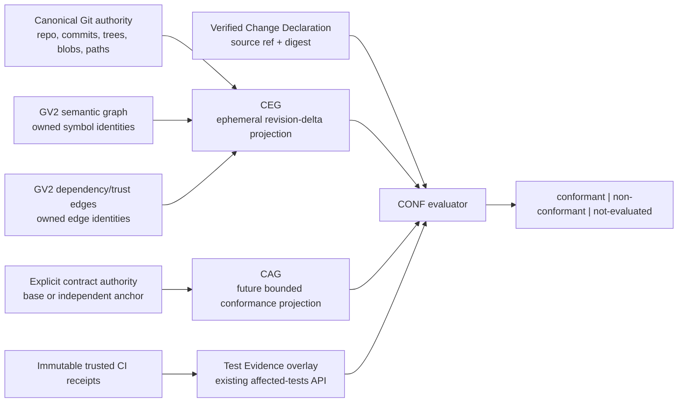

# Change Evidence Graph — design specification

| Type | Authority | Owner | Status | Freshness |
| --- | --- | --- | --- | --- |
| Spec | Derived | CEG and CONF | Proposed | 2026-08-30 — ADR-135 accepted after scoped Council repair re-review `council-599eaa64`; implementation remains Proposed |

| Upstream | Downstream |
| --- | --- |
| ADR-135, ADR-134, Graph v2 identities, canonical Git extraction, GCTX bounds | CEG APS work, CONF graph-semantic evaluation, later CAG and Test Evidence projections |

## 1. Goal

The Change Evidence Graph (CEG) provides exact, bounded evidence about how two
committed repository revisions differ. Its first consumer is **Intent & Claim
Integrity**: checking a Verified Change Declaration against the change that
actually landed, without requiring APS or another planning system.

CEG is useful only when it can answer a deterministic product predicate. It is
not a graph search product, a documentation index, a source of repository
authority, or a behavioural-equivalence oracle.

## 2. Boundary and topology



The arrows are joins by exact identity. CEG does not copy GV2 nodes, CAG does
not infer declarations from prose, and Test Evidence does not ingest raw logs.

## 3. First implementation posture

The initial CEG is:

- explicit and default-off;
- invoked only by a background CLI/check path;
- computed from exact committed Git objects;
- memory-only for one request plus a bounded cursor session;
- identity-only at the egress boundary;
- advisory through CONF;
- unavailable to save-time, pre-write, mid-edit, certification and enforcement
  hot paths.

There is no arbitrary revision-pair graph in the current product. Existing
`GraphDelta` is a live one-file update and the shared-base snapshot is a
semantic/dependency warm-start artefact, not complete CEG evidence. These are
inputs and implementation precedents only.

## 4. Contract

### 4.1 Snapshot vector

Every CEG request carries one immutable `CegSnapshotVector`:

```text
repository:
  repository_id
base:
  commit_oid
  tree_oid
head:
  commit_oid
  tree_oid
paths:
  ordered [path, base_blob_oid?, head_blob_oid?, git_status]
projections: ordered [
  authority_kind
  side: base | head
  revision_oid
  tree_oid
  coverage_digest
  schema_version
  generation
  parser_version
  tool_version
]
authority:
  contract_revision?
  contract_blob_oid?
  manifest_blob_oids[]
  lockfile_blob_oids[]
  toolchain_digests[]
  workflow_blob_oids[]
ci_receipt:
  trust_envelope_summary?
  receipt_ref?
  receipt_digest?
```

Absent optional axes are allowed only for predicates that do not consume them.
A consumed axis that is absent, stale, incompatible or mismatched yields
`not-evaluated`. Projection bindings are unique by owning authority and side;
one binding cannot represent multiple projections or both revisions.

### 4.2 Authority references

A CEG node or edge reference contains:

- authority kind;
- stable authority identity;
- base/head presence;
- content or edge digest;
- support state;
- evidence disposition.

It must not contain a copied `SymbolNode`, session-local node ID, source body,
log, comment, environment value or absolute path. Symbol joins use
`SymbolIdentity = (file, kind, name, ordinal)`. Edge joins use the owning
projection's typed endpoints and edge kind under the exact schema/generation.

### 4.3 Outcomes

```text
CegPredicateOutcome =
  unchanged { predicate, snapshot, evidence_summary }
  changed   { predicate, snapshot, bounded_witnesses }
  not-evaluated { predicate, snapshot?, reason, stage, observed, limit? }
```

`changed` is a proven violation and remains monotonic if another member later
fails. `unchanged` requires complete evidence for every predicate member.
`not-evaluated` is not clean, false or cached absence.

Stable initial reasons include:

- `identity.repository-mismatch`
- `identity.revision-mismatch`
- `identity.tree-mismatch`
- `identity.blob-mismatch`
- `identity.schema-mismatch`
- `identity.generation-mismatch`
- `unsupported.language`
- `unsupported.predicate`
- `parse.failed`
- `authority.changed-in-range`
- `authority.ambiguous`
- `receipt.untrusted`
- `receipt.incomplete`
- `receipt.configuration-mismatch`
- `budget.changed-paths`
- `budget.walk`
- `budget.edges`
- `budget.response-bytes`
- `budget.timeout`
- `surface.disabled`
- `surface.busy`

## 5. Predicate algorithms

### 5.1 `public-symbol-surface-unchanged`

For every supported changed blob, build the ordered set of public
`SymbolIdentity` values at base and head. The result is unchanged only when
both complete sets are identical. A changed identity becomes a bounded witness.

This predicate does not compare signatures, types, runtime dispatch or
behaviour. If a language or construct lacks complete public-symbol extraction,
the predicate is not evaluated; it is never renamed to `public-api-unchanged`.

### 5.2 `dependency-shape-unchanged`

Compare the ordered set of supported dependency-edge identities at base and
head after exact endpoint resolution. Dynamic or unsupported dependencies make
the relevant member not evaluated. Best-effort call edges do not enter this
predicate.

### 5.3 `privilege-surface-unchanged`

Compare only edge kinds whose owning Graph v2 projection declares complete
privilege/boundary semantics for the language and configuration. Unsupported
trust semantics yield not evaluated. The predicate never infers privilege from
directory names or prose.

### 5.4 CONF mapping

Git continues to evaluate `documentation-only`, `test-only` and
`scope: path:<prefix>`. CEG predicates may later support precise
graph-semantic declarations under CONF-010. The broad declarations
`no-behaviour-change` and `refactor-only` remain reason-coded not evaluated
until their semantics are deliberately narrowed or new complete evidence
exists.

## 6. Completeness manifest

Each builder produces a canonical manifest before a positive outcome:

| Field | Requirement |
| --- | --- |
| Coverage | Every Git coverage member is present exactly once |
| Blob identity | Consulted base/head blobs match the Git footprint |
| Language support | Support version recorded per member |
| Parse | Complete or explicit failure per member |
| Projection | Exact schema, generation, parser and tool versions |
| Edges | All edge kinds required by the predicate dispositioned |
| Bounds | No silent truncation; chunked coverage proves union completeness |
| Authority | Independent/base anchor when declarations changed |
| Receipts | Exact subject/configuration and approved immutable producer |

The cold-build oracle over the same committed objects is the parity authority
for supported fixtures. Optimised base-plus-changed-blob construction must be
exactly equal to it.

## 7. Execution, concurrency and recovery

1. Resolve and preflight the canonical replacement-disabled Git selection using
   ADR-134.
2. Build the snapshot vector and complete path manifest.
3. Claim the repository/snapshot key with cross-process single-flight.
4. Reuse a compatible committed shared base only as an index; it begins
   untrusted and is checked against the vector.
5. Parse exactly changed supported blobs for the head. Build the base separately
   when no compatible base exists.
6. Join identities, evaluate the requested predicate and validate completeness.
7. Atomically publish the in-memory generation to the request.
8. Release state within one second of the last request, session close,
   cancellation or TTL expiry.

One producer is allowed per key and two per host. The priority queue admits four
entries per repository and 16 per host and coalesces duplicates. Newer work
cancels obsolete queued work; a running subprocess and its descendants are
terminated under the existing process-group contract. Every producer and its
complete process tree runs in the low-priority `ceg-background-v1` resource
class. Crash, cancellation, corruption, overload, resource breach and timeout
publish no partial generation and return a typed unavailable/not-evaluated
outcome. Interactive validation always has priority.

## 8. Bounds

| Axis | Bound |
| --- | ---: |
| Caller-supplied changed paths | 200 |
| Internal chunk size | 200 |
| Reverse depth | 2 |
| Page items | 200 |
| Dependency/test walk | 10,000 |
| Affected symbols | 20,000 |
| Enumerated edges | 50,000 |
| Response page | 64 KiB |
| Cursor | 16 KiB |
| Session egress | 1 MiB |
| Concurrent cursor sessions | 2 per principal; 8 per workspace; 32 per host |
| Cursor idle/absolute TTL | 60 seconds / 5 minutes |
| Session creation | 10 per principal per rolling minute |
| Rolling egress credit | 4 MiB per principal per rolling minute |
| Rolling traversal credit | 100,000 identities per principal per rolling minute |
| Workspace rolling credit | 16 MiB and 400,000 identities per rolling minute |
| Host rolling credit | 64 MiB and 1,600,000 identities per rolling minute |
| Concurrent producer per key | 1 |
| Concurrent producers per host | 2 |
| Queue entries | 4 per repository; 16 per host |
| Producer CPU/RSS | 100% / 256 MiB |
| Host CEG CPU/RSS | 200% / 384 MiB |
| Retained state | 256 MiB per repository; 384 MiB per host |
| Persisted bytes | 0 |

The ADR-134 commit/record/byte/rename/time budgets also apply. A 1,000-path
stress delta must complete through verified chunk union or fail honest. Cursors
bind the snapshot vector and query fingerprint; deterministic pages report
truncation, omitted counts and narrowing guidance. An MCP principal is its
authenticated connection. A CLI/check principal is the long-lived local
broker's stable, non-egressed identity derived from authenticated
operating-system user and canonical repository identity, so a fresh client
process cannot reset credit. The broker owns every producer and all
principal/workspace/host credit ledgers; without it the CLI/check returns
`surface.unavailable`. Exhausted credit returns `surface.busy` or a budget
outcome before fresh traversal.

## 9. Privacy

The sealed DTO allowlist is: stable relative identities, hashes and digests,
typed source/receipt references, predicate and reason codes, bounded counts and
bounded witnesses. Structural no-leak tests forbid raw source, PR bodies, logs,
comments, environment data, absolute paths, PII and secrets.

No CEG persistence is admitted. A future persistence proposal needs a separate
ADR and must specify owner-only storage, integrity, retention, TTL/refcounts,
high-water GC, corruption recovery, schema invalidation and privacy fixtures
before implementation.

## 10. Contract & Authority projection

CAG is a future bounded conformance projection. It may read only explicit
versioned authorities, initially:

- Cargo manifests, lockfile, toolchain and distribution workspace declarations;
- pnpm/Nx workspace, project, package, lockfile and runtime-version declarations;
- workflow/action job, matrix, runner and step declarations.

Its identities are `AuthorityDocumentIdentity`, `BuildTargetIdentity`,
`BuildConfigurationIdentity` and `WorkflowJobIdentity`, each rooted in a
repository revision/tree plus path/blob and parser/schema version. It stores
predicates and sparse edges, not the Cartesian product of targets, features,
platforms and workflows. Ambiguous configuration is not evaluated.

CAG does not execute builds, infer supported platforms, search documentation,
own supply-chain/SBOM facts, or authorise a declaration changed by the same
range.

## 11. Test Evidence overlay

Test Evidence extends `anvil_affected_tests` with typed origin while retaining
the existing endpoint:

```text
TestEvidenceOrigin =
  ImportHeuristic
TrustedCiReceipt {
    test_target_identity
    configuration_identity
    receipt_ref
    receipt_digest
    trust_envelope_summary {
      envelope_version
      policy_revision
      policy_digest
      issuer_or_workload_identity
      key_or_trust_root_identity
      signature_or_transparency_digest
      subject_commit_oid
      subject_tree_oid
      workflow_path
      workflow_blob_oid
      action_digests[]
      event
      protected_ref
      check_run_identity
      producer
      runner_class
      runner_identity
      anvil_binary_digest
      instrumentation_digest
      configuration_digest
      platform_identity
      toolchain_digest
      lockfile_digest
      target_identity
      schema_version
      issued_at
      completed_at
      expires_at
      conclusion
      verification {
        mechanism
        trust_policy_digest
        verified_at
      }
    }
  }
```

Compatibility may derive the legacy heuristic boolean from the typed origin.
The envelope is authenticated against an independently configured producer
policy; any missing, invalid, revoked, expired or mismatched field is
`receipt.untrusted`. The full receipt remains in its external authority. anvil
projects only the latest compatible receipt per
`{target, platform, toolchain}`; 1, 10 and 50 historical-receipt fixtures prove
bounded resident size. A receipt proves that the named target completed under
the named configuration, not that unobserved tests were unnecessary.

## 12. Graduation evidence

CEG must pass:

- exact cold-oracle parity and fail-honest fixtures;
- zero hot-path reachability plus unchanged ADR-031 p95 gates under contention;
- the `ceg-background-v1` per-producer and host CPU/RSS ceilings, plus the
  unchanged all-process 800% CPU/700 MiB RSS concurrent ceiling;
- ADR-135's separate numeric CPU, RSS, cold, incremental, ingest, query,
  invalidation, contention, recovery, memory, disk and egress stop gates for
  CEG, CAG, Test Evidence and the combined arm;
- 1k/5k/10k/25k/50k/100k repository tiers and 1/20/200/1,000 delta tiers;
- corruption, cancellation, herd, ref-churn, starvation and recovery tests;
- sealed DTO no-leak and bounded egress tests;
- expiry, mismatch, idempotent duplicate request, queue overflow,
  session-retention/high-water release, cursor-chain, session-restart and
  sequential fresh-CLI credit evasion, and zero-persisted-byte fixtures.

CAG and Test Evidence additionally need their predicate-specific soundness,
completeness, expiry, mismatch, idempotent-ingest and trust-producer fixtures.
Their initial numeric stop gates are the separate CAG and Test Evidence columns
of ADR-135's matrix. Calibration uses its dedicated 4-core/8 GiB Linux runner,
20 independent cold/ingest/recovery samples, 1,000 warm queries,
nearest-rank percentiles and paired disabled/enabled contention runs on the same
SHA and fixture. Neither surface becomes resident or default-on until that
protocol confirms or tightens every cell.

A token-benefit claim follows DEVACC: exact Tier A goldens, then at least 10
paired successful non-APS/non-dev-loop tasks for Tier B, pinned model and anvil
SHA, no quality veto or rubric regression, non-negative success delta and at
least 20% median total-token reduction for the relevant projection. Tokens,
context bytes, latency and quality are reported independently for CEG, CAG, Test
Evidence and the combined arm.

## 13. Delivery slices

| Item | Outcome |
| --- | --- |
| CEG-001 | Freeze contract, snapshot vector, predicates, reason codes and cold oracle |
| CEG-002 | Build exact committed base/head projections with completeness manifest |
| CEG-003 | Add single-flight, cancellation, quotas and memory-only lifecycle |
| CEG-004 | Add bounded identity-only projector and no-leak tests |
| CEG-005 | Prove correctness, resource, scale, contention and recovery gates |
| CEG-006 | Run non-APS DEVACC arms and decide retain, narrow or park |
| CONF-010 | Consume graduated CEG predicates without broadening claim semantics |
| Later CAG | Implement only after its explicit authority schema and predicate ADR |
| Later Test Evidence | Extend `anvil_affected_tests` only after trusted-receipt admission |
