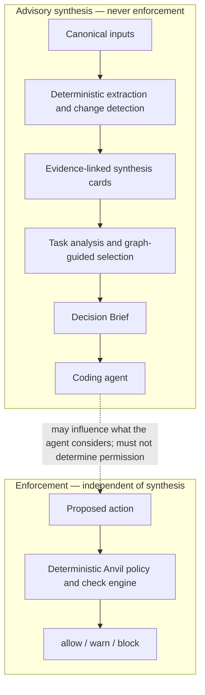

# Anvil Context Compiler — High-Level Specification

| Type | Authority | Owner | Status | Freshness |
| ---- | --------- | ----- | ------ | --------- |
| Spec | Advisory | CCTX | Draft | 2026-09-08 — drafted from the operator-supplied high-level specification; linked against the archived GCTX contract, GATT, CEG, and Graph Trust Surfaces |

| Upstream | Downstream |
| -------- | ---------- |
| [GCTX delivery contract](../../docs/architecture/graph-context-delivery-spec.md), [AI context delivery](../../docs/guides/ai-context-delivery.md), [GATT](../modules/graph-answer-attestation.aps.md), [CEG](../modules/change-evidence-graph.aps.md), [Graph Trust Surfaces](./2026-07-28-graph-trust-surfaces.md), [GV2](../../docs/architecture/graph-v2-foundation-spec.md), `crates/anvil-graph-cache`, `crates/anvil-gctx-types`, [local data and security](../../docs/public/anvil/operations/security.md) | [CCTX module](../modules/context-compiler.aps.md), [index Graph Substrate row](../index.aps.md#graph-substrate) |

**Status:** Draft for validation.
**Working name:** Context Compiler.
**Product:** Anvil.
**Primary owner:** eddacraft / @joshuaboys.
**APS home:** Graph Substrate, short ID **CCTX**.

This document is design intent, not as-built. It does not authorise
implementation. Durable architectural choices remain open until the owner
accepts an ADR; see [§15](#15-open-decisions).

## 1. Summary

The Context Compiler is an Anvil subsystem that continuously converts source
code, repository structure, documentation, Git history, architectural
decisions, and organisational policy into compact, versioned, evidence-linked
knowledge.

For a specific engineering task, it returns one bounded **Decision Brief**
containing the smallest useful understanding an agent needs to act: relevant
components, relationships, invariants, likely blast radius, applicable
policies, tests, uncertainty, freshness, and exact supporting evidence.

The subsystem reduces repeated repository exploration while improving the
consistency and auditability of agent decisions. Synthesised knowledge is
advisory context only. It must never silently become authority for an Anvil
allow, warn, or block decision.

## 2. Problem

Coding agents repeatedly reconstruct the same understanding of a repository by
searching files, reading source, traversing dependencies, finding tests, and
rediscovering architectural constraints. This causes:

- high and unpredictable token consumption;
- repeated tool calls and latency;
- inconsistent mental models across agents and sessions;
- missed policies, invariants, tests, and prior decisions;
- duplicated inference cost over largely stable source material;
- weak visibility into whether supplied context is current or well supported.

Compression reduces the size of context after it has been selected. Graph
retrieval improves selection but still leaves the agent to assemble meaning.
Anvil already ships that retrieval layer as GCTX — identity-only projections
over the resident graph, with optional consented snippets — documented in the
[GCTX delivery contract](../../docs/architecture/graph-context-delivery-spec.md)
and the [AI context delivery guide](../../docs/guides/ai-context-delivery.md).
The Context Compiler performs stable synthesis ahead of time, then uses
deterministic evidence and graph relationships to select task-specific
knowledge in one pass.

It does not replace GCTX, GATT, or CEG. It builds on graph evidence those
surfaces already produce, and it keeps enforcement on a separate path.

## 3. Product Objective

Give every supported coding agent the smallest evidence-backed understanding
required for a task, before it acts, while preserving an exact path back to
canonical source.

Success means that agents complete real engineering tasks with fewer billed
tokens, fewer exploratory calls, and no material regression in task quality,
source recall, or safety.

## 4. Principles

1. **Evidence before interpretation.** Every synthesised claim must cite
   canonical evidence.
2. **Deterministic authority.** Enforcement remains based on deterministic
   policy and canonical facts, never an LLM summary.
3. **Freshness is explicit.** A brief must expose its source revision,
   synthesis version, age, and invalidation state.
4. **Task-shaped output.** The system must not return a universal repository
   summary.
5. **Progressive disclosure.** One brief first; exact source and deeper graph
   traversal remain available when needed.
6. **Fail visibly.** Missing, stale, conflicting, or partial evidence must be
   reported rather than smoothed over.
7. **Local-first and bounded.** Source handling follows Anvil's existing local
   execution and data-boundary commitments. See
   [Local data and security](../../docs/public/anvil/operations/security.md).
8. **Measure total cost.** Ingestion, refresh, retrieval, inference, and
   recovery costs all count.

## 5. Users and Primary Jobs

### Coding agent

- Understand the relevant part of a repository before editing.
- Identify likely affected files, callers, dependants, tests, and policies.
- Discover uncertainty early and drill into exact source only where necessary.

### Engineering team

- Give different agents a consistent, current understanding of the system.
- Reduce repetitive exploration and missed architectural constraints.
- Review why a task brief contained a particular claim.

### Anvil decision engine

- Supply advisory context to agents before action.
- Keep enforcement independent from the synthesis path.
- Preserve evidence for later review and attestation.

The decision engine already owns allow / warn / block. GCTX is already
advisory and must not be confused with launch validation — see
[Graph context is not launch validation](../../docs/guides/ai-context-delivery.md#graph-context-is-not-launch-validation).
Context Compiler inherits that split and must not erode it.

## 6. Scope

### In scope

- Ingest source, symbols, dependency relationships, tests, repository
  metadata, relevant documentation, ADRs, policy, and Git change
  relationships.
- Produce versioned synthesis cards for stable concepts such as component
  responsibilities, invariants, workflows, ownership, known risks, and
  architectural boundaries.
- Track evidence, confidence, source hashes, synthesis version, and
  invalidation dependencies for every card and claim.
- Select relevant cards and deterministic graph facts for a task.
- Produce one bounded Decision Brief.
- Support exact-source drill-down and explanation of why material was
  included.
- Incrementally invalidate and rebuild affected knowledge after source
  changes.
- Emit metrics for cost, freshness, retrieval quality, and task outcomes.

### Out of scope for the first release

- Acting as the authority for allow, warn, or block decisions.
- Replacing Anvil's source graph, policy engine, or deterministic checks.
- A general-purpose enterprise knowledge product.
- Automatic code changes.
- Whole-repository natural-language summaries.
- Cross-customer learning from private source.
- Fully autonomous conflict resolution between contradictory sources.

### Adjacent work this module must not duplicate

| Surface | What it already owns | CCTX relationship |
| ------- | -------------------- | ----------------- |
| [GCTX](../archive/modules/graph-context-delivery.aps.md) (Complete) | Deterministic graph projections, sealed egress DTOs, identity-only default | Input and drill-down path. CCTX selects and synthesises over it; it does not re-implement search, callers, impact, or affected-tests. |
| [GATT](../modules/graph-answer-attestation.aps.md) | In-band limits on graph answers (caps, per-edge fidelity, cost self-report) | Affinity. How Decision Brief evidence relates to GATT attestation is an [open decision](#15-open-decisions), not a licence to fork the disclosure contract. |
| [CEG](../modules/change-evidence-graph.aps.md) | Exact committed-revision delta for CONF predicates | Affinity. CEG is deterministic revision-pair evidence for conformance. CCTX must not become a second CEG, a CONF evaluator, or a working-tree evidence graph. |
| [Graph Trust Surfaces](./2026-07-28-graph-trust-surfaces.md) | Operator-approved five-track shortlist (CGBDG, CONF/CEG, POLCAP, SCA, LSPNAV) | Affinity of intent (trustworthy graph answers), **not** membership in that shortlist. |
| [EVALCI](../modules/eval-regression-ci-gate.aps.md) | Policy eval-regression CI gate | Different eval. CCTX's first spike is an internal task-brief comparison, not a policy-baseline CI gate. |

## 7. Conceptual Architecture

Canonical inputs → deterministic extraction and change detection →
evidence-linked synthesis cards → task analysis and graph-guided selection →
Decision Brief → coding agent.

Separate path: proposed action → deterministic Anvil policy / check engine →
allow / warn / block.

The dotted edge is influence, not authority. Enforcement must keep working if
the Context Compiler is unavailable, stale, or wrong.

## 8. Core Components

These are conceptual roles, not crate names. No new crate is proposed while
this spec is Draft. Verified residents today:

- `crates/anvil-graph-cache` — resident graph, call graph, token estimator.
- `crates/anvil-gctx-types` — sealed GCTX egress DTOs.
- `crates/anvil-gctx-egress` — snippet slicing on the GCTX spine.

| Role | Responsibility |
| ---- | -------------- |
| Source adapters | Ingest source, symbols, docs, ADRs, policy, tests, and Git metadata already available to Anvil. |
| Deterministic evidence graph | Reuse the Anvil resident graph and GCTX projections; do not invent a parallel graph. |
| Change detector and invalidator | Mark cards and claims stale when supporting evidence changes; rebuild incrementally. |
| Synthesis engine | Produce evidence-linked cards for stable concepts. Advisory only. |
| Knowledge store | Versioned cards with hashes, synthesis version, and invalidation dependencies. Location is an [open decision](#15-open-decisions). |
| Task router | Interpret a task enough to select cards and graph facts. Not a universal summary. |
| Brief composer | Emit one bounded Decision Brief, distinguishing fact, interpretation, uncertainty, and recommendation. |
| Attestation and observability | Freshness, confidence, completeness, cost, and an exact path back to evidence. How this relates to GATT is open. |

## 9. Decision Brief Contract

A brief is **advisory**. It is never policy authority. It must include:

- task interpretation and scope;
- relevant components;
- relationships;
- invariants and applicable policy;
- likely blast radius;
- tests and validation;
- prior ADRs;
- risks and unknowns;
- claim-level evidence;
- freshness (source revision, synthesis version, age, invalidation state);
- confidence and completeness;
- drill-down handles to exact source and deeper graph traversal.

Every material claim must distinguish:

| Kind | Meaning | Authority |
| ---- | ------- | --------- |
| Deterministic fact | Canonical graph, Git, policy, or test evidence | May be cited as fact |
| Synthesised interpretation | Model-produced meaning over that evidence | Advisory only |
| Uncertainty | Missing, stale, conflicting, or partial evidence | Must be visible |
| Recommendation | Suggested next step or focus | Never allow / warn / block |

Unlabelled synthesis must not be treated as canonical fact.

## 10. Freshness and Invalidation

A brief is usable only when supporting evidence remains valid for the
requested source revision.

Require:

- source hashes and revision IDs;
- claim → evidence dependencies;
- immediate stale marking when those dependencies change;
- incremental rebuild of affected knowledge;
- visible partial or stale responses;
- no quiet stale fallback;
- a configurable maximum age for non-source inputs (docs, ADRs, policy
  copies that are not the live tree).

Fail visibly. A stale or partial brief that admits it is safer than a fluent
brief that does not.

## 11. Trust and Safety Boundary

The Context Compiler may influence what an agent considers. It may not
determine whether a proposed action is permitted.

- Enforcement must work if Context Compiler is unavailable.
- Never treat unlabelled synthesis as canonical fact.
- Record when advisory context affected a workflow.
- Preserve fail-open / fail-closed independently of synthesis availability.
- Expose conflicts between synthesis and deterministic evidence rather than
  resolving them in silence.

This is the same split GCTX already documents against
`anvil_validate_write`. Crossing it is the failure mode this subsystem exists
to avoid: a fluent summary that silently becomes an allow.

## 12. First Release / Spike

Internal evaluation only. Not a product compiler, not a release claim, not a
Graph Trust Surfaces track.

**Inputs**

- one Anvil repo revision;
- the current code graph / GCTX;
- selected docs, ADRs, tests, and policy;
- 20 representative real tasks.

**Variants**

1. Ordinary exploration (file search and reads, no graph tools).
2. GCTX-assisted (existing graph tools; no pre-synthesised brief).
3. Pre-synthesised brief only.
4. Graph-selected synthesis with exact-source drill-down.

**Task classes**

- orientation;
- localised bug;
- cross-module change;
- policy-sensitive change;
- test-impact;
- novel structural question.

The GCTX-031 `token_reduction` bench remains a shape regression on
`ImpactOutcome` payloads. This spike sits beside it as a task-outcome
comparison; it does not replace that harness.

Numeric thresholds wait until baselines exist. The spike's job is to produce
those baselines and to say honestly which brief variants were measured.

## 13. Success Metrics

Measure all of:

- billed tokens;
- synthesis and refresh amortised cost;
- tool calls;
- time to first useful action;
- latency;
- task success and tests;
- correct-file / symbol recall;
- missed blast-radius;
- stale or incorrect claims;
- drill-down frequency;
- recovery cost;
- brief size against budget.

**Initial gate** (after a baseline; no numeric thresholds until then):

- material reduction versus GCTX alone;
- no material regression in success or recall;
- zero hidden stale use;
- every material claim evidence-linked;
- refresh cost amortisable.

Token savings are evidence of efficiency, not the primary thesis. See
[§16](#16-product-positioning).

## 14. Key Risks

| Risk | Why it matters | Mitigation |
| ---- | -------------- | ---------- |
| Shared hallucination | One fluent error is reused by every agent | Provenance; every claim cites evidence |
| Staleness | A current-looking brief over a moved tree | Explicit freshness; immediate invalidation; no quiet stale fallback |
| False completeness | Caps and gaps read as "that's all" | Visible partial / conflict / unknown; GATT-shaped honesty where graph answers are reused |
| Task mismatch | A nearby but wrong brief | Task-shaped selection; fail visibly when scope is uncertain |
| Cost displacement | Inference and refresh eat the token savings | Measure total cost, including recovery |
| Authority leakage | A brief becomes allow / warn / block | Isolated enforcement; advisory labelling; fail-independent policy engine |
| Scope drift | Enterprise knowledge product, auto-edits, cross-customer learning | First-release out-of-scope list; bounded internal eval |

## 15. Open Decisions

No ADR is filed with this draft. These remain owner calls before Ready:

1. **Card granularity** — component, file, symbol, workflow, or mixed.
2. **Canonical versus advisory inputs** — which docs, ADRs, and policy texts
   are canonical facts versus advisory reading.
3. **Task intent representation** — how a task is named well enough to select
   cards without becoming a second planning system.
4. **Confidence model** — scores, ranks, or discrete labels; nothing that
   looks measured when it is estimated.
5. **Conflict surfacing** — how contradictory sources are shown, given that
   autonomous resolution is out of scope.
6. **Evidence format versus Graph Answer Attestation** — reuse GATT's
   in-band limits, extend them, or keep brief evidence as a distinct
   advisory contract.
7. **Synthesis models under local-first constraints** — what may run on-box,
   what may not leave the machine, and how that sits with Anvil's existing
   data boundary.
8. **Knowledge location** — repository-local versus user-local versus
   daemon-managed.

## 16. Product Positioning

Internal Anvil capability initially. Token savings are evidence of
efficiency, not the primary thesis.

Strategic value: decision-ready context that is current, bounded,
explainable, and tied to independent enforcement.

This is not a sixth Graph Trust Surfaces track, not a replacement for GCTX,
and not a general knowledge product. It is a compiler of task-shaped advisory
context over the graph Anvil already trusts.
