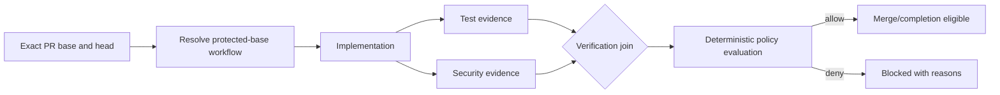

# Governed workflows

| Field | Value |
| --- | --- |
| Status | Final design; operator-approved 2026-09-18 |
| Product owner | GOVWF |
| Architecture decision | [ADR-150](../decisions/150-governed-workflow-transition-authority.md) (Proposed) |
| Delivery plan | [GOVWF](../modules/governed-workflows.aps.md) (Draft) |

## Summary

anvil must provide a deterministic governance layer for engineering workflows.
A team declares a workflow as a directed acyclic graph (DAG); anvil determines
whether a governed work item may move across an edge by evaluating admitted
evidence, approvals, exceptions, and policy against the authoritative workflow
version.

The product boundary is:

> **Humans, agents, and tools execute workflows. anvil governs transitions.**

The first enforceable slice is repository-scoped pull-request governance on
GitHub. A required check reports whether the exact pull-request head may be
treated as complete and merged under the workflow resolved from the current
protected base. A later provider-neutral transition API may expose the same
decision model to local CLI, MCP, other forges, deployment systems, and
orchestrators without changing the workflow contract.

## Problem And Success Criterion

Engineering controls are currently split across documentation, prompts, CI,
scripts, issue templates, repository conventions, and tribal knowledge. These
controls are often advisory. An agent may initially obey an instruction such
as “run this verification script and do not complete while its report contains
errors”, but the instruction can be skipped or reinterpreted as prompts,
models, tools, and workflows change.

The requirement is satisfied when an organisation can define a workflow once
and know that required controls cannot be silently skipped by a developer, an
AI coding agent, CI, or a future automation tool, and can reconstruct why each
governed transition was allowed or denied.

## Product Boundary

anvil answers:

> Is this work allowed to move from its current governed state to the requested
> next state, and what evidence proves that decision?

anvil does not become a general workflow runner, CI/CD service, issue tracker,
agent orchestrator, or task scheduler. External systems may execute actions and
produce evidence. The governance evaluator admits evidence and decides whether
a transition is allowed; it does not implicitly execute commands while
evaluating a transition.

`/dev-loop` is internal developer tooling. It may later dogfood the
provider-neutral transition API, but it is neither the customer-facing product
contract nor evidence that governed workflows have shipped.

## Initial Enforceable Slice

The first slice governs merge/completion of one GitHub pull request:

1. Resolve the workflow definition from the protected base authority.
2. Create or update the workflow instance for the repository, pull request,
   exact base commit, and exact head commit.
3. Admit receipts produced by registered evidence capabilities.
4. Evaluate node requirements and transition policy deterministically.
5. Publish a required GitHub check for the exact head commit.
6. Allow the host's normal merge controls to progress only on `allow`; report
   missing, stale, invalid, or failing evidence as a denial with reasons.

The instance identity is:

```text
repository + pull request + base commit + head commit + workflow version
```

An external issue, APS work item, or other work reference may be attached as
metadata, but none is required. APS remains an anvil development-planning
system, not a customer runtime dependency.

## Workflow Model

A workflow is a versioned DAG. Nodes represent meaningful states, activities,
verification steps, approvals, or gates. Edges name the transitions that policy
may authorise. Parallel branches and joins are first-class; the model is not
restricted to one linear checklist.

Authoritative instance state consists of:

- the resolved workflow and policy versions;
- the exact work identity and repository state;
- the set of completed nodes;
- the available and blocked transition frontier;
- admitted evidence and approval receipts;
- applicable exceptions;
- failed policies and outstanding requirements; and
- transition decisions and their provenance.



The definition format must be machine-readable, version controlled,
deterministic, auditable, and statically validatable. The exact schema remains
a GOVWF readiness decision. Validation must reject cycles, unknown nodes,
missing policies or capabilities, invalid joins, and workflows with no
reachable valid terminal state.

## Authority And Versioning

The pull request under evaluation cannot authorise weakening its own controls.
For the GitHub slice, workflow and policy authority resolve from the protected
base under a separately governed repository ruleset. A change to the workflow
definition is reviewable like any other protected governance change, but it
does not take authority merely because it appears in the pull-request head.

If the protected base changes, the instance receives a new revision. Evidence
whose bound base, head, workflow, policy, or capability version no longer
matches is not silently reused. The check remains blocked until the revised
instance has acceptable evidence.

Future organisation, business-area, team, project, repository, and work-item
composition may add mandatory controls at higher scopes. Lower scopes must not
silently remove those controls. That composition is deliberately deferred to
the existing ORGHIER/POLLC/POLFED authority work rather than invented in the
repository-first slice.

## Capabilities And Evidence

Workflows reference registered, versioned evidence-producing capabilities, not
arbitrary inline shell commands. A capability declares its identity, producer
contract, acceptable receipt schema, version semantics, trust requirements,
and availability. External CI, a local tool, a human approval adapter, or
another automation system may implement the capability.

Evidence is a first-class admitted object. At minimum a receipt must support:

- producer identity and capability version;
- generation time and validity bounds;
- repository, base, head, and change identity;
- workflow and policy version bindings;
- tool identity and version;
- content digest or equivalent attribution;
- structured result data; and
- verification status and admission reason.

An assertion such as “tests passed” is not evidence. A test receipt is
acceptable only when anvil can establish that the registered capability ran,
the expected suite was represented, the result belongs to the current change,
and the policy accepts its structured outcome. Missing, stale, unverified,
malformed, or mismatched evidence never becomes an implicit pass.

The first slice is an evidence-admission system, not an action runner. The
capability registry and cross-CI receipt transport are readiness gates because
their trust and durability choices define the real enforcement boundary.

## Deterministic Policy And Decisions

Workflow definitions state what must happen. Rego policy evaluated through the
existing Regorus-based policy layer determines whether the resulting state is
acceptable. LLM output may explain a denial or suggest remediation, but it is
never authoritative transition evidence or the final evaluator.

The transition decision contract must distinguish at least:

- `allow` — every required fact is valid and policy permits the edge;
- `deny` — requirements are missing or policy rejects the state;
- `degraded` — the workflow or an integration is invalid or unavailable; and
- `unsatisfiable` — no valid route to the requested terminal state remains.

Only `allow` satisfies the required check. Every other outcome is fail-closed
for governed progression and carries machine-readable reason codes plus a
human explanation.

## Approvals And Exceptions

Human approvals are evidence receipts, not comments interpreted by an LLM.
The GitHub slice binds approval identity, authority, review state, and the exact
head commit. The internal contract is provider-neutral so another forge can
map equivalent authoritative review evidence later.

Approved deviations reuse EXCEPT rather than creating a workflow-specific
bypass store. A valid exception must be scoped, attributed, expiring,
authority-valid, revocable, and included in the decision evidence. It changes
the compliance disposition without rewriting the underlying failed or missing
fact.

A host administrator may still bypass a GitHub ruleset outside anvil's control.
That operation is never reported as governed success. anvil must detect and
record the result as an ungoverned host bypass when the host exposes enough
information; prevention beyond the boundary anvil controls is not claimed.

## State, Receipts, And Auditability

For every transition an operator must be able to answer what was requested,
who or what acted, which workflow and policy applied, what evidence was
evaluated, which exception or approval applied, what decision was made, and
why.

This capability does not introduce a parallel event store. Durable local
governance facts reuse the established Kindling contract. Portable,
tamper-evident transition proof reuses the ADR-037 witness model, with a
content-addressed companion receipt where the full decision exceeds the
witness envelope. The first implementation design must settle how CI-produced
receipts reach that durable model across machines before any delivery item is
promoted Ready.

## Drift And Satisfiability

Static and runtime diagnostics must distinguish:

- valid — every referenced node, policy, capability, and terminal route is
  available;
- degraded — evaluation can continue only with a named unavailable or stale
  integration;
- unsatisfiable — mandatory requirements cannot be met or no valid terminal
  route remains; and
- configuration drift — the declared workflow no longer matches its policies,
  capability registry, integration contracts, or implementation support.

Examples include a deleted policy, an unavailable evidence producer, an
obsolete capability version, a missing required check installation, a cyclic
or unreachable graph, and a receipt schema that no longer matches the declared
producer.

## Deferred Expansion

After the GitHub merge/completion slice proves the model, the same evaluator
may be projected through:

- a local CLI or MCP transition request;
- other source-control providers;
- deployment or release gates;
- organisation-scoped workflow composition; and
- internal `/dev-loop` dogfooding.

These are consumers of one provider-neutral governance contract, not separate
workflow engines. None is a prerequisite for the first repository slice.

## First-Slice Acceptance Scenario

The initial end-to-end pilot is complete only when a protected repository can
declare a branching workflow in which test and security nodes join before
review and completion, and anvil can demonstrate all of the following:

1. valid exact-head receipts and exact-head approval produce `allow`;
2. a failure, stale receipt, wrong head, wrong base, wrong workflow version, or
   missing capability keeps the required check non-passing;
3. changing the protected base creates a revised instance and invalidates
   mismatched evidence;
4. an applicable EXCEPT grant is visible, scoped, and auditable;
5. a pull request cannot weaken its own workflow definition;
6. the decision can be reconstructed from durable receipts; and
7. a host-side bypass is not misreported as a governed transition.

## Delivery Readiness Gates

The design is approved, but implementation remains Draft until the GOVWF
module closes these gates:

- workflow schema, versioning, migration, and DAG validation contract;
- trusted-base resolution and GitHub ruleset/bootstrap design;
- capability registry ownership and producer admission rules;
- receipt schema, signature/content-addressing, freshness, and cross-CI
  durability;
- Regorus input/output schema, resource bounds, and reason taxonomy;
- GitHub review authority and exact-head mapping;
- EXCEPT integration review;
- Kindling and witness receipt mapping;
- concrete implementation homes and validation commands; and
- a design-partner repository for the end-to-end pilot.
